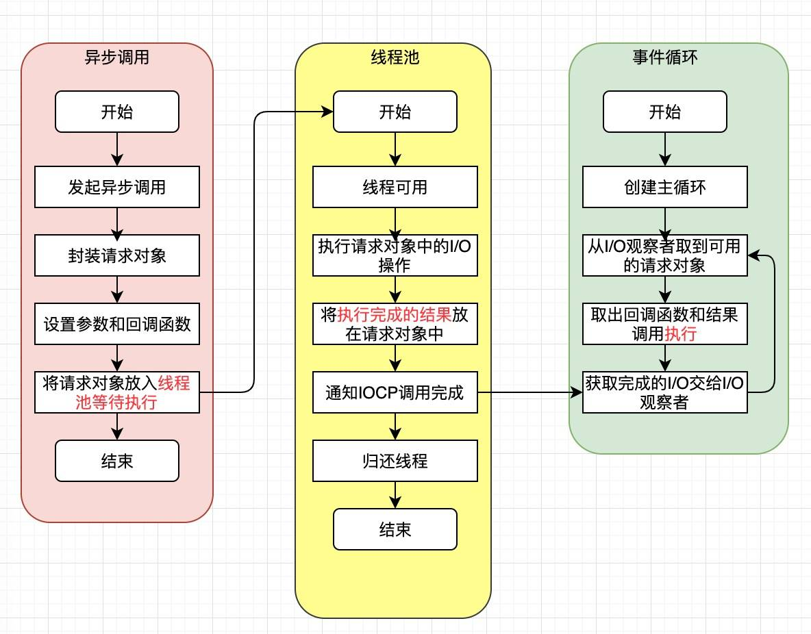

Node 相对于其他语言的优势在于对 I/O 的处理。我们知道 Node 基于 google 的 V8 引擎的非阻塞，事件驱动的平台。那么非阻塞和事件驱动都是什么意思？

答案就在 Node 的核心，**事件循环**。

先看一下 Node 的架构，然后再从下往上分析 Node 的事件循环，如下图：


## 异步 IO

## 非阻塞 IO

## Node 异步 IO 模型
下图是 libuv 的架构：



## 非 IO 的异步 API

## Event Loop

## 参考
- 深入浅出 Node.js - 朴灵
- [NodeJS Event Loop](https://blog.insiderattack.net/event-loop-and-the-big-picture-nodejs-event-loop-part-1-1cb67a182810)
- [JavaScript 运行机制详解：再谈 Event Loop](http://www.ruanyifeng.com/blog/2014/10/event-loop.html)
- https://juejin.im/post/5e1adbc05188253664549bab

```c
int uv_run(uv_loop_t* loop, uv_run_mode mode) {
  int timeout;
  int r;
  int ran_pending;

  r = uv__loop_alive(loop);
  if (!r)
    uv__update_time(loop);

  while (r != 0 && loop->stop_flag == 0) {
    // 更新loop的time字段
    uv__update_time(loop);
    // 执行超时回调
    uv__run_timers(loop);
    // 执行pending回调，ran_pending代表pending队列是否为空，即没有节点可以执行
    ran_pending = uv__run_pending(loop);
    // 继续执行各种队列
    uv__run_idle(loop);
    uv__run_prepare(loop);

    timeout = 0;
    // UV_RUN_ONCE并且有pending节点的时候，会阻塞式poll io，默认模式也是
    if ((mode == UV_RUN_ONCE && !ran_pending) || mode == UV_RUN_DEFAULT)
      timeout = uv_backend_timeout(loop);
    // poll io timeout是epoll_wait的超时时间
    uv__io_poll(loop, timeout);
    uv__run_check(loop);
    uv__run_closing_handles(loop);
    // 还有一次执行超时回调的机会
    if (mode == UV_RUN_ONCE) {
      uv__update_time(loop);
      uv__run_timers(loop);
    }

    r = uv__loop_alive(loop);
    if (mode == UV_RUN_ONCE || mode == UV_RUN_NOWAIT)
      break;
  }

  if (loop->stop_flag != 0)
    loop->stop_flag = 0;

  return r;
}
```

定时器阶段
```c
static void uv__update_time(uv_loop_t* loop){
  loop->time = uv__hrtime(UV_CLOCK_FAST) / 1000000;
}

// 找出已经超时的节点，并且执行里面的回调
void uv__run_timers(uv_loop_t* loop) {
  struct heap_node* heap_node;
  uv_timer_t* handle;

  for (;;) {
    heap_node = heap_min(timer_heap(loop));
    if (heap_node == NULL)
      break;

    handle = container_of(heap_node, uv_timer_t, heap_node);
    // 如果当前节点的时间大于当前时间则返回，说明后面的节点也没有超时
    if (handle->timeout > loop->time)
      break;
    // 移除该计时器节点，重新插入最小堆，如果设置了repeat的话
    uv_timer_stop(handle);
    uv_timer_again(handle);
    // 执行超时回调
    handle->timer_cb(handle);
  }
}
```

libuv 以最小堆的形式维护了超时任务节点，每次判断最快超时的节点有没有超时，没有的话说明后面的节点也不会超时，有的话继续往下判断。定时
setTimeout 和 setInterval。

pending 阶段

上一轮的 poll io 阶段没有执行的 io 回调，会在下一轮循环的 pending 阶段被执行。

```c
static int uv__run_pending(uv_loop_t* loop) {
  QUEUE* q;
  QUEUE pq;
  uv__io_t* w;

  if (QUEUE_EMPTY(&loop->pending_queue))
    return 0;
  // 把pending_queue队列的节点移到pq，即清空了pending_queue
  QUEUE_MOVE(&loop->pending_queue, &pq);

  // 遍历pq队列
  while (!QUEUE_EMPTY(&pq)) {
    // 取出当前第一个需要处理的节点，即pq.next
    q = QUEUE_HEAD(&pq);
    // 把当前需要处理的节点移出队列
    QUEUE_REMOVE(q);
    // 重置一下prev和next指针，因为这时候这两个指针是指向队列中的两个节点
    QUEUE_INIT(q);
    w = QUEUE_DATA(q, uv__io_t, pending_queue);
    w->cb(loop, w, POLLOUT);
  }

  return 1;
}
```

把 pending 队列的节点逐个执行 

pending队列的节点是如何产生的：
```c
void uv__io_feed(uv_loop_t* loop, uv__io_t* w) {
  if (QUEUE_EMPTY(&w->pending_queue))
    QUEUE_INSERT_TAIL(&loop->pending_queue, &w->pending_queue);
}
```

libuv通过 `uv__io_feed` 函数生产pending任务，从libuv的代码中我们看到io错误的时候会调这个函数（还有其他情况）
```c
if (handle->delayed_error)
    uv__io_feed(handle->loop, &handle->io_watcher);
```

io 关闭的时候会从 pending 队列移除对应的节点。
```c
void uv__io_close(uv_loop_t* loop, uv__io_t* w) {
  uv__io_stop(loop, w, POLLIN | POLLOUT | UV__POLLRDHUP | UV__POLLPRI);
  QUEUE_REMOVE(&w->pending_queue);
  uv__platform_invalidate_fd(loop, w->fd);
}
```

idle阶段
prepare阶段
 
类似idle阶段，自定义的任务队列
 
poll io阶段
处理网络io、文件io的阶段。可能会引起nodejs的短暂阻塞。
 
```c
// 最长阻塞时间
timeout = uv_backend_timeout(loop);
uv__io_poll(loop, timeout);
```

最长阻塞时间
```c
int uv_backend_timeout(const uv_loop_t* loop) {
  if (loop->stop_flag != 0)
    return 0;

  if (!uv__has_active_handles(loop) && !uv__has_active_reqs(loop))
    return 0;

  if (!QUEUE_EMPTY(&loop->idle_handles))
    return 0;

  if (!QUEUE_EMPTY(&loop->pending_queue))
    return 0;

  if (loop->closing_handles)
    return 0;

  return uv__next_timeout(loop);
}
```

1. `stop_flag`:这个标记是 0的时候，意味着事件循环跑完这一轮就退出了，返回的时间是0

2. `!uv__has_active_handles`和`!uv__has_active_reqs`:如果没有任何的异步任务（包括timer和异步I/O)，那timeOut时间一定就是0了

3. `QUEUE_EMPTY(idle_handles)`和`QUEUE_EMPTY(pending_queue)`:异步任务是通过注册的方式放进了`pending_queue`中，无论是否成功，都
已经被注册，如果什么都没有，这两个队列就是空，所以没必要等了。

4. `closing_handles`:我们的循环进入了关闭阶段，没必要等待了

`uv__next_timeout`是怎么获取时间的
```c
int uv__next_timeout(const uv_loop_t* loop) {
  const struct heap_node* heap_node;
  const uv_timer_t* handle;
  uint64_t diff;

  heap_node = heap_min((const struct heap*) &loop->timer_heap);
  if (heap_node == NULL)
    return -1; /* block indefinitely */

  handle = container_of(heap_node, uv_timer_t, heap_node);
  if (handle->timeout <= loop->time)
    return 0;

//这句代码给出了关键性的指导
  diff = handle->timeout - loop->time;

//不能大于最大的INT_MAX
  if (diff > INT_MAX)
    diff = INT_MAX;

  return diff;
}
```

1. 对比当前loop设置的时间，开头的`update_time`，在这里用上了，保存在`loop->time`中

2. 获取到距离此时此刻，loop中，最先到期的一个timer的时间

这个timeout如果有值，那就一定是距离此时此刻，loop中，最先到期的一个timer的时间，如果这个timer时间太长，则以`INT_MAX` 这个常数时
间为基准。在(unix)c++头文件`#include <limits.h>`中定义得到这个常量是：32767(应该是32.767毫秒).

`uv__io_poll`是经典的epoll处理模式。先把业务事件注册到epoll中，然后在`epoll_wait`中等待事件的到来。最后执行对应事件的回调。
`uv__io_poll`获得了一个最多是32767的一个等待时间，如果 timeout 为 0 ，`uv__io_poll` 是不会阻塞事件循环的。
只有在 所有被注册的异步任务都没有完成（返回）的时候，才会调用  `uv__io_poll`，这时候等一下其实没什么所谓，目的就是等待一些
可能在极短的时间内完成的 I/O 操作。

```c
void uv__io_poll(uv_loop_t* loop, int timeout) {
  // 判断是否有事件发生    
  if (loop->nfds == 0) {
    //判断观察者队列是否为空，如果为空，则返回
    assert(QUEUE_EMPTY(&loop->watcher_queue));
    return;
  }
  
  nevents = 0;
  // 处理观察者队列
  while (!QUEUE_EMPTY(&loop->watcher_queue)) {
    if (w->events == 0)
      op = EPOLL_CTL_ADD;  // 新增监听事件
    else
      op = EPOLL_CTL_MOD;  // 修改事件
    ...
    w->events = w->pevents;
  }

  
  assert(timeout >= -1);
  //如果有超时时间，将当前时间赋给base变量
  base = loop->time;
  // 本轮执行监听事件的最大数量
  count = 48; /* Benchmarks suggest this gives the best throughput. */
  //进入监听循环
  for (;; nevents = 0) {
  // 有超时时间的话，初始化spec
    if (timeout != -1) {
      spec.tv_sec = timeout / 1000;
      spec.tv_nsec = (timeout % 1000) * 1000000;
    }
    
    if (pset != NULL)
      pthread_sigmask(SIG_BLOCK, pset, NULL);
    // 监听内核事件，当有事件到来时，即返回事件的数量。
    // 在timeout时间内，event-loop会一直阻塞在此处，直到超时时间到来或者有内核事件触发。
    nfds = uv__epoll_wait(loop->backend_fd,
                  events,
                  nevents,
                  events,
                  ARRAY_SIZE(events),
                  timeout == -1 ? NULL : &spec);

    if (pset != NULL)
      pthread_sigmask(SIG_UNBLOCK, pset, NULL);

    /* Update loop->time unconditionally. It's tempting to skip the update when
     * timeout == 0 (i.e. non-blocking poll) but there is no guarantee that the
     * operating system didn't reschedule our process while in the syscall.
     */
    SAVE_ERRNO(uv__update_time(loop));
    //如果内核没有监听到可用事件，且本次监听有超时时间，则返回。
    if (nfds == 0) {
      assert(timeout != -1);
      return;
    }
    
    if (nfds == -1) {
      if (errno != EINTR)
        abort();

      if (timeout == 0)
        return;

      if (timeout == -1)
        continue;

      /* Interrupted by a signal. Update timeout and poll again. */
      goto update_timeout;
    }

    。。。
    //判断事件循环的观察者队列是否为空
    assert(loop->watchers != NULL);
    loop->watchers[loop->nwatchers] = (void*) events;
    loop->watchers[loop->nwatchers + 1] = (void*) (uintptr_t) nfds;
    // 循环处理内核返回的事件，执行事件绑定的回调函数
    for (i = 0; i < nfds; i++) {
        。。。。
    }
    
}
```

poll 阶段的任务是阻塞以等待监听事件的来临，然后执行对应的回调。其中阻塞是有超时时间，在某些条件下超时时间会被置为 0。此时，就会
进入下一阶段，而本 poll 阶段未执行的回调会在下一循环的 pending 阶段执行。

等待结束以后，就会进入check阶段.

check 阶段
该阶段执行`setImmediate`的回调函数。

closing_handles 阶段
执行关闭请求的回调函数，比如`socket.on('close', ...)`。
当一个handle调用`uv_close`关闭的时候，可以注册一个回调，在`closing_handles`阶段就会被执行。
```c
void uv_close(uv_handle_t* handle, uv_close_cb close_cb) {
  handle->flags |= UV_HANDLE_CLOSING;
  handle->close_cb = close_cb;
  ...
  uv__make_close_pending(handle);
}

void uv__make_close_pending(uv_handle_t* handle) {
  handle->next_closing = handle->loop->closing_handles;
  handle->loop->closing_handles = handle;
}
```

handle绑定了一个`close_cb`然后插入到`closing_handles`队列。然后在`closing_handles`阶段被执行。

```c
static void uv__run_closing_handles(uv_loop_t* loop) {
  uv_handle_t* p;
  uv_handle_t* q;

  p = loop->closing_handles;
  loop->closing_handles = NULL;

  while (p) {
    q = p->next_closing;
    uv__finish_close(p);
    p = q;
  }
}
static void uv__finish_close(uv_handle_t* handle) {
  ...
  if (handle->close_cb) {
    handle->close_cb(handle);
  }
}
```

至此，完成了一轮事件循环。