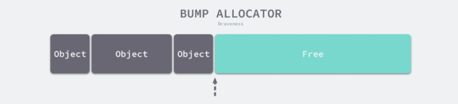
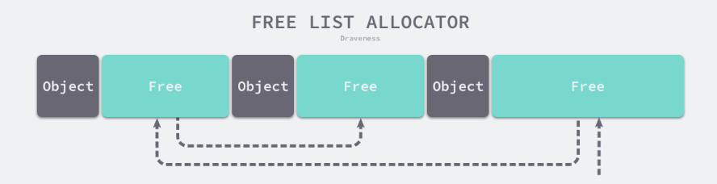
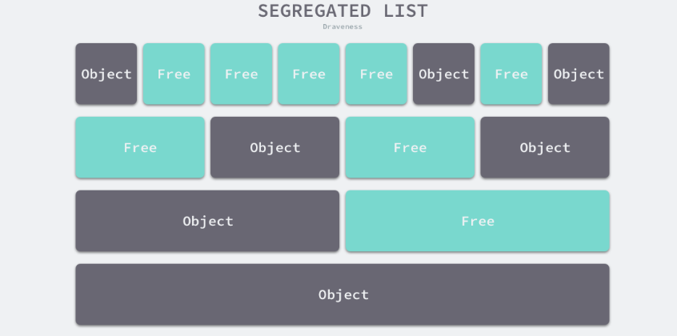
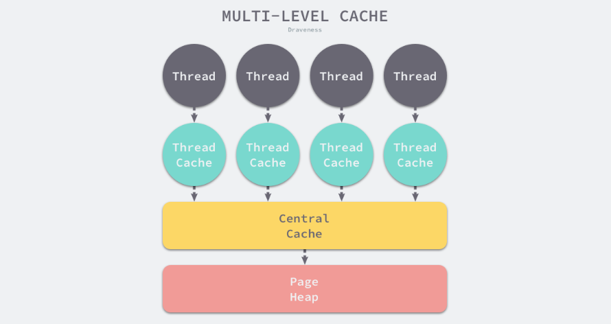

内存空间包含两个重要区域 — 栈区（Stack）和堆区（Heap）。函数调用的参数、返回值以及局部变量大都会被分配到栈上，这部分内存会由编译器进行管理；
不同编程语言使用不同的方法管理堆区的内存，C++ 等编程语言会由工程师主动申请和释放内存，Go 以及 Java 等编程语言会由工程师和编译器共同管理，堆中
的对象由内存分配器分配并由垃圾收集器回收。

内存管理一般包含三个不同的组件，分别是用户程序（Mutator）、分配器（Allocator）和收集器（Collector）1，当用户程序申请内存时，它会**通过内存分配
器申请新的内存，而分配器会负责从堆中初始化相应的内存区域**。

编程语言的内存分配器一般包含两种分配方法，一种是线性分配器（Sequential Allocator，Bump Allocator），另一种是空闲链表分配器（Free-List Allocator）

## 线性分配器

线性分配（Bump Allocator）是一种高效的内存分配方法，但是有较大的局限性。

线性分配器，只需要在内存中维护一个指向内存特定位置的指针，当用户程序申请内存时，分配器只需要检查剩余的空闲内存、返回分配的内存区域并修改指针在内存
中的位置，即移动下图中的指针：

它有较快的执行速度，以及较低的实现复杂度；但是线性分配器无法在内存被释放时重用内存。如下图所示，如果已经分配的内存被回收，线性分配器是无法重新利用红
色的这部分内存的：

正是因为线性分配器的这种特性，我们需要合适的垃圾回收算法配合使用。标记压缩（Mark-Compact）、复制回收（Copying GC）和分代
回收（Generational GC）等算法可以通过拷贝的方式整理存活对象的碎片，将空闲内存定期合并，这样就能利用线性分配器的效率提升内存分配器的性能了。

因为线性分配器的使用需要配合具有拷贝特性的垃圾回收算法

## 空闲链表分配器

空闲链表分配器（Free-List Allocator）可以重用已经被释放的内存，它在内部会维护一个类似链表的数据结构。当用户程序申请内存时，空闲链表分配器会
依次遍历空闲的内存块，找到足够大的内存，然后申请新的资源并修改链表：

因为不同的内存块以链表的方式连接，所以使用这种方式分配内存的分配器可以重新利用回收的资源，但是因为分配内存时需要遍历链表，所以它的时间
复杂度就是 O(n)。

空闲链表分配器可以选择不同的策略在链表中的内存块中进行选择，最常见的四种方式：

1. 首次适应（First-Fit）— 从链表头开始遍历，选择第一个大小大于申请内存的内存块；
2. 循环首次适应（Next-Fit）— 从上次遍历的结束位置开始遍历，选择第一个大小大于申请内存的内存块；
3. 最优适应（Best-Fit）— 从链表头遍历整个链表，选择最合适的内存块；
4. 隔离适应（Segregated-Fit）— 将内存分割成多个链表，每个链表中的内存块大小相同，申请内存时先找到满足条件的链表，再从链表中选择合适的内存块；

Go 语言使用的内存分配策略与第四种策略有些相似

### 隔离适应策略

如上图所示，该策略会将内存分割成由 4、8、16、32 字节的内存块组成的链表，当我们向内存分配器申请 8 字节的内存时，我们会在上图中的第二个链表
找到空闲的内存块并返回。隔离适应的分配策略减少了需要遍历的内存块数量，提高了内存分配的效率。

### 分级分配

线程缓存分配（Thread-Caching Malloc，TCMalloc）是用于分配内存的的机制，它比 glibc 中的 malloc 函数还要快很多

Go 语言的内存分配器就借鉴了 TCMalloc 的设计实现高速的内存分配，它的核心理念是**使用多级缓存根据将对象根据大小分类，并按照类别实施不同的分配策略**。

#### 对象大小

Go 语言的内存分配器会根据申请分配的内存大小选择不同的处理逻辑，运行时根据对象的大小将对象分成微对象、小对象和大对象三种：
微对象 `(0, 16B)`
小对象 `[16B, 32KB]`
大对象 `(32KB, +∞)`

**程序中的绝大多数对象的大小都在 32KB 以下，而申请的内存大小影响 Go 语言运行时分配内存的过程和开销，所以分别处理大对象和小对象有利于提
高内存分配器的性能**。

#### 多级缓存

内存分配器不仅会区别对待大小不同的对象，还会将内存分成不同的级别分别管理，TCMalloc 和 Go 运行时分配器都会引入线程
缓存（Thread Cache）、中心缓存（Central Cache）和页堆（Page Heap）三个组件分级管理内存：

线程缓存属于每一个独立的线程，它能够满足线程上绝大多数的内存分配需求，因为不涉及多线程，所以也不需要使用互斥锁来保护内存，这能够减少锁竞争带来的性能损耗。
当线程缓存不能满足需求时，就会使用中心缓存作为补充解决小对象的内存分配问题；在遇到 32KB 以上的对象时，内存分配器就会选择页堆直接分配大量的内存。

与计算机操作系统中的多级缓存也有些类似，因为多数的对象都是小对象，我们可以通过线程缓存和中心缓存提供足够的内存空间，发现资源不足时就从上一级组件中获取更多的内存资源。

自动内存管理的另一个重要的组成部分便是自动回收。

垃圾回收器

垃圾回收器的执行过程可根据代码的行为被划分为两个半独立的组件： 赋值器（Mutator）和回收器（Collector）。

赋值器指用户态代码。因为对垃圾回收器而言，需要回收的内存是由用户态的代码产生的，用户态代码仅仅只是在修改对象之间的引用关系（对象之间引
用关系的一个有向图，即对象图）进行操作。回收器即为程序运行时负责执行垃圾回收的代码。

Go 的内存分配器基于 Thread-Cache Malloc (tcmalloc) [1]，tcmalloc 为每个线程实现了一个本地缓存， 区分了小对象（小于 32kb）和大对象
分配两种分配类型，其管理的内存单元称为 span。

计算机领域中，无外乎时间换空间、空间换时间。统一管理内存会提前分配或一次性释放一大块内存， 进而减少与操作系统沟通造成的开销，进而提高程序的运
行性能。 支持内存管理另一个优势就是能够更好的支持垃圾回收

Go 的内存分配器核心组件：

Go GC 的特点 无分代 不整理 写屏障 并发标记清理（三色标记清扫）
