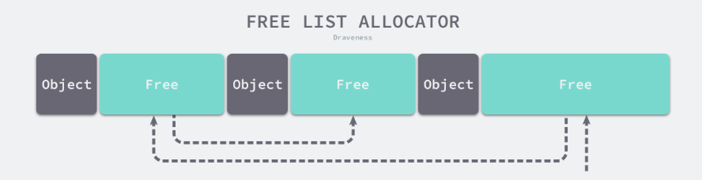

程序运行所产生的数据和变量会分配在内存空间中的两个区域：

- 栈（Stack），函数的参数，返回值，局部变量一般会被分配到这里，由编译器管理。
- 堆（Heap），堆的内存，不同的语言有不同的管理方法，Go 中由编译器和开发者共同管理，堆的对象由内存分配器分配并由垃圾收集器回收。

内存管理一般包含三个不同的组件：

- 用户程序（Mutator）
- 分配器（Allocator）
- 收集器（Collector）

户程序申请内存时，分配器申请新内存，并从堆中初始化相应的内存区域。

内存分配器一般包含两种：

- 线性分配器（Sequential Allocator，Bump Allocator）
- 空闲链表分配器（Free-List Allocator）

## 线性分配器

线性分配（Bump Allocator）只需要在内存中**维护一个指向内存特定位置的指针**，用户程序申请内存时，分配器只需要检查剩余的空闲内存、返回分配的内存区域并修改指针在内存
中的位置，即移动下图中的指针：


优势：

- 执行速度快
- 实现复杂度低

缺点：由于只维护了一空闲内存位置的指针，导致分配过的内存空间被释放后无法重用内存。如图红色部分内存无法无法重用：


所以线性分配器需要合适的垃圾回收算法配合使用。如，标记压缩（Mark-Compact）、复制回收（Copying GC）和分代回收（Generational GC）等算法可以通过拷贝的方式整理存活对象的碎片，将空闲内存定期合并，这样
就能利用线性分配器的效率提升内存分配器的性能了。

## 空闲链表分配器

空闲链表分配器（Free-List Allocator）内部维护了一个链表。申请内存时，空闲链表分配器会依次遍历空闲的内存块，找到足够大的内存，然后申请新的资源并修改链表：



这种方式可以重用内存，但是分配内存的时间复杂度就是 O(n)，因为需要遍历链表。

空闲链表分配器选择内存的四种方式：

1. 首次适应（First-Fit）— 从链表头开始遍历，选择第一个大小大于申请内存的内存块；
2. 循环首次适应（Next-Fit）— 从上次遍历的结束位置开始遍历，选择第一个大小大于申请内存的内存块；
3. 最优适应（Best-Fit）— 从链表头遍历整个链表，选择最合适的内存块；
4. 隔离适应（Segregated-Fit）— 将内存分割成多个链表，每个链表中的内存块大小相同，申请内存时先找到满足条件的链表，再从链表中选择合适的内存块；
减少了需要遍历的内存块数量，提高了内存分配的效率。

### 分级分配

Go 的内存分配器借鉴了 TCMalloc （Thread-Caching Malloc，线程缓存分配） 的设计。

Go 运行时根据对象的大小将对象分为三类：

- 微对象 `(0, 16B)`
- 小对象 `[16B, 32KB]`
- 大对象 `(32KB, +∞)`

**程序中的绝大多数对象的大小都在 32KB 以下，而申请的内存大小影响 Go 语言运行时分配内存的过程和开销，所以分别处理大对象和小对象有利于提高内存分配器的性能**。

#### 多级缓存

内存分配器不还将内存分成不同的级别分别管理，TCMalloc 和 Go 运行时分配器都会引入线程缓存（Thread Cache）、中心缓存（Central Cache）和页堆（Page Heap）三个组件分级管理内存：


线程缓存属于每一个独立的线程，它能够满足线程上绝大多数的内存分配需求，因为不涉及多线程，所以也不需要使用互斥锁来保护内存，这能够减少锁竞争带来的性能损耗。
当线程缓存不能满足需求时，就会使用中心缓存作为补充解决小对象的内存分配问题；在遇到 32KB 以上的对象时，内存分配器就会选择页堆直接分配大量的内存。

由于多数的对象都是小对象，可以通过线程缓存和中心缓存提供足够的内存空间，发现资源不足时就从上一级组件中获取更多的内存资源。

自动内存管理的另一个重要的组成部分便是自动回收。

垃圾回收器

垃圾回收器的执行过程可根据代码的行为被划分为两个半独立的组件： 赋值器（Mutator）和回收器（Collector）。

赋值器指用户态代码。因为对垃圾回收器而言，需要回收的内存是由用户态的代码产生的，用户态代码仅仅只是在修改对象之间的引用关系（对象之间引
用关系的一个有向图，即对象图）进行操作。回收器即为程序运行时负责执行垃圾回收的代码。

Go 的内存分配器基于 Thread-Cache Malloc (tcmalloc) [1]，tcmalloc 为每个线程实现了一个本地缓存， 区分了小对象（小于 32kb）和大对象
分配两种分配类型，其管理的内存单元称为 span。

计算机领域中，无外乎时间换空间、空间换时间。统一管理内存会提前分配或一次性释放一大块内存， 进而减少与操作系统沟通造成的开销，进而提高程序的运
行性能。 支持内存管理另一个优势就是能够更好的支持垃圾回收

Go 的内存分配器核心组件：

Go GC 的特点 无分代 不整理 写屏障 并发标记清理（三色标记清扫）

## 参考链接

- <https://draveness.me/golang/docs/part3-runtime/ch07-memory/golang-memory-allocator/>
- <https://changkun.de/golang/zh-cn/part2runtime/ch07alloc/>

逃逸分析
在 C 语言和 C++ 这类需要手动管理内存的编程语言中，将对象或者结构体分配到栈上或者堆上是由工程师自主决定的，这也为工程师的工作带来的挑战，如果工程师能够精准地为每一个变量分配最合理的空间，那么整个程序的运行效率和内存使用效率一定是最高的，但是手动分配内存会导致如下的两个问题：

- 不需要分配到堆上的对象分配到了堆上 — 浪费内存空间；
- 需要分配到堆上的对象分配到了栈上 — 悬挂指针、影响内存安全；

与悬挂指针相比，浪费的内存空间反而是小问题。在 C 语言中，栈上的变量被函数作为返回值返回给调用方是一个常见的错误，在如下所示的代码中，栈上的变量 i 被错误地返回：

```go
int *dangling_pointer() {
    int i = 2;
    return &i;
}
```

当 dangling_pointer 函数返回后，它的本地变量就会被编译器直接回收，调用方获取的是危险的悬挂指针，我们不确定当前指针指向的值是否合法，这种问题在大型项目中是比较难以发现和定位的。

在编译器优化中，**逃逸分析**（Escape analysis）是用来**决定指针动态作用域**的方法。Go 语言的编译器**使用逃逸分析决定哪些变量应该在栈上分配，哪些变量应该在堆上分配**，其中包括使用 new、make 和字面量等方法隐式分配的内存，Go 语言的逃逸分析遵循以下两个不变性：

- **指向栈对象的指针不能存在于堆中**；
- **指向栈对象的指针不能在栈对象回收后存活**；

- escape-analysis-and-key-invariants.png

上图展示两条不变性存在的意义，当我们违反了第一条不变性，堆上的绿色指针指向了栈中的黄色内存，一旦当前函数返回函数栈被回收，该绿色指针指向的值就不再合法；如果我们违反了第二条不变性，因为寄存器 SP 下面的内存由于函数返回已经被释放掉，所以黄色指针指向的内存已经不再合法。


逃逸分析是静态分析的一种，在编译器解析了 Go 语言源文件后，它可以获得整个程序的抽象语法树（Abstract syntax tree，AST），编译器可以根据抽象语法树分析静态的数据流，我们会通过以下几个步骤实现静态分析的全过程6：

- 构建带权重的有向图，其中顶点 cmd/compile/internal/gc.EscLocation 表示被分配的变量，边 cmd/compile/internal/gc.EscEdge 表示变量之间的分配关系，权重表示寻址和取地址的次数；
- 遍历对象分配图并查找违反两条不变性的变量分配关系，如果堆上的变量指向了栈上的变量，那么栈上的变量就需要分配在堆上；
- 记录从函数的调用参数到堆以及返回值的数据流，增强函数参数的逃逸分析；

决定变量是在栈上还是堆上虽然重要，但是这是一个定义相对清晰的问题，我们可以通过编译器在统一作出决策。为了保证内存的绝对安全，编译器可能会将一些变量错误地分配到堆上，但是因为这些对也会被垃圾收集器处理，所以不会造成内存泄露以及悬挂指针等安全问题，解放了工程师的生产力。
