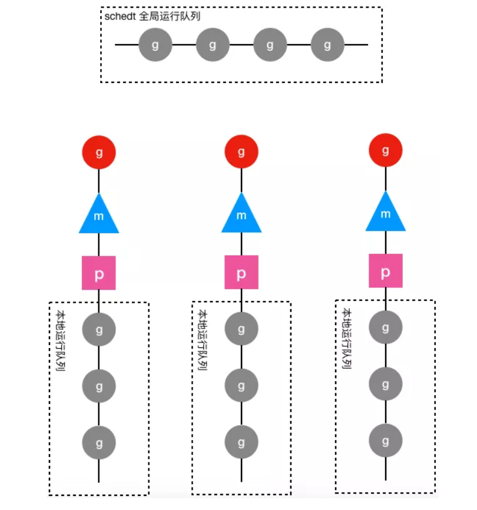

## Goroutine 是什么
goroutine 其实就是协程，也叫用户态线程，二级线程，为了解决系统线程太“重”的问题：
- 创建和切换太重，操作系统线程的创建和切换都需要进入内核，进入内核消耗的性能较高，开销大。
- 内存使用太重 1. 内核创建线程时，会默认分配一块较大的栈内存，避免极端情况下，系统线程栈的溢出。但是大部分情况下，系统线程
用不了那么多内存，导致浪费。2. 栈内存空间一旦创建和初始化完成后，大小就不能再改变，在某些场景下，线程栈还是有溢出的
风险


goroutine 是用户态线程，它的创建和切换，都是在用户代码中完成的，不需要进入系统内核，开销远远小于系统线程的创建和切换

goroutine 启动时 默认栈大小是 2 k。栈不够用就自动扩展，如果太大了就自动收缩。避免了内存的浪费，和栈溢出的风险。

goroutine 建立在系统线程之上，与系统线程是一个多对多（M:N）的模型。

M 指 M 个 goroutine 运行在 N 个系统线程之上，系统内核负责对 N 个线程的调度，N 个线程又负责对 M 个 goroutine 调度。

## 调度器初始化

```go
func schedinit() {
// raceinit must be the first call to race detector.
// In particular, it must be done before mallocinit below calls racemapshadow.
   
    //getg函数在源代码中没有对应的定义，由编译器插入类似下面两行代码
    //get_tls(CX)
    //MOVQ g(CX), BX; BX存器里面现在放的是当前g结构体对象的地址
    _g_ := getg() // _g_ = &g0

    ......

    //设置最多启动10000个操作系统线程，也是最多10000个M
    sched.maxmcount = 10000

    ......
   
    mcommoninit(_g_.m) //初始化m0，因为从前面的代码我们知道g0->m = &m0

    ......

    sched.lastpoll = uint64(nanotime())
    procs := ncpu  //系统中有多少核，就创建和初始化多少个p结构体对象
    if n, ok := atoi32(gogetenv("GOMAXPROCS")); ok && n > 0 {
        procs = n //如果环境变量指定了GOMAXPROCS，则创建指定数量的p
    }
    if procresize(procs) != nil {//创建和初始化全局变量 allp
        throw("unknown runnable goroutine during bootstrap")
    }

    ......
}
```
g0的地址已经被设置到了线程本地存储之中，schedinit通过getg函数（getg函数是编译器实现的，我们在源代码中是找不到其定义的）从线程本地存
储中获取当前正在运行的g，这里获取出来的是g0，然后调用mcommoninit函数对m0(g0.m)进行必要的初始化，对m0初始化完成之后调用procresize初始化系
统需要用到的p结构体对象，按照go语言官方的说法，p就是processor的意思，它的数量决定了最多可以有都少个goroutine同时并行运行。schedinit函数除了
初始化m0和p，还设置了全局变量sched的maxmcount成员为10000，限制最多可以创建10000个操作系统线程出来工作。

```go
func mcommoninit(mp *m) {
    _g_ := getg() //初始化过程中_g_ = g0

    // g0 stack won't make sense for user (and is not necessary unwindable).
    if _g_ != _g_.m.g0 {  //函数调用栈traceback，不需要关心
        callers(1, mp.createstack[:])
    }

    lock(&sched.lock)
    if sched.mnext+1 < sched.mnext {
        throw("runtime: thread ID overflow")
    }
    mp.id = sched.mnext
    sched.mnext++
    checkmcount() //检查已创建系统线程是否超过了数量限制（10000）

    //random初始化
    mp.fastrand[0] = 1597334677 * uint32(mp.id)
    mp.fastrand[1] = uint32(cputicks())
    if mp.fastrand[0]|mp.fastrand[1] == 0 {
        mp.fastrand[1] = 1
    }

    //创建用于信号处理的gsignal，只是简单的从堆上分配一个g结构体对象,然后把栈设置好就返回了
    mpreinit(mp)
    if mp.gsignal != nil {
        mp.gsignal.stackguard1 = mp.gsignal.stack.lo + _StackGuard
    }

    //把 m 挂入全局链表 allm 之中
    // Add to allm so garbage collector doesn't free g->m
    // when it is just in a register or thread-local storage.
    mp.alllink = allm

    // NumCgoCall() iterates over allm w/o schedlock,
    // so we need to publish it safely.
    atomicstorep(unsafe.Pointer(&allm), unsafe.Pointer(mp))
    unlock(&sched.lock)

    // Allocate memory to hold a cgo traceback if the cgo call crashes.
    if iscgo || GOOS == "solaris" || GOOS == "windows" {
        mp.cgoCallers = new(cgoCallers)
    }
}
```
这里并未对m0做什么关于调度相关的初始化，只是把m0放入全局链表allm之中就返回了。

继续调用procresize创建和初始化p结构体对象，在这个函数里面会创建指定个数（根据cpu核数或环境变量确定）的p结构体对象放在全
变量allp里, 并把m0和allp[0]绑定在一起，因此当这个函数执行完成之后就有

```go
m0.p = allp[0]
allp[0].m = &m0
```
到此m0, g0, 和m需要的p完全关联在一起了。


### 初始化allp
```go
func procresize(nprocs int32) *p {
    old := gomaxprocs //系统初始化时 gomaxprocs = 0

    ......

    // Grow allp if necessary.
    if nprocs > int32(len(allp)) { //初始化时 len(allp) == 0
        // Synchronize with retake, which could be running
        // concurrently since it doesn't run on a P.
        lock(&allpLock)
        if nprocs <= int32(cap(allp)) {
            allp = allp[:nprocs]
        } else { //初始化时进入此分支，创建allp 切片
            nallp := make([]*p, nprocs)
            // Copy everything up to allp's cap so we
            // never lose old allocated Ps.
            copy(nallp, allp[:cap(allp)])
            allp = nallp
        }
        unlock(&allpLock)
    }

    // initialize new P's
    //循环创建nprocs个p并完成基本初始化
    for i := int32(0); i < nprocs; i++ {
        pp := allp[i]
        if pp == nil {
            pp = new(p)//调用内存分配器从堆上分配一个struct p
            pp.id = i
            pp.status = _Pgcstop
            ......
            atomicstorep(unsafe.Pointer(&allp[i]), unsafe.Pointer(pp))
        }

        ......
    }

    ......

    _g_ := getg()  // _g_ = g0
    if _g_.m.p != 0 && _g_.m.p.ptr().id < nprocs {//初始化时m0->p还未初始化，所以不会执行这个分支
        // continue to use the current P
        _g_.m.p.ptr().status = _Prunning
        _g_.m.p.ptr().mcache.prepareForSweep()
    } else {//初始化时执行这个分支
        // release the current P and acquire allp[0]
        if _g_.m.p != 0 {//初始化时这里不执行
            _g_.m.p.ptr().m = 0
        }
        _g_.m.p = 0
        _g_.m.mcache = nil
        p := allp[0]
        p.m = 0
        p.status = _Pidle
        acquirep(p) //把p和m0关联起来，其实是这两个strct的成员相互赋值
        if trace.enabled {
            traceGoStart()
        }
    }
   
    //下面这个for 循环把所有空闲的p放入空闲链表
    var runnablePs *p
    for i := nprocs - 1; i >= 0; i-- {
        p := allp[i]
        if _g_.m.p.ptr() == p {//allp[0]跟m0关联了，所以是不能放任
            continue
        }
        p.status = _Pidle
        if runqempty(p) {//初始化时除了allp[0]其它p全部执行这个分支，放入空闲链表
            pidleput(p)
        } else {
            ......
        }
    }

    ......
   
    return runnablePs
}
```

这个函数的主要流程：
1. 使用make([]*p, nprocs)初始化全局变量allp，即allp = make([]*p, nprocs)
2. 循环创建并初始化nprocs个p结构体对象并依次保存在allp切片之中
3. 把m0和allp[0]绑定在一起，即m0.p = allp[0], allp[0].m = m0
4. 把除了allp[0]之外的所有p放入到全局变量sched的pidle空闲队列之中

## main goroutine 的创建
schedinit完成调度系统初始化后，返回到rt0_go函数中开始调用newproc() 创建一个新的goroutine用于执行mainPC所对应的runtime·main函数

```sh
# create a new goroutine to start program
MOVQ  $runtime·mainPC(SB), AX # entry，mainPC是runtime.main
# newproc的第二个参数入栈，也就是新的goroutine需要执行的函数
PUSHQ  AX          # AX = &funcval{runtime·main},

# newproc的第一个参数入栈，该参数表示runtime.main函数需要的参数大小，因为runtime.main没有参数，所以这里是0
PUSHQ  $0
CALL  runtime·newproc(SB) # 创建main goroutine
POPQ  AX
POPQ  AX

# start this M
CALL  runtime·mstart(SB)  # 主线程进入调度循环，运行刚刚创建的goroutine

# 上面的mstart永远不应该返回的，如果返回了，一定是代码逻辑有问题，直接abort
CALL  runtime·abort(SB)// mstart should never return
RET

DATA  runtime·mainPC+0(SB)/8,$runtime·main(SB)
GLOB  Lruntime·mainPC(SB),RODATA,$8
```

newproc函数用于创建新的goroutine，它有两个参数，先说第二个参数fn，新创建出来的goroutine将从fn这个函数开始执行，而这个fn函数可能也会
有参数，newproc的第一个参数正是fn函数的参数以字节为单位的大小。比如
```go
func start(a, b, c int64) {
    ......
}

func main() {
    go start(1, 2, 3)
}
```
编译器在编译上面的go语句时，就会把其替换为对newproc函数的调用，编译后的代码逻辑上等同于下面的伪代码

```go
func main() {
    push 0x3
    push 0x2
    push 0x1
    runtime.newproc(24, start)
}
```

编译器编译时首先会用几条指令把start函数需要用到的3个参数压栈，然后调用newproc函数。因为start函数的3个int64类型的参数共占24个字节，所以
传递给newproc的第一个参数是24，表示start函数需要24字节大小的参数。


为什么需要传递fn函数的参数大小给newproc函数呢？
原因就在于newproc函数将创建一个新的goroutine来执行fn函数，而这个新创建的goroutine与当前这个goroutine会使用不同的栈，因此就需要在创
建goroutine的时候把fn需要用到的参数先从当前goroutine的栈上拷贝到新的goroutine的栈上之后才能让其开始执行，而newproc函数本身并不知道需要拷
贝多少数据到新创建的goroutine的栈上去，所以需要用参数的方式指定拷贝多少数据。

newproc函数是对newproc1的一个包装，这里最重要的准备工作有两个，一个是获取fn函数第一个参数的地址（代码中的argp），另一个是使用systemstack函数
切换到g0栈，当然，对于我们这个初始化场景来说现在本来就在g0栈，所以不需要切换，然而这个函数是通用的，在用户的goroutine中也会创建goroutine，这时
就需要进行栈的切换。

```go
// Create a new g running fn with siz bytes of arguments.
// Put it on the queue of g's waiting to run.
// The compiler turns a go statement into a call to this.
// Cannot split the stack because it assumes that the arguments
// are available sequentially after &fn; they would not be
// copied if a stack split occurred.
//go:nosplit
func newproc(siz int32, fn *funcval) {
    //函数调用参数入栈顺序是从右向左，而且栈是从高地址向低地址增长的
    //注意：argp指向fn函数的第一个参数，而不是newproc函数的参数
    //参数fn在栈上的地址+8的位置存放的是fn函数的第一个参数
    argp := add(unsafe.Pointer(&fn), sys.PtrSize)
    gp := getg()  //获取正在运行的g，初始化时是m0.g0
   
    //getcallerpc()返回一个地址，也就是调用newproc时由call指令压栈的函数返回地址，
    //对于我们现在这个场景来说，pc就是CALLruntime·newproc(SB)指令后面的POPQ AX这条指令的地址
    pc := getcallerpc()
   
    //systemstack的作用是切换到g0栈执行作为参数的函数
    //我们这个场景现在本身就在g0栈，因此什么也不做，直接调用作为参数的函数
    systemstack(func() {
        newproc1(fn, (*uint8)(argp), siz, gp, pc)
    })
}
```

newproc1函数的第一个参数fn是新创建的goroutine需要执行的函数，注意这个fn的类型是funcval结构体类型，其定义如下：
```go
type funcval struct {
    fn uintptr
    // variable-size, fn-specific data here
}
```

newproc1的第二个参数argp是fn函数的第一个参数的地址，第三个参数是fn函数的参数以字节为单位的大小

newproc1是在g0的栈上执行的。该函数很长也很重要

```go
// Create a new g running fn with narg bytes of arguments starting
// at argp. callerpc is the address of the go statement that created
// this. The new g is put on the queue of g's waiting to run.
func newproc1(fn *funcval, argp *uint8, narg int32, callergp *g, callerpc uintptr) {
    //因为已经切换到g0栈，所以无论什么场景都有 _g_ = g0，当然这个g0是指当前工作线程的g0
    //对于我们这个场景来说，当前工作线程是主线程，所以这里的g0 = m0.g0
    _g_ := getg()

    ......

    _p_ := _g_.m.p.ptr() //初始化时_p_ = g0.m.p，从前面的分析可以知道其实就是allp[0]
    newg := gfget(_p_) //从p的本地缓冲里获取一个没有使用的g，初始化时没有，返回nil
    if newg == nil {
         //new一个g结构体对象，然后从堆上为其分配栈，并设置g的stack成员和两个stackgard成员
        newg = malg(_StackMin)
        casgstatus(newg, _Gidle, _Gdead) //初始化g的状态为_Gdead
         //放入全局变量allgs切片中
        allgadd(newg) // publishes with a g->status of Gdead so GC scanner doesn't look at uninitialized stack.
    }
   
    ......
   
    //调整g的栈顶置针，无需关注
    totalSize := 4*sys.RegSize + uintptr(siz) + sys.MinFrameSize // extra space in case of reads slightly beyond frame
    totalSize += -totalSize & (sys.SpAlign - 1)                  // align to spAlign
    sp := newg.stack.hi - totalSize
    spArg := sp

    //......
   
    if narg > 0 {
         //把参数从执行newproc函数的栈（初始化时是g0栈）拷贝到新g的栈
        memmove(unsafe.Pointer(spArg), unsafe.Pointer(argp), uintptr(narg))
        // ......
    }
```

这段代码主要从堆上分配一个g结构体对象并为这个newg分配一个大小为2048字节的栈，并设置好newg的stack成员，然后把newg需要执行的函数的参
数从执行newproc函数的栈（初始化时是g0栈）拷贝到newg的栈

newg的stack.hi和stack.lo分别指向了其栈空间的起止位置。

```go
//把newg.sched结构体成员的所有成员设置为0
memclrNoHeapPointers(unsafe.Pointer(&newg.sched), unsafe.Sizeof(newg.sched))

//设置newg的sched成员，调度器需要依靠这些字段才能把goroutine调度到CPU上运行。
newg.sched.sp = sp  //newg的栈顶
newg.stktopsp = sp
//newg.sched.pc表示当newg被调度起来运行时从这个地址开始执行指令
//把pc设置成了goexit这个函数偏移1（sys.PCQuantum等于1）的位置，
//至于为什么要这么做需要等到分析完gostartcallfn函数才知道
newg.sched.pc = funcPC(goexit) + sys.PCQuantum // +PCQuantum so that previous instruction is in same function
newg.sched.g = guintptr(unsafe.Pointer(newg))

gostartcallfn(&newg.sched, fn) //调整sched成员和newg的栈
```

这段代码首先对newg的sched成员进行了初始化，该成员包含了调度器代码在调度goroutine到CPU运行时所必须的一些信息

其中sched的sp成员表示newg被调度起来运行时应该使用的栈的栈顶，sched的pc成员表示当newg被调度起来运行时从这个地址开始执行指令，然而从上面
的代码可以看到，new.sched.pc被设置成了goexit函数的第二条指令的地址而不是fn.fn，这是为什么呢？

```go
// adjust Gobuf as if it executed a call to fn
// and then did an immediate gosave.
func gostartcallfn(gobuf *gobuf, fv *funcval) {
    var fn unsafe.Pointer
    if fv != nil {
        fn = unsafe.Pointer(fv.fn) //fn: gorotine的入口地址，初始化时对应的是runtime.main
    } else {
        fn = unsafe.Pointer(funcPC(nilfunc))
    }
    gostartcall(gobuf, fn, unsafe.Pointer(fv))
}
```

gostartcallfn首先从参数fv中提取出函数地址（初始化时是runtime.main），然后继续调用gostartcall函数。
```go
// adjust Gobuf as if it executed a call to fn with context ctxt
// and then did an immediate gosave.
func gostartcall(buf *gobuf, fn, ctxt unsafe.Pointer) {
    sp := buf.sp //newg的栈顶，目前newg栈上只有fn函数的参数，sp指向的是fn的第一参数
    if sys.RegSize > sys.PtrSize {
        sp -= sys.PtrSize
        *(*uintptr)(unsafe.Pointer(sp)) = 0
    }
    sp -= sys.PtrSize //为返回地址预留空间，
    //这里在伪装fn是被goexit函数调用的，使得fn执行完后返回到goexit继续执行，从而完成清理工作
    *(*uintptr)(unsafe.Pointer(sp)) = buf.pc //在栈上放入goexit+1的地址
    buf.sp = sp //重新设置newg的栈顶寄存器
    //这里才真正让newg的ip寄存器指向fn函数，注意，这里只是在设置newg的一些信息，newg还未执行，
    //等到newg被调度起来运行时，调度器会把buf.pc放入cpu的IP寄存器，
    //从而使newg得以在cpu上真正的运行起来
    buf.pc = uintptr(fn)
    buf.ctxt = ctxt
}
```
gostartcall函数的主要作用有两个：
1. 调整newg的栈空间，把goexit函数的第二条指令的地址入栈，伪造成goexit函数调用了fn，从而使fn执行完成后执行ret指令时返
回到goexit继续执行完成最后的清理工作；
2. 重新设置newg.buf.pc 为需要执行的函数的地址，即fn，我们这个场景为runtime.main函数的地址。

调整完成newg的栈和sched成员之后，返回到newproc1函数
```go
newg.gopc = callerpc  //主要用于traceback
newg.ancestors = saveAncestors(callergp)
//设置newg的startpc为fn.fn，该成员主要用于函数调用栈的traceback和栈收缩
//newg真正从哪里开始执行并不依赖于这个成员，而是sched.pc
newg.startpc = fn.fn  

......

//设置g的状态为_Grunnable，表示这个g代表的goroutine可以运行了
casgstatus(newg, _Gdead, _Grunnable)

......

//把newg放入_p_的运行队列，初始化的时候一定是p的本地运行队列，其它时候可能因为本地队列满了而放入全局队列
runqput(_p_, newg, true)

......
}
```


1. 首先，main goroutine对应的newg结构体对象的sched成员已经完成了初始化，图中只显示了pc和sp成员，pc成员指向了runtime.main函数的第一条
指令，sp成员指向了newg的栈顶内存单元，该内存单元保存了runtime.main函数执行完成之后的返回地址，也就是runtime.goexit函数的第二条指令，预
期runtime.main函数执行完返回之后就会去执行runtime.exit函数的CALL runtime.goexit1(SB)这条指令；
2. 其次，newg已经放入与当前主线程绑定的p结构体对象的本地运行队列，因为它是第一个真正意义上的goroutine，还没有其它goroutine，所以它被
放在了本地运行队列的头部；
3. 最后，newg的m成员为nil，因为它还没有被调度起来运行，也就没有跟任何m进行绑定。

## main goroutine 的调度
调度器如何把main goroutine调度到CPU上去运行 ?
如何保存g0的调度信息？

schedule函数有什么重要作用？

gogo函数如何完成从g0到main goroutine的切换？

```go
func mstart() {

    _g_ := getg() //_g_ = g0
    //对于启动过程来说，g0的stack.lo早已完成初始化，所以onStack = false
    osStack := _g_.stack.lo == 0
    if osStack {
        // Initialize stack bounds from system stack.
        // Cgo may have left stack size in stack.hi.
        // minit may update the stack bounds.
        size := _g_.stack.hi
        if size == 0 {
            size = 8192 * sys.StackGuardMultiplier
        }
        _g_.stack.hi = uintptr(noescape(unsafe.Pointer(&size)))
        _g_.stack.lo = _g_.stack.hi - size + 1024
    }
    // Initialize stack guards so that we can start calling
    // both Go and C functions with stack growth prologues.
    _g_.stackguard0 = _g_.stack.lo + _StackGuard
    _g_.stackguard1 = _g_.stackguard0
    
    mstart1()
    // Exit this thread.
    if GOOS == "windows" || GOOS == "solaris" || GOOS == "plan9" || GOOS == "darwin" || GOOS == "aix" {
        // Window, Solaris, Darwin, AIX and Plan 9 always system-allocate
        // the stack, but put it in _g_.stack before mstart,
        // so the logic above hasn't set osStack yet.
        osStack = true
    }
    mexit(osStack)
}


func mstart1() {

    _g_ := getg()  //启动过程时 _g_ = m0的g0
    if _g_ != _g_.m.g0 {
        throw("bad runtime·mstart")
    }
    // Record the caller for use as the top of stack in mcall and
    // for terminating the thread.
    // We're never coming back to mstart1 after we call schedule,
    // so other calls can reuse the current frame.
    //getcallerpc()获取mstart1执行完的返回地址
    //getcallersp()获取调用mstart1时的栈顶地址
    save(getcallerpc(), getcallersp())
    asminit()  //在AMD64 Linux平台中，这个函数什么也没做，是个空函数
    minit()    //与信号相关的初始化，目前不需要关心
    // Install signal handlers; after minit so that minit can
    // prepare the thread to be able to handle the signals.
    if _g_.m == &m0 { //启动时_g_.m是m0，所以会执行下面的mstartm0函数
        mstartm0() //也是信号相关的初始化，现在我们不关注
    }
    if fn := _g_.m.mstartfn; fn != nil { //初始化过程中fn == nil
        fn()
    }
    if _g_.m != &m0 {// m0已经绑定了allp[0]，不是m0的话还没有p，所以需要获取一个p
        acquirep(_g_.m.nextp.ptr())
        _g_.m.nextp = 0
    }
    
    //schedule函数永远不会返回
    schedule()
}
```

mstart1首先调用save函数来保存g0的调度信息，save这一行代码非常重要，是我们理解调度循环的关键点之一。这里首先需要注意的是代码中的getcallerpc()
返回的是mstart调用mstart1时被call指令压栈的返回地址，getcallersp()函数返回的是调用mstart1函数之前mstart函数的栈顶地址

```go
// save updates getg().sched to refer to pc and sp so that a following

// gogo will restore pc and sp.
//
// save must not have write barriers because invoking a write barrier
// can clobber getg().sched.
//
//go:nosplit
//go:nowritebarrierrec
func save(pc, sp uintptr) {
    _g_ := getg()
    _g_.sched.pc = pc //再次运行时的指令地址
    _g_.sched.sp = sp //再次运行时到栈顶
    _g_.sched.lr = 0
    _g_.sched.ret = 0
    _g_.sched.g = guintptr(unsafe.Pointer(_g_))
    // We need to ensure ctxt is zero, but can't have a write
    // barrier here. However, it should always already be zero.
    // Assert that.
    if _g_.sched.ctxt != nil {
        badctxt()
    }
}
```

save函数保存了调度相关的所有信息，包括最为重要的当前正在运行的g的下一条指令的地址和栈顶地址

不管是对g0还是其它goroutine来说这些信息在调度过程中都是必不可少的，我们会在后面的调度分析中看到调度器是如何利用这些信息来完成调度的。


g0.sched.sp指向了mstart1函数执行完成后的返回地址，该地址保存在了mstart函数的栈帧之中；g0.sched.pc指向的是mstart函数中调用mstart1函
数之后的 if 语句。

save函数执行完成后，返回到mstart1继续其它跟m相关的一些初始化，完成这些初始化后则调用调度系统的核心函数schedule()完成goroutine的调度

之所以说它是核心，原因在于每次调度goroutine都是从schedule函数开始的。

```go
// One round of scheduler: find a runnable goroutine and execute it.

// Never returns.
func schedule() {
    _g_ := getg()  //_g_ = 每个工作线程m对应的g0，初始化时是m0的g0
    //......
    var gp *g
  
    //......
    
    if gp == nil {
        // Check the global runnable queue once in a while to ensure fairness.
        // Otherwise two goroutines can completely occupy the local runqueue
        // by constantly respawning each other.
        //为了保证调度的公平性，每进行61次调度就需要优先从全局运行队列中获取goroutine，
        //因为如果只调度本地队列中的g，那么全局运行队列中的goroutine将得不到运行
        if _g_.m.p.ptr().schedtick%61 == 0 && sched.runqsize > 0 {
            lock(&sched.lock) //所有工作线程都能访问全局运行队列，所以需要加锁
            gp = globrunqget(_g_.m.p.ptr(), 1) //从全局运行队列中获取1个goroutine
            unlock(&sched.lock)
        }
    }
    if gp == nil {
        //从与m关联的p的本地运行队列中获取goroutine
        gp, inheritTime = runqget(_g_.m.p.ptr())
        if gp != nil && _g_.m.spinning {
            throw("schedule: spinning with local work")
        }
    }
    if gp == nil {
        //如果从本地运行队列和全局运行队列都没有找到需要运行的goroutine，
        //则调用findrunnable函数从其它工作线程的运行队列中偷取，如果偷取不到，则当前工作线程进入睡眠，
        //直到获取到需要运行的goroutine之后findrunnable函数才会返回。
      gp, inheritTime = findrunnable() // blocks until work is available
    }
    //跟启动无关的代码.....
    //当前运行的是runtime的代码，函数调用栈使用的是g0的栈空间
    //调用execte切换到gp的代码和栈空间去运行
    execute(gp, inheritTime)  
}
```

schedule函数通过调用globrunqget()和runqget()函数分别从全局运行队列和当前工作线程的本地运行队列中选取下一个需要运行的goroutine，如果
这两个队列都没有需要运行的goroutine则通过findrunnalbe()函数从其它p的运行队列中盗取goroutine，一旦找到下一个需要运行的goroutine，则
调用excute函数从g0切换到该goroutine去运行。对于我们这个场景来说，前面的启动流程已经创建好第一个goroutine并放入了当前工作线程的本地运行队列，所
以这里会通过runqget把目前唯一的一个goroutine取出来


execute函数是如何把从运行队列中找出来的goroutine调度到CPU上运行的。

```go
// Schedules gp to run on the current M.

// If inheritTime is true, gp inherits the remaining time in the
// current time slice. Otherwise, it starts a new time slice.
// Never returns.
//
// Write barriers are allowed because this is called immediately after
// acquiring a P in several places.
//
//go:yeswritebarrierrec
func execute(gp *g, inheritTime bool) {
    _g_ := getg() //g0
    //设置待运行g的状态为_Grunning
    casgstatus(gp, _Grunnable, _Grunning)
  
    //......
    
    //把g和m关联起来
    _g_.m.curg = gp 
    gp.m = _g_.m
    //......
    //gogo完成从g0到gp真正的切换
    gogo(&gp.sched)
}
```

完成gp运行前的准备工作之后，execute调用gogo函数完成从g0到gp的的切换：**CPU执行权的转让以及栈的切换**。


execute函数的第一个参数gp即是需要调度起来运行的goroutine，这里首先把gp的状态从_Grunnable修改为_Grunning，然后把gp和m关联起来，这样通
过m就可以找到当前工作线程正在执行哪个goroutine，反之亦然。

执行流的切换从本质上来说就是CPU寄存器以及函数调用栈的切换，然而不管是go还是c这种高级语言都无法精确控制CPU寄存器的修改，因而高级语言在这
里也就无能为力了，只能依靠汇编指令来达成目的。

```sh
# func gogo(buf *gobuf)

# restore state from Gobuf; longjmp
TEXT runtime·gogo(SB), NOSPLIT, $16-8
    #buf = &gp.sched
    MOVQ  buf+0(FP), BX   # BX = buf
  
    #gobuf->g --> dx register
    MOVQ  gobuf_g(BX), DX  # DX = gp.sched.g
  
    #下面这行代码没有实质作用，检查gp.sched.g是否是nil，如果是nil进程会crash死掉
    MOVQ  0(DX), CX   # make sure g != nil
  
    get_tls(CX) 
  
    #把要运行的g的指针放入线程本地存储，这样后面的代码就可以通过线程本地存储
    #获取到当前正在执行的goroutine的g结构体对象，从而找到与之关联的m和p
    MOVQ  DX, g(CX)
  
    #把CPU的SP寄存器设置为sched.sp，完成了栈的切换
    MOVQ  gobuf_sp(BX), SP  # restore SP
  
    #下面三条同样是恢复调度上下文到CPU相关寄存器
    MOVQ  gobuf_ret(BX), AX
    MOVQ  gobuf_ctxt(BX), DX
    MOVQ  gobuf_bp(BX), BP
  
    #清空sched的值，因为我们已把相关值放入CPU对应的寄存器了，不再需要，这样做可以少gc的工作量
    MOVQ  $0, gobuf_sp(BX)  # clear to help garbage collector
    MOVQ  $0, gobuf_ret(BX)
    MOVQ  $0, gobuf_ctxt(BX)
    MOVQ  $0, gobuf_bp(BX)
  
    #把sched.pc值放入BX寄存器
    MOVQ  gobuf_pc(BX), BX
  
    #JMP把BX寄存器的包含的地址值放入CPU的IP寄存器，于是，CPU跳转到该地址继续执行指令，
    JMP BX
```

execute函数在调用gogo时把gp的sched成员的地址作为实参（型参buf）传递了过来，该参数位于FP寄存器所指的位置，所以第1条指令
```sh
MOVQ  buf+0(FP), BX # &gp.sched --> BX
```
把buf的值也就是gp.sched的地址放在了BX寄存器之中，这样便于后面的指令依靠BX寄存器来存取gp.sched的成员。sched成员保存了调度相关的信息，上一节
我们已经看到，main goroutine创建时已经把这些信息设置好了。

```sh
MOVQ  gobuf_g(BX), DX  # gp.sched.g --> DX
```
把gp.sched.g读取到DX寄存器，注意这条指令的源操作数是间接寻址，如果读者对间接寻址不熟悉的话可以参考预备知识汇编语言部分。

```sh
MOVQ  0(DX), CX # make sure g != nil
```

的作用在于检查gp.sched.g是否为nil，如果为nil指针的话，这条指令会导致程序死掉，有读者可能会有疑问，为什么要让它死掉啊，原因在于
这个gp.sched.g是由go runtime代码负责设置的，按道理说不可能为nil，如果为nil，一定是程序逻辑写得有问题，所以需要把这个bug暴露出来，而不
是把它隐藏起来。

```sh
get_tls(CX)

#把DX值也就是需要运行的goroutine的指针写入线程本地存储之中
#运行这条指令之前，线程本地存储存放的是g0的地址
MOVQ  DX, g(CX)
```

把DX寄存器的值也就是gp.sched.g(这是一个指向g的指针)写入线程本地存储之中，这样后面的代码就可以通过线程本地存储获取到当前正
在执行的goroutine的g结构体对象，从而找到与之关联的m和p。
```sh
MOVQ  gobuf_sp(BX), SP # restore SP
```
设置CPU的栈顶寄存器SP为gp.sched.sp，这条指令完成了栈的切换，从g0的栈切换到了gp的栈。

```sh
#下面三条同样是恢复调度上下文到CPU相关寄存器

  MOVQ  gobuf_ret(BX), AX #系统调用的返回值放入AX寄存器
  MOVQ  gobuf_ctxt(BX), DX
  MOVQ  gobuf_bp(BX), BP
  
  //清空gp.sched中不再需要的值，因为我们已把相关值放入CPU对应的寄存器了，不再需要，这样做可以少gc的工作量
  MOVQ  $0, gobuf_sp(BX)  // clear to help garbage collector
  MOVQ  $0, gobuf_ret(BX)
  MOVQ  $0, gobuf_ctxt(BX)
  MOVQ  $0, gobuf_bp(BX)
```
一是根据gp.sched其它字段设置CPU相关寄存器，可以看到这里恢复了CPU的栈基地址寄存器BP，二是把gp.sched中已经不需要的成员
设置为0，这样可以减少gc的工作量。

```sh
MOVQ  gobuf_pc(BX), BX
```

把gp.sched.pc的值读取到BX寄存器，这个pc值是gp这个goroutine马上需要执行的第一条指令的地址，对于我们这个场景来说它现在
就是runtime.main函数的第一条指令，现在这条指令的地址就放在BX寄存器里面。最后一条指令
```sh
JMP  BX
```

JMP BX指令把BX寄存器里面的指令地址放入CPU的rip寄存器，于是，CPU就会跳转到该地址继续执行属于gp这个goroutine的代码，这样就完
成了goroutine的切换。

这15条指令，其实就只做了两件事：
1. 把gp.sched的成员恢复到CPU的寄存器完成状态以及栈的切换；
2. 跳转到gp.sched.pc所指的指令地址（runtime.main）处执行。

现在已经从g0切换到了gp这个goroutine，对于我们这个场景来说，gp还是第一次被调度起来运行，它的入口函数是runtime.main，所以接下来CPU就开
始执行runtime.main函数：

```go
// The main goroutine.

func main() {
    g := getg()  // g = main goroutine，不再是g0了
    ......
    // Max stack size is 1 GB on 64-bit, 250 MB on 32-bit.
    // Using decimal instead of binary GB and MB because
    // they look nicer in the stack overflow failure message.
    if sys.PtrSize == 8 { //64位系统上每个goroutine的栈最大可达1G
        maxstacksize = 1000000000
    } else {
        maxstacksize = 250000000
    }
    // Allow newproc to start new Ms.
    mainStarted = true
    if GOARCH != "wasm" { // no threads on wasm yet, so no sysmon
        //现在执行的是main goroutine，所以使用的是main goroutine的栈，需要切换到g0栈去执行newm()
        systemstack(func() {
            //创建监控线程，该线程独立于调度器，不需要跟p关联即可运行
             newm(sysmon, nil)
        })
    }
    
    ......
    //调用runtime包的初始化函数，由编译器实现
    runtime_init() // must be before defer
    // Record when the world started.
    runtimeInitTime = nanotime()
    gcenable()  //开启垃圾回收器
    ......
    //main 包的初始化函数，也是由编译器实现，会递归的调用我们import进来的包的初始化函数
    fn := main_init // make an indirect call, as the linker doesn't know the address of the main package when laying down the runtime
    fn()
    ......
    
    //调用main.main函数
    fn = main_main // make an indirect call, as the linker doesn't know the address of the main package when laying down the runtime
    fn()
    
    ......
    //进入系统调用，退出进程，可以看出main goroutine并未返回，而是直接进入系统调用退出进程了
    exit(0)
    
    //保护性代码，如果exit意外返回，下面的代码也会让该进程crash死掉
    for {
        var x *int32
        *x = 0
    }
}
```

runtime.main函数主要工作流程如下：
1. 启动一个sysmon系统监控线程，该线程负责整个程序的gc、抢占调度以及netpoll等功能的监控，在抢占调度一章我们再继续分析sysmon是如何协
助完成goroutine的抢占调度的；
2. 开启 gc
3. 执行runtime包的初始化；
4. 执行main包以及main包import的所有包的初始化；
5. 执行main.main函数；
6. 从main.main函数返回后调用exit系统调用退出进程；

runtime.main执行完main包的main函数之后就直接调用exit系统调用结束进程了，它并没有返回到调用它的函数（还记得是从哪里开始执
行的runtime.main吗？），其实runtime.main是main goroutine的入口函数，并不是直接被调用的，而是在schedule()->execute()->gogo()这个调用
链的gogo函数中用汇编代码直接跳转过来的，所以从这个角度来说，goroutine确实不应该返回，没有地方可返回啊！可是从前面的分析中我们得知，在创
建goroutine的时候已经在其栈上放好了一个返回地址，伪造成goexit函数调用了goroutine的入口函数，这里怎么没有用到这个返回地址啊？其实那是
为非main goroutine准备的，非main goroutine执行完成后就会返回到goexit继续执行，而main goroutine执行完成后整个进程就结束了，这
是main goroutine与其它goroutine的一个区别。

从g0切换到main goroutine的流程：
1. 保存g0的调度信息，主要是保存CPU栈顶寄存器SP到g0.sched.sp成员之中；
2. 调用schedule函数寻找需要运行的goroutine，我们这个场景找到的是main goroutine;
3. 调用gogo函数首先从g0栈切换到main goroutine的栈，然后从main goroutine的g结构体对象之中取出sched.pc的值并使用JMP指令跳转到该地址去执行；
4. main goroutine执行完毕直接调用exit系统调用退出进程。

## 非 main goroutine 的退出 和调度循环
main goroutine退出时会直接执行exit系统调用退出整个进程，而非main goroutine退出时则会进入goexit函数完成最后的清理工作

非main goroutine是如何返回到goexit函数的；

mcall函数如何从用户goroutine切换到g0继续执行；

调度循环。


### 非main goroutine返回到goexit

```go
package main

import (
    "fmt"
)

func g2(n int, ch chan int) {
    ch <- n * n
}

func main() {
    ch := make(chan int)

    go g2(100, ch)

    fmt.Println(<-ch)
}
```

main goroutine启动后在main函数中创建了一个goroutine执行g2函数，我们称它为g2 goroutine，下面我们就用这个g2的退出来验证一下
非main goroutine退出时是否真的会返回到goexit继续执行。

比较简单的办法就是用gdb来调试，在gdb中首先使用backtrace命令查看g2函数是被谁调用的，然后单步执行看它能否返回到goexit继续执行。
```sh
(gdb) b main.g2       // 在main.g2函数入口处下断点
Breakpoint 1 at 0x4869c0: file /home/bobo/study/go/goexit.go, line 7.
(gdb) r
Starting program: /home/bobo/study/go/goexit
Thread 1 "goexit" hit Breakpoint 1 at /home/bobo/study/go/goexit.go:7
(gdb) bt       //查看函数调用链，看起来g2真的是被runtime.goexit调用的
#0 main.g2 (n=100, ch=0xc000052060) at /home/bobo/study/go/goexit.go:7
#1 0x0000000000450ad1 in runtime.goexit () at /usr/local/go/src/runtime/asm_amd64.s:1337
(gdb) disass     //反汇编找ret的地址，这是为了在ret处下断点
Dump of assembler code for function main.g2:
=> 0x00000000004869c0 <+0>:mov   %fs:0xfffffffffffffff8,%rcx
  0x00000000004869c9 <+9>:cmp   0x10(%rcx),%rsp
  0x00000000004869cd <+13>:jbe   0x486a0d <main.g2+77>
  0x00000000004869cf <+15>:sub   $0x20,%rsp
  0x00000000004869d3 <+19>:mov   %rbp,0x18(%rsp)
  0x00000000004869d8 <+24>:lea   0x18(%rsp),%rbp
  0x00000000004869dd <+29>:mov   0x28(%rsp),%rax
  0x00000000004869e2 <+34>:imul   %rax,%rax
  0x00000000004869e6 <+38>:mov   %rax,0x10(%rsp)
  0x00000000004869eb <+43>:mov   0x30(%rsp),%rax
  0x00000000004869f0 <+48>:mov   %rax,(%rsp)
  0x00000000004869f4 <+52>:lea   0x10(%rsp),%rax
  0x00000000004869f9 <+57>:mov   %rax,0x8(%rsp)
  0x00000000004869fe <+62>:callq 0x4046a0 <runtime.chansend1>
  0x0000000000486a03 <+67>:mov   0x18(%rsp),%rbp
  0x0000000000486a08 <+72>:add   $0x20,%rsp
  0x0000000000486a0c <+76>:retq  
  0x0000000000486a0d <+77>:callq 0x44ece0 <runtime.morestack_noctxt>
  0x0000000000486a12 <+82>:jmp   0x4869c0 <main.g2>
End of assembler dump.
(gdb) b *0x0000000000486a0c             //在retq指令位置下断点
Breakpoint 2 at 0x486a0c: file /home/bobo/study/go/goexit.go, line 9.
(gdb) c
Continuing.

Thread 1 "goexit" hit Breakpoint 2 at /home/bobo/study/go/goexit.go:9
(gdb) disass             //程序停在了ret指令处
Dump of assembler code for function main.g2:
  0x00000000004869c0 <+0>:mov   %fs:0xfffffffffffffff8,%rcx
  0x00000000004869c9 <+9>:cmp   0x10(%rcx),%rsp
  0x00000000004869cd <+13>:jbe   0x486a0d <main.g2+77>
  0x00000000004869cf <+15>:sub   $0x20,%rsp
  0x00000000004869d3 <+19>:mov   %rbp,0x18(%rsp)
  0x00000000004869d8 <+24>:lea   0x18(%rsp),%rbp
  0x00000000004869dd <+29>:mov   0x28(%rsp),%rax
  0x00000000004869e2 <+34>:imul   %rax,%rax
  0x00000000004869e6 <+38>:mov   %rax,0x10(%rsp)
  0x00000000004869eb <+43>:mov   0x30(%rsp),%rax
  0x00000000004869f0 <+48>:mov   %rax,(%rsp)
  0x00000000004869f4 <+52>:lea   0x10(%rsp),%rax
  0x00000000004869f9 <+57>:mov   %rax,0x8(%rsp)
  0x00000000004869fe <+62>:callq 0x4046a0 <runtime.chansend1>
  0x0000000000486a03 <+67>:mov   0x18(%rsp),%rbp
  0x0000000000486a08 <+72>:add   $0x20,%rsp
=> 0x0000000000486a0c <+76>:retq  
  0x0000000000486a0d <+77>:callq 0x44ece0 <runtime.morestack_noctxt>
  0x0000000000486a12 <+82>:jmp   0x4869c0 <main.g2>
End of assembler dump.
(gdb) si         //单步执行一条指令
runtime.goexit () at /usr/local/go/src/runtime/asm_amd64.s:1338
1338CALLruntime·goexit1(SB)// does not return
(gdb) disass           //可以看出来g2已经返回到了goexit函数中
Dump of assembler code for function runtime.goexit:
  0x0000000000450ad0 <+0>:nop
=> 0x0000000000450ad1 <+1>:callq 0x42faf0 <runtime.goexit1>
  0x0000000000450ad6 <+6>:nop
```

使用gdb调试时，首先我们在g2函数入口处下了一个断点，程序暂停后通过查看函数调用栈发现g2函数确实是被goexit调用的，然后再一次使用断点让程序暂停
在g2返回之前的最后一条指令retq处，最后单步执行这条指令，可以看到程序从g2函数返回到了goexit函数的第二条指令的位置，这个位置正是当初在
创建goroutine时设置好的返回地址。可以看到，虽然g2函数并不是被goexit函数直接调用的，但它执行完成之后却返回到了goexit函数中！

### 非main goroutine的退出流程

```sh
// The top-most function running on a goroutine
// returns to goexit+PCQuantum.
TEXT runtime·goexit(SB),NOSPLIT,$0-0
    BYTE  $0x90  // NOP
    CALL  runtime·goexit1(SB)  // does not return
    // traceback from goexit1 must hit code range of goexit
    BYTE  $0x90  // NOP
```

非main goroutine返回时直接返回到了goexit的第二条指令：CALL	runtime·goexit1(SB)，该指令继续调用goexit1函数。

```go
// Finishes execution of the current goroutine.
func goexit1() {
    if raceenabled {  //与竞态检查有关，不关注
        racegoend()
    }
    if trace.enabled { //与backtrace有关，不关注
        traceGoEnd()
    }
    mcall(goexit0)
}
```
goexit1函数通过调用mcall从当前运行的g2 goroutine切换到g0，然后在g0栈上调用和执行goexit0这个函数。

```sh
# func mcall(fn func(*g))
# Switch to m->g0's stack, call fn(g).
# Fn must never return. It should gogo(&g->sched)
# to keep running g.
# mcall的参数是一个指向funcval对象的指针
TEXT runtime·mcall(SB), NOSPLIT, $0-8
    #取出参数的值放入DI寄存器，它是funcval对象的指针，此场景中fn.fn是goexit0的地址
    MOVQ  fn+0(FP), DI

    get_tls(CX)
    MOVQ  g(CX), AX # AX = g，本场景g 是 g2

    #mcall返回地址放入BX
    MOVQ  0(SP), BX# caller's PC

    #保存g2的调度信息，因为我们要从当前正在运行的g2切换到g0
    MOVQ  BX, (g_sched+gobuf_pc)(AX)   #g.sched.pc = BX，保存g2的rip
    LEAQ  fn+0(FP), BX # caller's SP  
    MOVQ  BX, (g_sched+gobuf_sp)(AX)  #g.sched.sp = BX，保存g2的rsp
    MOVQ  AX, (g_sched+gobuf_g)(AX)   #g.sched.g = g
    MOVQ  BP, (g_sched+gobuf_bp)(AX)  #g.sched.bp = BP，保存g2的rbp

    # switch to m->g0 & its stack, call fn
    #下面三条指令主要目的是找到g0的指针
    MOVQ  g(CX), BX         #BX = g
    MOVQ  g_m(BX), BX    #BX = g.m
    MOVQ  m_g0(BX), SI   #SI = g.m.g0

    #此刻，SI = g0， AX = g，所以这里在判断g 是否是 g0，如果g == g0则一定是哪里代码写错了
    CMPQ  SI, AX# if g == m->g0 call badmcall
    JNE  3(PC)
    MOVQ  $runtime·badmcall(SB), AX
    JMP  AX

    #把g0的地址设置到线程本地存储之中
    MOVQ  SI, g(CX)

    #恢复g0的栈顶指针到CPU的rsp积存，这一条指令完成了栈的切换，从g的栈切换到了g0的栈
    MOVQ  (g_sched+gobuf_sp)(SI), SP# rsp = g0->sched.sp

    #AX = g
    PUSHQ  AX   #fn的参数g入栈
    MOVQ  DI, DX   #DI是结构体funcval实例对象的指针，它的第一个成员才是goexit0的地址
    MOVQ  0(DI), DI   #读取第一个成员到DI寄存器
    CALL  DI   #调用goexit0(g)
    POPQ  AX
    MOVQ  $runtime·badmcall2(SB), AX
    JMP  AX
    RET
```

mcall的参数是一个函数，在Go语言的实现中，函数变量并不是一个直接指向函数代码的指针，而是一个指向funcval结构体对象的指针，funcval结构体对象的
第一个成员fn才是真正指向函数代码的指针。

也就是说，在我们这个场景中mcall函数的fn参数的fn成员中存放的才是goexit0函数的第一条指令的地址。

mcall函数主要有两个功能：
1. 首先从当前运行的g(我们这个场景是g2)切换到g0，这一步包括保存当前g的调度信息，把g0设置到tls中，修改CPU的rsp寄存器使其指向g0的栈；
2. 以当前运行的g(我们这个场景是g2)为参数调用fn函数(此处为goexit0)。

mcall做的事情跟gogo函数完全相反，gogo函数实现了从g0切换到某个goroutine去运行，而mcall实现了从某个goroutine切换到g0来运行，因
此，mcall和gogo的代码非常相似，然而mcall和gogo在做切换时有个重要的区别：gogo函数在从g0切换到其它goroutine时首先切换了栈，然后通过跳转
指令从runtime代码切换到了用户goroutine的代码，而mcall函数在从其它goroutine切换回g0时只切换了栈，并未使用跳转指令跳转到runtime代码去
执行。为什么会有这个差别呢？原因在于在从g0切换到其它goroutine之前执行的是runtime的代码而且使用的是g0栈，所以切换时需要首先切换栈然
后再从runtime代码跳转某个goroutine的代码去执行（切换栈和跳转指令不能颠倒，因为跳转之后执行的就是用户的goroutine代码了，没有机会切换栈了），然
而从某个goroutine切换回g0时，goroutine使用的是call指令来调用mcall函数，mcall函数本身就是runtime的代码，所以call指令其实已经完成了
从goroutine代码到runtime代码的跳转，因此mcall函数自身的代码就不需要再跳转了，只需要把栈切换到g0栈即可。

从g2栈切换到g0栈之后，下面开始在g0栈执行goexit0函数，该函数完成最后的清理工作：
1. 把g的状态从_Grunning变更为_Gdead；
2. 然后把g的一些字段清空成0值；
3. 调用dropg函数解除g和m之间的关系，其实就是设置g->m = nil, m->currg = nil；
4. 把g放入p的freeg队列缓存起来供下次创建g时快速获取而不用从内存分配。freeg就是g的一个对象池；
5. 调用schedule函数再次进行调度；

```go
// goexit continuation on g0.
func goexit0(gp *g) {
    _g_ := getg()  //g0

    casgstatus(gp, _Grunning, _Gdead) //g马上退出，所以设置其状态为_Gdead
    if isSystemGoroutine(gp, false) {
        atomic.Xadd(&sched.ngsys, -1)
    }
   
   //清空g保存的一些信息
    gp.m = nil
    locked := gp.lockedm != 0
    gp.lockedm = 0
    _g_.m.lockedg = 0
    gp.paniconfault = false
    gp._defer = nil // should be true already but just in case.
    gp._panic = nil // non-nil for Goexit during panic. points at stack-allocated data.
    gp.writebuf = nil
    gp.waitreason = 0
    gp.param = nil
    gp.labels = nil
    gp.timer = nil

    ......

    // Note that gp's stack scan is now "valid" because it has no
    // stack.
    gp.gcscanvalid = true
   
    //g->m = nil, m->currg = nil 解绑g和m之关系
    dropg()

    ......
   
    gfput(_g_.m.p.ptr(), gp) //g放入p的freeg队列，方便下次重用，免得再去申请内存，提高效率

    ......
   
    //下面再次调用schedule
    schedule()
}
```
g2的生命周期就结束了，工作线程再次调用了schedule函数进入新一轮的调度循环。

### 调度循环
任何goroutine被调度起来运行都是通过schedule()->execute()->gogo()这个函数调用链完成的，而且这个调用链中的函数一直没有返回。以我们
刚刚讨论过的g2 goroutine为例，从g2开始被调度起来运行到退出是沿着下面这条路径进行的
```sh
schedule()->execute()->gogo()->g2()->goexit()->goexit1()->mcall()->goexit0()->schedule()
```

可以看出，一轮调度是从调用schedule函数开始的，然后经过一系列代码的执行到最后又再次通过调用schedule函数来进行新一轮的调度，从一轮调度到新一轮
调度的这一过程我们称之为一个调度循环

这里说的调度循环是指某一个工作线程的调度循环，而同一个Go程序中可能存在多个工作线程，每个工作线程都有自己的调度循环，也就是说每个工作线程都在
进行着自己的调度循环。

上面调度循环中的每一个函数调用都没有返回，虽然g2()->goexit()->goexit1()->mcall()这几个函数是在g2的栈空间执行的，但剩下的函数都是在g0的栈
空间执行的，那么问题就来了，在一个复杂的程序中，调度可能会进行无数次循环，也就是说会进行无数次没有返回的函数调用，大家都知道，每调用一次函数都
会消耗一定的栈空间，而如果一直这样无返回的调用下去无论g0有多少栈空间终究是会耗尽的，那么这里是不是有问题？其实没有问题，关键点就在于，每
次执行mcall切换到g0栈时都是切换到g0.sched.sp所指的固定位置，这之所以行得通，正是因为从schedule函数开始之后的一系列函数永远都不会返回，所以
重用这些函数上一轮调度时所使用过的栈内存是没有问题的。

工作线程的执行流程：
1. 初始化，调用mstart函数；
2. 调用mstart1函数，在该函数中调用save函数设置g0.sched.sp和g0.sched.pc等调度信息，其中g0.sched.sp指向mstart函数栈帧的栈顶；
3. 依次调用schedule->execute->gogo函数执行调度；
4. 运行用户的goroutine代码；
5. 用户goroutine代码执行过程中调用runtime中的某些函数，然后这些函数调用mcall切换到g0.sched.sp所指的栈并最终再次调用schedule函数进入
新一轮调度，之后工作线程一直循环执行着3～5这一调度循环直到进程退出为止。

## goroutine 调度器
所谓的对 goroutine 的调度，是指程序代码按照一定的算法在适当的时候挑选出合适的 goroutine 并放到 CPU 上去运行的过程，这些负责对 goroutine 进
行调度的程序代码我们称之为 goroutine 调度器。

```go
// 程序启动时的初始化代码
......
for i := 0; i < N; i++ { // 创建 N 个操作系统线程执行 schedule 函数
    create_os_thread(schedule) // 创建一个操作系统线程执行 schedule 函数
}

//schedule函数实现调度逻辑
func schedule() {
   for { //调度循环
         // 根据某种算法从 M 个 goroutine 中找出一个需要运行的 goroutine
         g := find_a_runnable_goroutine_from_M_goroutines()
         run_g(g) // CPU 运行该 goroutine，直到需要调度其它 goroutine 才返回
         save_status_of_g(g) // 保存 goroutine 的状态，主要是寄存器的值
    }
}
```

在执行操作系统代码时，内核调度器按照一定的算法挑选出一个线程并把该线程保存在内存之中的寄存器的值放入 CPU 对应的寄存器从而恢复该线程的运行。

系统线程对 goroutine 的调度与内核对系统线程的调度原理是一样的，**实质都是通过保存和修改 CPU 寄存器的值来达到切换 线程/goroutine 的目的**。

内核调度线程时，寄存器和程序计数器的值保存在内核的内存中，那么线程对 goroutine 的调度时，寄存器和程序计数器的值，保存在哪里？

goroutine 的调度器，引入了一个数据结构来保存 CPU 寄存器的值以及 goroutine 的其它一些状态信息。

当 goroutine 被调离 CPU 时，调度器代码负责把 CPU 寄存器的值保存在 g 对象的成员变量之中，当 goroutine 被调度起来运行时，调度器代码又负
责把 g 对象的成员变量所保存的寄存器的值恢复到 CPU 的寄存器。


要实现对 goroutine 的调度，至少还需要一个存放所有（可运行）goroutine 的容器，便于工作线程寻找需要被调度起来运行的 goroutine。

goroutine 的调度器，又引入了 `schedt` 结构体：
- 保存调度器自身的状态信息
- 它还拥有一个用来保存 goroutine 的运行队列

每个 Go 程序只有一个调度器，所以在每个 Go 程序中 `schedt` 结构体只有一个实例对象，该实例对象在源代码中被定义成了一个共享的全局变量，这样每个工
作线程都可以访问它以及它所拥有的 goroutine 运行队列，这个运行队列被称为**全局运行队列**。

全局运行队列是每个工作线程都可以读写的，因此访问它需要加锁，然而在一个繁忙的系统中，加锁会导致严重的性能问题。

调度器又为每个工作线程引入了一个私有的**局部 goroutine 运行队列**。工作线程优先使用自己的局部运行队列，只有必要时才会去访问全局运行队列。
大大减少了锁冲突，提高了工作线程的并发性。

局部运行队列被包含在 p 结构体的实例对象之中，每一个运行着 go 代码的工作线程都会与一个 p 结构体的实例对象关联在一起。

Go 调度器源代码中还有一个用来代表工作线程的 m 结构体，每个工作线程都有唯一的一个m结构体的实例对象与之对应，m 结构体对象除了记录着工作线程的诸
如栈的起止位置、当前正在执行的 goroutine 以及是否空闲等等状态信息之外，还通过指针维持着与 p 结构体的实例对象之间的绑定关系。

通过m既可以找到与之对应的工作线程正在运行的goroutine，又可以找到工作线程的局部运行队列等资源。



红色的 g 表示 m 对应的工作线程正在运行的 goroutine，而灰色的 g 表示处于运行队列之中正在等待被调度起来运行的 goroutine。

每个 m 都绑定了一个 p，每个 p 都有一个私有的本地 goroutine 队列，m 对应的线程从本地和全局 goroutine 队列中获取 goroutine 并运行。


工作线程执行的代码是如何找到属于自己的那个 m 结构体实例对象的？

线程本地存储其实就是线程私有的全局变量，只要每个工作线程拥有了各自私有的 m 结构体全局变量，就能在不同的工作线程中使用相同的全局变量名来访问不
同的 m 结构体对象

```go
// 程序启动时的初始化代码
......
for i := 0; i < N; i++ { // 创建N个操作系统线程执行schedule函数
     create_os_thread(schedule) // 创建一个操作系统线程执行schedule函数
}


// 定义一个线程私有全局变量，注意它是一个指向m结构体对象的指针
// ThreadLocal用来定义线程私有全局变量
ThreadLocal self *m
//schedule函数实现调度逻辑
func schedule() {
    // 创建和初始化m结构体对象，并赋值给私有全局变量self
    self = initm()  
    for { //调度循环
          if (self.p.runqueue is empty) {
                 // 根据某种算法从全局运行队列中找出一个需要运行的goroutine
                 g := find_a_runnable_goroutine_from_global_runqueue()
           } else {
                 // 根据某种算法从私有的局部运行队列中找出一个需要运行的goroutine
                 g := find_a_runnable_goroutine_from_local_runqueue()
           }
          run_g(g) // CPU运行该goroutine，直到需要调度其它goroutine才返回
          save_status_of_g(g) // 保存goroutine的状态，主要是寄存器的值
     }
}
```


`runtime/runtime2.go`
```go
// Stack describes a Go execution stack.
// The bounds of the stack are exactly [lo, hi),
// with no implicit data structures on either side.
// 用于记录 goroutine 使用的栈的起始和结束位置
type stack struct {  
    lo uintptr    // 栈顶，指向内存低地址
    hi uintptr    // 栈底，指向内存高地址
}

// 用于保存 goroutine 的调度信息，主要包括 CPU 的几个寄存器的值
type gobuf struct {
    // The offsets of sp, pc, and g are known to (hard-coded in) libmach.
    //
    // ctxt is unusual with respect to GC: it may be a
    // heap-allocated funcval, so GC needs to track it, but it
    // needs to be set and cleared from assembly, where it's
    // difficult to have write barriers. However, ctxt is really a
    // saved, live register, and we only ever exchange it between
    // the real register and the gobuf. Hence, we treat it as a
    // root during stack scanning, which means assembly that saves
    // and restores it doesn't need write barriers. It's still
    // typed as a pointer so that any other writes from Go get
    // write barriers.
    sp   uintptr  // 保存CPU的 rsp 寄存器的值
    pc   uintptr  // 保存CPU的 rip 寄存器的值
    g    guintptr // 记录当前这个 gobuf 对象属于哪个 goroutine
    ctxt unsafe.Pointer
 
    // 保存系统调用的返回值，因为从系统调用返回之后如果p被其它工作线程抢占，
    // 则这个goroutine会被放入全局运行队列被其它工作线程调度，其它线程需要知道系统调用的返回值。
    ret  sys.Uintreg  
    lr   uintptr
 
    // 保存CPU的 rip 寄存器的值
    bp   uintptr // for GOEXPERIMENT=framepointer
}


// 保存了goroutine的所有信息，包括栈，gobuf结构体和其它的一些状态信息
type g struct {
    // Stack parameters.
    // stack describes the actual stack memory: [stack.lo, stack.hi).
    // stackguard0 is the stack pointer compared in the Go stack growth prologue.
    // It is stack.lo+StackGuard normally, but can be StackPreempt to trigger a preemption.
    // stackguard1 is the stack pointer compared in the C stack growth prologue.
    // It is stack.lo+StackGuard on g0 and gsignal stacks.
    // It is ~0 on other goroutine stacks, to trigger a call to morestackc (and crash).
 
    // 记录该goroutine使用的栈
    stack       stack   // offset known to runtime/cgo
    // 下面两个成员用于栈溢出检查，实现栈的自动伸缩，抢占调度也会用到stackguard0
    stackguard0 uintptr // offset known to liblink
    stackguard1 uintptr // offset known to liblink

    ......
 
    // 此goroutine正在被哪个工作线程执行
    m              *m      // current m; offset known to arm liblink
    // 保存调度信息，主要是几个寄存器的值
    sched          gobuf
 
    ......
    // schedlink字段指向全局运行队列中的下一个g，
    //所有位于全局运行队列中的g形成一个链表
    schedlink      guintptr

    ......
    // 抢占调度标志，如果需要抢占调度，设置preempt为true
    preempt        bool       // preemption signal, duplicates stackguard0 = stackpreempt

   ......
}

// 保存了m自身使用的栈信息，当前正在运行的goroutine以及与m绑定的p等信息
type m struct {
    // g0主要用来记录工作线程使用的栈信息，在执行调度代码时需要使用这个栈
    // 执行用户goroutine代码时，使用用户goroutine自己的栈，调度时会发生栈的切换
    g0      *g     // goroutine with scheduling stack

    // 通过TLS实现m结构体对象与工作线程之间的绑定
    tls           [6]uintptr   // thread-local storage (for x86 extern register)
    mstartfn      func()
    // 指向工作线程正在运行的goroutine的g结构体对象
    curg          *g       // current running goroutine
 
    // 记录与当前工作线程绑定的p结构体对象
    p             puintptr // attached p for executing go code (nil if not executing go code)
    nextp         puintptr
    oldp          puintptr // the p that was attached before executing a syscall
   
    // spinning状态：表示当前工作线程正在试图从其它工作线程的本地运行队列偷取goroutine
    spinning      bool // m is out of work and is actively looking for work
    blocked       bool // m is blocked on a note
   
    // 没有goroutine需要运行时，工作线程睡眠在这个park成员上，
    // 其它线程通过这个park唤醒该工作线程
    park          note
    // 记录所有工作线程的一个链表
    alllink       *m // on allm
    schedlink     muintptr

    // Linux平台thread的值就是操作系统线程ID
    thread        uintptr // thread handle
    freelink      *m      // on sched.freem

    ......
}

// 保存工作线程执行go代码时所必需的资源，比如goroutine的运行队列，内存分配用到的缓存等等。
type p struct {
    lock mutex

    status       uint32 // one of pidle/prunning/...
    link            puintptr
    schedtick   uint32     // incremented on every scheduler call
    syscalltick  uint32     // incremented on every system call
    sysmontick  sysmontick // last tick observed by sysmon
    m                muintptr   // back-link to associated m (nil if idle)

    ......

    // Queue of runnable goroutines. Accessed without lock.
    //本地goroutine运行队列
    runqhead uint32  // 队列头
    runqtail uint32     // 队列尾
    runq     [256]guintptr  //使用数组实现的循环队列
    // runnext, if non-nil, is a runnable G that was ready'd by
    // the current G and should be run next instead of what's in
    // runq if there's time remaining in the running G's time
    // slice. It will inherit the time left in the current time
    // slice. If a set of goroutines is locked in a
    // communicate-and-wait pattern, this schedules that set as a
    // unit and eliminates the (potentially large) scheduling
    // latency that otherwise arises from adding the ready'd
    // goroutines to the end of the run queue.
    runnext guintptr

    // Available G's (status == Gdead)
    gFree struct {
        gList
        n int32
    }

    ......
}

// 保存调度器的状态信息和goroutine的全局运行队列
type schedt struct {
    // accessed atomically. keep at top to ensure alignment on 32-bit systems.
    goidgen  uint64
    lastpoll uint64

    lock mutex

    // When increasing nmidle, nmidlelocked, nmsys, or nmfreed, be
    // sure to call checkdead().

    // 由空闲的工作线程组成链表
    midle        muintptr // idle m's waiting for work
    // 空闲的工作线程的数量
    nmidle       int32    // number of idle m's waiting for work
    nmidlelocked int32    // number of locked m's waiting for work
    mnext        int64    // number of m's that have been created and next M ID
    // 最多只能创建maxmcount个工作线程
    maxmcount    int32    // maximum number of m's allowed (or die)
    nmsys        int32    // number of system m's not counted for deadlock
    nmfreed      int64    // cumulative number of freed m's

    ngsys uint32 // number of system goroutines; updated atomically

    // 由空闲的p结构体对象组成的链表
    pidle      puintptr // idle p's
    // 空闲的p结构体对象的数量
    npidle     uint32
    nmspinning uint32 // See "Worker thread parking/unparking" comment in proc.go.

    // Global runnable queue.
    // goroutine全局运行队列
    runq     gQueue
    runqsize int32

    ......

    // Global cache of dead G's.
    // gFree是所有已经退出的goroutine对应的g结构体对象组成的链表
    // 用于缓存g结构体对象，避免每次创建goroutine时都重新分配内存
    gFree struct {
        lock          mutex
        stack        gList // Gs with stacks
        noStack   gList // Gs without stacks
        n              int32
    }
 
    ......
}

// 全局变量
allgs     []*g     // 保存所有的g
allm       *m    // 所有的m构成的一个链表，包括下面的m0
allp       []*p    // 保存所有的p，len(allp) == gomaxprocs

ncpu             int32   // 系统中cpu核的数量，程序启动时由runtime代码初始化
gomaxprocs int32   // p的最大值，默认等于ncpu，但可以通过GOMAXPROCS修改

sched      schedt     // 调度器结构体对象，记录了调度器的工作状态

m0  m       // 代表进程的主线程
g0   g        // m0的g0，也就是m0.g0 = &g0
```

## 调度器初始化
## main goroutine
## 非 main goroutine

## Goroutine 调度策略
1. 调度时机：什么时候会发生调度？

2. 调度策略：使用什么策略来挑选下一个进入运行的goroutine？

3. 切换机制：如何把挑选出来的goroutine放到CPU上运行？

`runtime/proc.go`
```go
// One round of scheduler: find a runnable goroutine and execute it.
// Never returns.
func schedule() {
    _g_ := getg()   //_g_ = m.g0

    ......

    var gp *g

    ......
   
    if gp == nil {
    // Check the global runnable queue once in a while to ensure fairness.
    // Otherwise two goroutines can completely occupy the local runqueue
    // by constantly respawning each other.
       //为了保证调度的公平性，每个工作线程每进行61次调度就需要优先从全局运行队列中获取goroutine出来运行，
       //因为如果只调度本地运行队列中的goroutine，则全局运行队列中的goroutine有可能得不到运行
        if _g_.m.p.ptr().schedtick%61 == 0 && sched.runqsize > 0 {
            lock(&sched.lock) //所有工作线程都能访问全局运行队列，所以需要加锁
            gp = globrunqget(_g_.m.p.ptr(), 1) //从全局运行队列中获取1个goroutine
            unlock(&sched.lock)
        }
    }
    if gp == nil {
        //从与m关联的p的本地运行队列中获取goroutine
        gp, inheritTime = runqget(_g_.m.p.ptr())
        if gp != nil && _g_.m.spinning {
            throw("schedule: spinning with local work")
        }
    }
    if gp == nil {
        //如果从本地运行队列和全局运行队列都没有找到需要运行的goroutine，
        //则调用findrunnable函数从其它工作线程的运行队列中偷取，如果偷取不到，则当前工作线程进入睡眠，
        //直到获取到需要运行的goroutine之后findrunnable函数才会返回。
        gp, inheritTime = findrunnable() // blocks until work is available
    }

    ......

    //当前运行的是runtime的代码，函数调用栈使用的是g0的栈空间
    //调用execte切换到gp的代码和栈空间去运行
    execute(gp, inheritTime)  
}
```
第一步，从全局运行队列中寻找goroutine。为了保证调度的公平性，每个工作线程每经过61次调度就需要优先尝试从全局运行队列中找出一个goroutine来运行，
这样才能保证位于全局运行队列中的goroutine得到调度的机会。全局运行队列是所有工作线程都可以访问的，所以在访问它之前需要加锁。

第二步，从工作线程本地运行队列中寻找goroutine。如果不需要或不能从全局运行队列中获取到goroutine则从本地运行队列中获取。

第三步，从其它工作线程的运行队列中偷取goroutine。如果上一步也没有找到需要运行的goroutine，则调用findrunnable从其他工作线程的运行队列
中偷取goroutine，findrunnable函数在偷取之前会再次尝试从全局运行队列和当前线程的本地运行队列中查找需要运行的goroutine。

globrunqget函数  从全局运行队列中获取可运行的goroutine 第一个参数是与当前工作线程绑定的p，第二个参数max表示最多可以从全
局队列中拿多少个g到当前工作线程的本地运行队列中来
```go
// Try get a batch of G's from the global runnable queue.
// Sched must be locked.
func globrunqget(_p_ *p, max int32) *g {
    if sched.runqsize == 0 {  //全局运行队列为空
        return nil
    }

    //根据p的数量平分全局运行队列中的goroutines
    n := sched.runqsize / gomaxprocs + 1
    if n > sched.runqsize { //上面计算n的方法可能导致n大于全局运行队列中的goroutine数量
        n = sched.runqsize
    }
    if max > 0 && n > max {
        n = max   //最多取max个goroutine
    }
    if n > int32(len(_p_.runq)) / 2 {
        n = int32(len(_p_.runq)) / 2  //最多只能取本地队列容量的一半
    }

    sched.runqsize -= n

    //直接通过函数返回gp，其它的goroutines通过runqput放入本地运行队列
    gp := sched.runq.pop()  //pop从全局运行队列的队列头取
    n--
    for ; n > 0; n-- {
        gp1 := sched.runq.pop()  //从全局运行队列中取出一个goroutine
        runqput(_p_, gp1, false)  //放入本地运行队列
    }
    return gp
}
```

globrunqget函数首先会根据全局运行队列中goroutine的数量，函数参数max以及_p_的本地队列的容量计算出到底应该拿多少个goroutine，然后
把第一个g结构体对象通过返回值的方式返回给调用函数，其它的则通过runqput函数放入当前工作线程的本地运行队列。这段代码值得一提的是，计算应该从
全局运行队列中拿走多少个goroutine时根据p的数量（gomaxprocs）做了负载均衡。


从全局运行队列中获取到goroutine，那么接下来就在工作线程的本地运行队列中寻找需要运行的goroutine。
```go
// Get g from local runnable queue.
// If inheritTime is true, gp should inherit the remaining time in the
// current time slice. Otherwise, it should start a new time slice.
// Executed only by the owner P.
func runqget(_p_ *p) (gp *g, inheritTime bool) {
    // If there's a runnext, it's the next G to run.
    //从runnext成员中获取goroutine
    for {
        //查看runnext成员是否为空，不为空则返回该goroutine
        next := _p_.runnext  
        if next == 0 {
            break
        }
        if _p_.runnext.cas(next, 0) {
            return next.ptr(), true
        }
    }

    //从循环队列中获取goroutine
    for {
        h := atomic.LoadAcq(&_p_.runqhead) // load-acquire, synchronize with other consumers
        t := _p_.runqtail
        if t == h {
            return nil, false
        }
        gp := _p_.runq[h%uint32(len(_p_.runq))].ptr()
        if atomic.CasRel(&_p_.runqhead, h, h+1) { // cas-release, commits consume
            return gp, false
        }
    }
}
```

这里首先需要注意的是不管是从runnext还是从循环队列中拿取goroutine都使用了cas操作，这里的cas操作是必需的，因为可能有其他工作线程此时此刻也正在
访问这两个成员，从这里偷取可运行的goroutine。

代码中对runqhead的操作使用了atomic.LoadAcq和atomic.CasRel

atomic.LoadAcq 其语义主要包含如下几条：
1. 原子读取，也就是说不管代码运行在哪种平台，保证在读取过程中不会有其它线程对该变量进行写入；

2. 位于atomic.LoadAcq之后的代码，对内存的读取和写入必须在atomic.LoadAcq读取完成后才能执行，编译器和CPU都不能打乱这个顺序；

3. 当前线程执行atomic.LoadAcq时可以读取到其它线程最近一次通过atomic.CasRel对同一个变量写入的值，与此同时，位于atomic.LoadAcq之后
的代码，不管读取哪个内存地址中的值，都可以读取到其它线程中位于atomic.CasRel（对同一个变量操作）之前的代码最近一次对内存的写入。

atomic.CasRel
1. 原子的执行比较并交换的操作；

2. 位于atomic.CasRel之前的代码，对内存的读取和写入必须在atomic.CasRel对内存的写入之前完成，编译器和CPU都不能打乱这个顺序；

3. 线程执行atomic.CasRel完成后其它线程通过atomic.LoadAcq读取同一个变量可以读到最新的值，与此同时，位于atomic.CasRel之前的代码对内存写
入的值，可以被其它线程中位于atomic.LoadAcq（对同一个变量操作）之后的代码读取到。

因为可能有多个线程会并发的修改和读取runqhead，以及需要依靠runqhead的值来读取runq数组的元素，所以需要使用atomic.LoadAcq和atomic.CasRel来保证
上述语义。

cas操作需要特别注意ABA的问题 runqget函数这两个使用cas的地方会不会有问题?


首先来看对runnext的cas操作。只有跟_p_绑定的当前工作线程才会去修改runnext为一个非0值，其它线程只会把runnext的值从一个非0值修改为0值，然而
跟_p_绑定的当前工作线程正在此处执行代码，所以在当前工作线程读取到值A之后，不可能有线程修改其值为B(0)之后再修改回A。

再来看对runq的cas操作。当前工作线程操作的是_p_的本地队列，只有跟_p_绑定在一起的当前工作线程才会因为往该队列里面添加goroutine而去修改runqtail，
而其它工作线程不会往该队列里面添加goroutine，也就不会去修改runqtail，它们只会修改runqhead，所以，当我们这个工作线程从runqhead读取到值A之后，
其它工作线程也就不可能修改runqhead的值为B之后再第二次把它修改为值A（因为runqtail在这段时间之内不可能被修改，runqhead的值也就无法
越过runqtail再回绕到A值），也就是说，代码从逻辑上已经杜绝了引发ABA的条件。


```go
// Finds a runnable goroutine to execute.
// Tries to steal from other P's, get g from global queue, poll network.
func findrunnable() (gp *g, inheritTime bool) {
    _g_ := getg()

    // The conditions here and in handoffp must agree: if
    // findrunnable would return a G to run, handoffp must start
    // an M.

top:
    _p_ := _g_.m.p.ptr()

    ......

    // local runq
    //再次看一下本地运行队列是否有需要运行的goroutine
    if gp, inheritTime := runqget(_p_); gp != nil {
        return gp, inheritTime
    }

    // global runq
    //再看看全局运行队列是否有需要运行的goroutine
    if sched.runqsize != 0 {
        lock(&sched.lock)
        gp := globrunqget(_p_, 0)
        unlock(&sched.lock)
        if gp != nil {
            return gp, false
        }
    }

    ......

    // Steal work from other P's.
    //如果除了当前工作线程还在运行外，其它工作线程已经处于休眠中，那么也就不用去偷了，肯定没有
    procs := uint32(gomaxprocs)
    if atomic.Load(&sched.npidle) == procs-1 {
        // Either GOMAXPROCS=1 or everybody, except for us, is idle already.
        // New work can appear from returning syscall/cgocall, network or timers.
        // Neither of that submits to local run queues, so no point in stealing.
        goto stop
    }
    // If number of spinning M's >= number of busy P's, block.
    // This is necessary to prevent excessive CPU consumption
    // when GOMAXPROCS>>1 but the program parallelism is low.
    // 这个判断主要是为了防止因为寻找可运行的goroutine而消耗太多的CPU。
    // 因为已经有足够多的工作线程正在寻找可运行的goroutine，让他们去找就好了，自己偷个懒去睡觉
    if !_g_.m.spinning && 2*atomic.Load(&sched.nmspinning) >= procs-atomic.Load(&sched.npidle) {
        goto stop
    }
    if !_g_.m.spinning {
        //设置m的状态为spinning
        _g_.m.spinning = true
        //处于spinning状态的m数量加一
        atomic.Xadd(&sched.nmspinning, 1)
    }
   
    //从其它p的本地运行队列盗取goroutine
    for i := 0; i < 4; i++ {
        for enum := stealOrder.start(fastrand()); !enum.done(); enum.next() {
            if sched.gcwaiting != 0 {
                goto top
            }
            stealRunNextG := i > 2 // first look for ready queues with more than 1 g
            if gp := runqsteal(_p_, allp[enum.position()], stealRunNextG); gp != nil {
                return gp, false
            }
        }
    }

stop:

    ......

    // Before we drop our P, make a snapshot of the allp slice,
    // which can change underfoot once we no longer block
    // safe-points. We don't need to snapshot the contents because
    // everything up to cap(allp) is immutable.
    allpSnapshot := allp

    // return P and block
    lock(&sched.lock)
 
    ......
 
    if sched.runqsize != 0 {
        gp := globrunqget(_p_, 0)
        unlock(&sched.lock)
        return gp, false
    }
   
    // 当前工作线程解除与p之间的绑定，准备去休眠
    if releasep() != _p_ {
        throw("findrunnable: wrong p")
    }
    //把p放入空闲队列
    pidleput(_p_)
    unlock(&sched.lock)

// Delicate dance: thread transitions from spinning to non-spinning state,
// potentially concurrently with submission of new goroutines. We must
// drop nmspinning first and then check all per-P queues again (with
// #StoreLoad memory barrier in between). If we do it the other way around,
// another thread can submit a goroutine after we've checked all run queues
// but before we drop nmspinning; as the result nobody will unpark a thread
// to run the goroutine.
// If we discover new work below, we need to restore m.spinning as a signal
// for resetspinning to unpark a new worker thread (because there can be more
// than one starving goroutine). However, if after discovering new work
// we also observe no idle Ps, it is OK to just park the current thread:
// the system is fully loaded so no spinning threads are required.
// Also see "Worker thread parking/unparking" comment at the top of the file.
    wasSpinning := _g_.m.spinning
    if _g_.m.spinning {
        //m即将睡眠，状态不再是spinning
        _g_.m.spinning = false
        if int32(atomic.Xadd(&sched.nmspinning, -1)) < 0 {
            throw("findrunnable: negative nmspinning")
        }
    }

    // check all runqueues once again
    // 休眠之前再看一下是否有工作要做
    for _, _p_ := range allpSnapshot {
        if !runqempty(_p_) {
            lock(&sched.lock)
            _p_ = pidleget()
            unlock(&sched.lock)
            if _p_ != nil {
                acquirep(_p_)
                if wasSpinning {
                    _g_.m.spinning = true
                    atomic.Xadd(&sched.nmspinning, 1)
                }
                goto top
            }
            break
        }
    }

    ......
    //休眠
    stopm()
    goto top
}
```

第一点，工作线程M的自旋状态(spinning)。工作线程在从其它工作线程的本地运行队列中盗取goroutine时的状态称为自旋状态。

当前M在去其它p的运行队列盗取goroutine之前把spinning标志设置成了true，同时增加处于自旋状态的M的数量，而盗取结束之后则把spinning标志还
原为false，同时减少处于自旋状态的M的数量，从后面的分析可以看到，当有空闲P又有goroutine需要运行的时候，这个处于自旋状态的M的数量决定
了是否需要唤醒或者创建新的工作线程。

第二点，盗取算法。

盗取过程用了两个嵌套for循环。内层循环实现了盗取逻辑，从代码可以看出盗取的实质就是遍历allp中的所有p，查看其运行队列是否有goroutine，如果
有，则取其一半到当前工作线程的运行队列，然后从findrunnable返回，如果没有则继续遍历下一个p。但这里为了保证公平性，遍历allp时并不是固
定的从allp[0]即第一个p开始，而是从随机位置上的p开始，而且遍历的顺序也随机化了，并不是现在访问了第i个p下一次就访问第i+1个p，而是使用了一种
伪随机的方式遍历allp中的每个p，防止每次遍历时使用同样的顺序访问allp中的元素。

挑选出盗取的对象p之后，则调用runqsteal盗取p的运行队列中的goroutine，runqsteal函数再调用runqgrap从p的队列中批量拿出多个goroutine，这两
个函数本身比较简单，但runqgrab有一个小细节需要注意一下

```go
// Grabs a batch of goroutines from _p_'s runnable queue into batch.
// Batch is a ring buffer starting at batchHead.
// Returns number of grabbed goroutines.
// Can be executed by any P.
func runqgrab(_p_ *p, batch *[256]guintptr, batchHead uint32, stealRunNextG bool) uint32 {
    for {
        h := atomic.LoadAcq(&_p_.runqhead) // load-acquire, synchronize with other consumers
        t := atomic.LoadAcq(&_p_.runqtail) // load-acquire, synchronize with the producer
        n := t - h        //计算队列中有多少个goroutine
        n = n - n/2     //取队列中goroutine个数的一半
        if n == 0 {
            ......
            return ......
        }
        //小细节：按理说队列中的goroutine个数最多就是len(_p_.runq)，
        //所以n的最大值也就是len(_p_.runq)/2，那为什么需要这个判断呢？
        if n > uint32(len(_p_.runq)/2) { // read inconsistent h and t
            continue
        }
        ......
    }
}
```

从计算过程来看n应该是runq队列中goroutine数量的一半，它的最大值不会超过队列容量的一半，但为什么这里的代码却偏偏要去判断n是否大于队列容量的一半
呢？这里关键点在于读取runqhead和runqtail是两个操作而非一个原子操作，当我们读取runqhead之后但还未读取runqtail之前，如果有其它线程快速的
在增加（这是完全有可能的，其它偷取者从队列中偷取goroutine会增加runqhead，而队列的所有者往队列中添加goroutine会增加runqtail）这两个值，则
会导致我们读取出来的runqtail已经远远大于我们之前读取出来放在局部变量h里面的runqhead了，也就是代码注释中所说的h和t已经不一致了，所以这里需要这个
if判断来检测异常情况。


如果工作线程经过多次努力一直找不到需要运行的goroutine则调用stopm进入睡眠状态

```go
// Stops execution of the current m until new work is available.
// Returns with acquired P.
func stopm() {
    _g_ := getg()

    if _g_.m.locks != 0 {
        throw("stopm holding locks")
    }
    if _g_.m.p != 0 {
        throw("stopm holding p")
    }
    if _g_.m.spinning {
        throw("stopm spinning")
    }

    lock(&sched.lock)
    mput(_g_.m)   //把m结构体对象放入sched.midle空闲队列
    unlock(&sched.lock)
    notesleep(&_g_.m.park)  //进入睡眠状态
 
    //被其它工作线程唤醒
    noteclear(&_g_.m.park)
    acquirep(_g_.m.nextp.ptr())
    _g_.m.nextp = 0
}
```
stopm的核心是调用mput把m结构体对象放入sched的midle空闲队列，然后通过notesleep(&m.park)函数让自己进入睡眠状态。

note是go runtime实现的一次性睡眠和唤醒机制，一个线程可以通过调用notesleep(*note)进入睡眠状态，而另外一个线程则可以通过notewakeup(*note)把
其唤醒

note的底层实现机制跟操作系统相关，不同系统使用不同的机制，比如linux下使用的futex系统调用，而mac下则是使用的pthread_cond_t条件变量

当从notesleep函数返回后，需要再次绑定一个p，然后返回到findrunnable函数继续重新寻找可运行的goroutine，一旦找到可运行的goroutine就会返
回到schedule函数，并把找到的goroutine调度起来运行

`runtime/lock_futex.go`
```go
func notesleep(n *note) {
    gp := getg()
    if gp != gp.m.g0 {
        throw("notesleep not on g0")
    }
    ns := int64(-1)  //超时时间设置为-1，表示无限期等待
    if *cgo_yield != nil {
        // Sleep for an arbitrary-but-moderate interval to poll libc interceptors.
        ns = 10e6
    }
 
    //使用循环，保证不是意外被唤醒
    for atomic.Load(key32(&n.key)) == 0 {
        gp.m.blocked = true
        futexsleep(key32(&n.key), 0, ns)
        if *cgo_yield != nil {
            asmcgocall(*cgo_yield, nil)
        }
        gp.m.blocked = false
    }
}
```

notesleep函数调用futexsleep进入睡眠，这里之所以需要用一个循环，是因为futexsleep有可能意外从睡眠中返回，所以从futexsleep函数返回后还
需要检查note.key是否还是0，如果是0则表示并不是其它工作线程唤醒了我们，只是futexsleep意外返回了，需要再次调用futexsleep进入睡眠。

futexsleep调用futex函数进入睡眠。
`runtime/os_linux.go`

```go
// Atomically,
//if(*addr == val) sleep
// Might be woken up spuriously; that's allowed.
// Don't sleep longer than ns; ns < 0 means forever.
//go:nosplit
func futexsleep(addr *uint32, val uint32, ns int64) {
    var ts timespec

    // Some Linux kernels have a bug where futex of
    // FUTEX_WAIT returns an internal error code
    // as an errno. Libpthread ignores the return value
    // here, and so can we: as it says a few lines up,
    // spurious wakeups are allowed.
    if ns < 0 {
        //调用futex进入睡眠
        futex(unsafe.Pointer(addr), _FUTEX_WAIT_PRIVATE, val, nil, nil, 0)
        return
    }

    // It's difficult to live within the no-split stack limits here.
    // On ARM and 386, a 64-bit divide invokes a general software routine
    // that needs more stack than we can afford. So we use timediv instead.
    // But on real 64-bit systems, where words are larger but the stack limit
    // is not, even timediv is too heavy, and we really need to use just an
    // ordinary machine instruction.
    if sys.PtrSize == 8 {
        ts.set_sec(ns / 1000000000)
        ts.set_nsec(int32(ns % 1000000000))
    } else {
        ts.tv_nsec = 0
        ts.set_sec(int64(timediv(ns, 1000000000, (*int32)(unsafe.Pointer(&ts.tv_nsec)))))
    }
    futex(unsafe.Pointer(addr), _FUTEX_WAIT_PRIVATE, val, unsafe.Pointer(&ts), nil, 0)
}
```

futex是go汇编实现的函数，主要功能就是执行futex系统调用进入操作系统内核进行睡眠。

##　调度时机
go语言的调度器会在以下三种情况下对goroutine进行调度：
1. goroutine执行某个操作因条件不满足需要等待而发生的调度；

2. goroutine主动调用Gosched()函数让出CPU而发生的调度；

3. goroutine运行时间太长或长时间处于系统调用之中而被调度器剥夺运行权而发生的调度。


```go
package main

func start(c chan int) {
    c <- 100
}

func main() {
    c := make(chan int)

    go start(c)

    <-c
}
```

main goroutine首先会创建一个无缓存的channel，然后启动一个goroutine(为了方便讨论我们称它为g2)向channel发送数据，而main自己则去读取这个channel。

这两个goroutine读写channel时一定会发生一次阻塞，不是main goroutine读取channel时发生阻塞就是g2写入channel时发生阻塞。

用gdb反汇编一下main函数

```sh
0x44f4d0 <+0>: mov   %fs:0xfffffffffffffff8,%rcx
0x44f4d9 <+9>: cmp   0x10(%rcx),%rsp
0x44f4dd <+13>: jbe   0x44f549 <main.main+121>
0x44f4df <+15>: sub   $0x28,%rsp
0x44f4e3 <+19>: mov   %rbp,0x20(%rsp)
0x44f4e8 <+24>: lea   0x20(%rsp),%rbp
0x44f4ed <+29>: lea   0xb36c(%rip),%rax        
0x44f4f4 <+36>: mov   %rax,(%rsp)
0x44f4f8 <+40>: movq   $0x0,0x8(%rsp)
0x44f501 <+49>: callq    0x404330 <runtime.makechan>  #创建channel
0x44f506 <+54>: mov   0x10(%rsp),%rax
0x44f50b <+59>: mov   %rax,0x18(%rsp)
0x44f510 <+64>: movl   $0x8,(%rsp)
0x44f517 <+71>: lea   0x240f2(%rip),%rcx        
0x44f51e <+78>: mov   %rcx,0x8(%rsp)
0x44f523 <+83>: callq   0x42c1b0 <runtime.newproc> #创建goroutine
0x44f528 <+88>: mov   0x18(%rsp),%rax
0x44f52d <+93>: mov   %rax,(%rsp)
0x44f531 <+97>: movq   $0x0,0x8(%rsp)
0x44f53a <+106>: callq   0x405080 <runtime.chanrecv1> #从channel读取数据
0x44f53f <+111>: mov   0x20(%rsp),%rbp
0x44f544 <+116>: add   $0x28,%rsp
0x44f548 <+120>: retq  
0x44f549 <+121>: callq 0x447390 <runtime.morestack_noctxt>
0x44f54e <+126>: jmp   0x44f4d0 <main.main>
```
从main函数的汇编代码我们可以看到，创建goroutine的go关键字被编译器翻译成了对runtime.newproc函数的调用

1. 切换到g0栈；

2. 分配g结构体对象；

3. 初始化g对应的栈信息，并把参数拷贝到新g的栈上；

4. 设置好g的sched成员，该成员包括调度g时所必须pc, sp, bp等调度信息；

5. 调用runqput函数把g放入运行队列；

6. 返回


runqput是如何把goroutine放入运行队列的
`runtime/proc.go`
```go
// runqput tries to put g on the local runnable queue.
// If next is false, runqput adds g to the tail of the runnable queue.
// If next is true, runqput puts g in the _p_.runnext slot.
// If the run queue is full, runnext puts g on the global queue.
// Executed only by the owner P.
func runqput(_p_ *p, gp *g, next bool)   {
    if randomizeScheduler && next && fastrand() % 2 == 0  {
        next = false
    }

    if next  {
        //把gp放在_p_.runnext成员里，
        //runnext成员中的goroutine会被优先调度起来运行
    retryNext:
        oldnext := _p_.runnext
        if !_p_.runnext.cas(oldnext, guintptr(unsafe.Pointer(gp)))  {
             //有其它线程在操作runnext成员，需要重试
            goto retryNext
        }
        if oldnext == 0  { //原本runnext为nil，所以没任何事情可做了，直接返回
            return
        }
        // Kick the old runnext out to the regular run queue.
        gp = oldnext.ptr() //原本存放在runnext的gp需要放入runq的尾部
    }

retry:
    //可能有其它线程正在并发修改runqhead成员，所以需要跟其它线程同步
    h := atomic.LoadAcq(&_p_.runqhead) // load-acquire, synchronize with consumers
    t := _p_.runqtail
    if t - h < uint32(len(_p_.runq))  { //判断队列是否满了
        //队列还没有满，可以放入
        _p_.runq[t % uint32(len(_p_.runq))].set(gp)
       
        // store-release, makes it available for consumption
        //虽然没有其它线程并发修改这个runqtail，但其它线程会并发读取该值以及p的runq成员
        //这里使用StoreRel是为了：
        //1，原子写入runqtail
        //2，防止编译器和CPU乱序，保证上一行代码对runq的修改发生在修改runqtail之前
        //3，可见行屏障，保证当前线程对运行队列的修改对其它线程立马可见
        atomic.StoreRel(&_p_.runqtail, t + 1)
        return
    }
    //p的本地运行队列已满，需要放入全局运行队列
    if runqputslow(_p_, gp, h, t) {
        return
    }
    // the queue is not full, now the put above must succeed
    goto retry
}
```

runqput函数流程很清晰，它首先尝试把gp放入_p_的本地运行队列，如果本地队列满了，则通过runqputslow函数把gp放入全局运行队列。
`runtime/proc.go`
```go
// Put g and a batch of work from local runnable queue on global queue.
// Executed only by the owner P.
func runqputslow(_p_ *p, gp *g, h, t uint32) bool  {
    var batch [len(_p_.runq) / 2 + 1]*g  //gp加上_p_本地队列的一半

    // First, grab a batch from local queue.
    n := t - h
    n = n / 2
    if n != uint32(len(_p_.runq) / 2)  {
        throw("runqputslow: queue is not full")
    }
    for i := uint32(0); i < n; i++ { //取出p本地队列的一半
        batch[i] = _p_.runq[(h+i) % uint32(len(_p_.runq))].ptr()
    }
    if !atomic.CasRel(&_p_.runqhead, h, h + n)  { // cas-release, commits consume
        //如果cas操作失败，说明已经有其它工作线程从_p_的本地运行队列偷走了一些goroutine，所以直接返回
        return false
    }
    batch[n] = gp

    if randomizeScheduler {
        for i := uint32(1); i <= n; i++ {
            j := fastrandn(i + 1)
            batch[i], batch[j] = batch[j], batch[i]
        }
    }

    // Link the goroutines.
    //全局运行队列是一个链表，这里首先把所有需要放入全局运行队列的g链接起来，
    //减少后面对全局链表的锁住时间，从而降低锁冲突
    for i := uint32(0); i < n; i++  {
        batch[i].schedlink.set(batch[i+1])
    }
    var q gQueue
    q.head.set(batch[0])
    q.tail.set(batch[n])

    // Now put the batch on global queue.
    lock(&sched.lock)
    globrunqputbatch(&q, int32(n+1))
    unlock(&sched.lock)
    return true
}
```
runqputslow函数首先使用链表把从_p_的本地队列中取出的一半连同gp一起串联起来，然后在加锁成功之后通过globrunqputbatch函数把该链表链
入全局运行队列（全局运行队列是使用链表实现的）。值的一提的是runqputslow函数并没有一开始就把全局运行队列锁住，而是等所有的准备工作做完
之后才锁住全局运行队列，这是并发编程加锁的基本原则，需要尽量减小锁的粒度，降低锁冲突的概率。

### 因读取channel阻塞而发生的被动调度
从代码逻辑的角度来说，我们不能确定main goroutine和新创建出来的g2谁先运行，但对于我们分析来说我们可以假定某个goroutine先运行，因为不管
谁先运行，都会阻塞在channel的读或则写上

假设main创建好g2后首先阻塞在了对channel的读操作上。下面我们看看读取channel的过程。

读取channel是通过调用runtime.chanrecv1函数来完成的
`runtime/chan.go`
```go
// entry points for <- c from compiled code
//go:nosplit
func chanrecv1(c *hchan, elem unsafe.Pointer) {
    chanrecv(c, elem, true)
}

// runtime/chan.go : 415
func chanrecv(c *hchan, ep unsafe.Pointer, block bool) (selected, received bool) {
    ......
    //省略部分的代码逻辑主要在判断读取操作是否可以立即完成，如果不能立即完成
    //就需要把g挂在channel c的读取队列上，然后调用goparkunlock函数阻塞此goroutine
    goparkunlock(&c.lock, waitReasonChanReceive, traceEvGoBlockRecv, 3)
    ......
}
```

chanrecv1直接调用chanrecv函数实现读取操作，chanrecv首先会判断channel是否有数据可读，如果有数据则直接读取并返回，但如果没有数据，则需
要把当前goroutine挂入channel的读取队列之中并调用goparkunlock函数阻塞该goroutine.

`runtime/proc.go`
```go
// Puts the current goroutine into a waiting state and unlocks the lock.
// The goroutine can be made runnable again by calling goready(gp).
func goparkunlock(lock *mutex, reason waitReason, traceEv byte, traceskip int) {
    gopark(parkunlock_c, unsafe.Pointer(lock), reason, traceEv, traceskip)
}

// runtime/proc.go : 276
// Puts the current goroutine into a waiting state and calls unlockf.
// If unlockf returns false, the goroutine is resumed.
// unlockf must not access this G's stack, as it may be moved between
// the call to gopark and the call to unlockf.
// Reason explains why the goroutine has been parked.
// It is displayed in stack traces and heap dumps.
// Reasons should be unique and descriptive.
// Do not re-use reasons, add new ones.
func gopark(unlockf func(*g, unsafe.Pointer) bool, lock unsafe.Pointer, reason     waitReason, traceEv byte, traceskip int) {
    ......
    // can't do anything that might move the G between Ms here.
    mcall(park_m) //切换到g0栈执行park_m函数
}
```

goparkunlock函数直接调用gopark函数，gopark则调用mcall从当前main goroutine切换到g0去执行park_m函数（mcall前面我们分析过，其主要作用
就是保存当前goroutine的现场，然后切换到g0栈去调用作为参数传递给它的函数）
`runtime/proc.go`
```go
// park continuation on g0.
func park_m(gp *g) {
    _g_ := getg()

    if trace.enabled {
        traceGoPark(_g_.m.waittraceev, _g_.m.waittraceskip)
    }

    casgstatus(gp, _Grunning, _Gwaiting)
    dropg()  //解除g和m之间的关系

    ......
   
    schedule()
}
```

park_m首先把当前goroutine的状态设置为_Gwaiting（因为它正在等待其它goroutine往channel里面写数据），然后调用dropg函数解除g和m之间
的关系，最后通过调用schedule函数进入调度循环，schedule函数我们也详细分析过，它首先会从运行队列中挑选出一个goroutine，然后调用gogo函数切换到
被挑选出来的goroutine去运行。因为main goroutine在读取channel被阻塞之前已经把创建好的g2放入了运行队列，所以在这里schedule会把g2调度起来运
行，这里完成了一次从main goroutine到g2调度（我们假设只有一个工作线程在进行调度）。

### 唤醒阻塞在channel上的goroutine
g2 goroutine的入口是start函数，下面我们就从该函数开始分析g2写channel的流程，看它如何唤醒正在等待着读取channel的main goroutine

```sh
0x44f480 <+0>:mov   %fs:0xfffffffffffffff8,%rcx
0x44f489 <+9>:cmp   0x10(%rcx),%rsp
0x44f48d <+13>:jbe   0x44f4c1 <main.start+65>
0x44f48f <+15>:sub   $0x18,%rsp
0x44f493 <+19>:mov   %rbp,0x10(%rsp)
0x44f498 <+24>:lea   0x10(%rsp),%rbp
0x44f49d <+29>:mov   0x20(%rsp),%rax
0x44f4a2 <+34>:mov   %rax,(%rsp)
0x44f4a6 <+38>:lea   0x2d71b(%rip),%rax        
0x44f4ad <+45>:mov   %rax,0x8(%rsp)
0x44f4b2 <+50>:callq   0x404560 <runtime.chansend1> #写channel
0x44f4b7 <+55>:mov   0x10(%rsp),%rbp
0x44f4bc <+60>:add   $0x18,%rsp
0x44f4c0 <+64>:retq  
0x44f4c1 <+65>:callq    0x447390 <runtime.morestack_noctxt>
0x44f4c6 <+70>:jmp   0x44f480 <main.start>
```
编译器把对channel的发送操作翻译成了对runtime.chansend1函数的调用

`runtime/chan.go`
```go
// entry point for c <- x from compiled code
//go:nosplit
func chansend1(c *hchan, elem unsafe.Pointer) {
    chansend(c, elem, true, getcallerpc())
}

// runtime/chan.go : 142
func chansend(c *hchan, ep unsafe.Pointer, block bool, callerpc uintptr) bool {
    ......
    if sg := c.recvq.dequeue(); sg != nil {
        // Found a waiting receiver. We pass the value we want to send
        // directly to the receiver, bypassing the channel buffer (if any).
        //可以直接发送数据给sg
        send(c, sg, ep, func() { unlock(&c.lock) }, 3)
        return true
    }
    ......
}

// runtime/chan.go : 269
func send(c *hchan, sg *sudog, ep unsafe.Pointer, unlockf func(), skip int) {
    ......
    goready(gp, skip+1)
}

// runtime/proc.go : 310
func goready(gp *g, traceskip int) {
    systemstack(func() {
        ready(gp, traceskip, true)
    })
}
```

channel发送和读取的流程类似，如果能够立即发送则立即发送并返回，如果不能立即发送则需要阻塞，在我们这个场景中，因为main goroutine此时此
刻正挂在channel的读取队列上等待数据，所以这里直接调用send函数发送给main goroutine，send函数则调用goready函数切换到g0栈并调用ready函
数来唤醒sg对应的goroutine，即正在等待读channel的main goroutine。

`runtime/proc.go`
```go
// Mark gp ready to run.
func ready(gp *g, traceskip int, next bool) {
    ......
    // Mark runnable.
    _g_ := getg()
    ......
    // status is Gwaiting or Gscanwaiting, make Grunnable and put on runq
    casgstatus(gp, _Gwaiting, _Grunnable)
    runqput(_g_.m.p.ptr(), gp, next) //放入运行队列
    if atomic.Load(&sched.npidle) != 0 && atomic.Load(&sched.nmspinning) == 0 {
        //有空闲的p而且没有正在偷取goroutine的工作线程，则需要唤醒p出来工作
        wakep()
    }
    ......
}
```
ready函数首先把需要唤醒的goroutine的状态设置为_Grunnable，然后把其放入运行队列之中等待调度器的调度。

## 工作线程的唤醒及创建

### 唤醒空闲的P
为了充分利用CPU，ready函数在唤醒goroutine之后会去判断是否需要启动新工作线程出来工作，判断规则是，如果当前有空闲的p而且没有工作线
程正在尝试从各个工作线程的本地运行队列偷取goroutine的话（没有处于spinning状态的工作线程），那么就需要把空闲的p唤醒起来工作

唤醒空闲的p是由wakep函数完成的。
`runtime/proc.go`
```go
// Tries to add one more P to execute G's.
// Called when a G is made runnable (newproc, ready).
func wakep() {
    // be conservative about spinning threads
    if !atomic.Cas(&sched.nmspinning, 0, 1) {
        return
    }
    startm(nil, true)
}
```
wakep首先通过cas操作再次确认是否有其它工作线程正处于spinning状态，这里之所以需要使用cas操作再次进行确认，原因在于，在当前工作线程通过如下条件
```go
atomic.Load(&sched.npidle) != 0 && atomic.Load(&sched.nmspinning) == 0
```
判断到需要启动工作线程之后到真正启动工作线程之前的这一段时间之内，如果已经有工作线程进入了spinning状态而在四处寻找需要运行的goroutine，这样的
话我们就没有必要再启动一个多余的工作线程出来了。


如果cas操作成功，则继续调用startm创建一个新的或唤醒一个处于睡眠状态的工作线程出来工作。
`runtime/proc.go`
```go
// Schedules some M to run the p (creates an M if necessary).
// If p==nil, tries to get an idle P, if no idle P's does nothing.
// May run with m.p==nil, so write barriers are not allowed.
// If spinning is set, the caller has incremented nmspinning and startm will
// either decrement nmspinning or set m.spinning in the newly started M.
//go:nowritebarrierrec
func startm(_p_ *p, spinning bool) {
    lock(&sched.lock)
    if _p_ == nil { //没有指定p的话需要从p的空闲队列中获取一个p
        _p_ = pidleget() //从p的空闲队列中获取空闲p
        if _p_ == nil {
            unlock(&sched.lock)
            if spinning {
                // The caller incremented nmspinning, but there are no idle Ps,
                // so it's okay to just undo the increment and give up.
                //spinning为true表示进入这个函数之前已经对sched.nmspinning加了1，需要还原
                if int32(atomic.Xadd(&sched.nmspinning, -1)) < 0 {
                    throw("startm: negative nmspinning")
                }
            }
            return //没有空闲的p，直接返回
        }
    }
    mp := mget() //从m空闲队列中获取正处于睡眠之中的工作线程，所有处于睡眠状态的m都在此队列中
    unlock(&sched.lock)
    if mp == nil {
        //没有处于睡眠状态的工作线程
        var fn func()
        if spinning {
            // The caller incremented nmspinning, so set m.spinning in the new M.
            fn = mspinning
        }
        newm(fn, _p_) //创建新的工作线程
        return
    }
    if mp.spinning {
        throw("startm: m is spinning")
    }
    if mp.nextp != 0 {
        throw("startm: m has p")
    }
    if spinning && !runqempty(_p_) {
        throw("startm: p has runnable gs")
    }
    // The caller incremented nmspinning, so set m.spinning in the new M.
    mp.spinning = spinning
    mp.nextp.set(_p_)
   
    //唤醒处于休眠状态的工作线程
    notewakeup(&mp.park)
}
```

startm函数首先判断是否有空闲的p结构体对象，如果没有则直接返回，如果有则需要创建或唤醒一个工作线程出来与之绑定，从这里可以看出所谓的唤醒p，其实就
是把空闲的p利用起来。

在确保有可以绑定的p对象之后，startm函数首先尝试从m的空闲队列中查找正处于休眠状态的工作线程，如果找到则通过notewakeup函数唤醒它，否则调用newm函数
创建一个新的工作线程出来。

notewakeup函数是如何唤醒工作线程的
`runtime/lock_futex.go`
```go
func notewakeup(n *note) {
    //设置n.key = 1, 被唤醒的线程通过查看该值是否等于1来确定是被其它线程唤醒还是意外从睡眠中苏醒
    old := atomic.Xchg(key32(&n.key), 1)  
    if old != 0 {
        print("notewakeup - double wakeup (", old, ")\n")
        throw("notewakeup - double wakeup")
    }
    //调用futexwakeup唤醒
    futexwakeup(key32(&n.key), 1)
}
```

notewakeup函数首先使用atomic.Xchg设置note.key值为1，这是为了使被唤醒的线程可以通过查看该值是否等于1来确定是被其它线程唤醒还是意外从睡眠中
苏醒了过来，如果该值为1则表示是被唤醒的，可以继续工作了，但如果该值为0则表示是意外苏醒，需要再次进入睡眠，工作线程苏醒之后的处理逻辑我们已经
在notesleep函数中见过，所以这里略过。

把note.key的值设置为1后，notewakeup函数继续调用futexwakeup函数
`runtime/os_linux.go`
```go
// If any procs are sleeping on addr, wake up at most cnt.
//go:nosplit
func futexwakeup(addr *uint32, cnt uint32) {
    //调用futex函数唤醒工作线程
    ret := futex(unsafe.Pointer(addr), _FUTEX_WAKE_PRIVATE, cnt, nil, nil, 0)
    if ret >= 0 {
        return
    }

    // I don't know that futex wakeup can return
    // EAGAIN or EINTR, but if it does, it would be
    // safe to loop and call futex again.
    systemstack(func() {
        print("futexwakeup addr=", addr, " returned ", ret, "\n")
    })

    *(*int32)(unsafe.Pointer(uintptr(0x1006))) = 0x1006
}
```

### 创建工作线程
回到startm函数，如果没有正处于休眠状态的工作线程，则需要调用newm函数新建一个工作线程。
`runtime/proc.go`
```go
// Create a new m. It will start off with a call to fn, or else the scheduler.
// fn needs to be static and not a heap allocated closure.
// May run with m.p==nil, so write barriers are not allowed.
//go:nowritebarrierrec
func newm(fn func(), _p_ *p) {
    // 调用allocm函数从堆上分配一个m结构体对象
    mp := allocm(_p_, fn)
    mp.nextp.set(_p_)
    ......
    newm1(mp)
}

func newm1(mp *m) {
      //省略cgo相关代码.......
      execLock.rlock() // Prevent process clone.
      newosproc(mp)
      execLock.runlock()
}
```

newm1继续调用newosproc函数，newosproc的主要任务是调用clone函数创建一个系统线程，而新建的这个系统线程将从mstart函数开始运行。
`runtime/os_linux.go`
```go
// May run with m.p==nil, so write barriers are not allowed.
//go:nowritebarrier
func newosproc(mp *m) {
    stk := unsafe.Pointer(mp.g0.stack.hi)                    
    ......
    ret := clone(cloneFlags, stk, unsafe.Pointer(mp), unsafe.Pointer(mp.g0),         unsafe.Pointer(funcPC(mstart)))
    ......
}
//clone系统调用的Flags选项
cloneFlags = _CLONE_VM | /* share memory */ //指定父子线程共享进程地址空间
  _CLONE_FS | /* share cwd, etc */
  _CLONE_FILES | /* share fd table */
  _CLONE_SIGHAND | /* share sig handler table */
  _CLONE_SYSVSEM | /* share SysV semaphore undo lists (see issue #20763) */
  _CLONE_THREAD /* revisit - okay for now */  //创建子线程而不是子进程
```
clone函数是由汇编语言实现的，该函数使用clone系统调用完成创建系统线程的核心功能。

## 主动调度
主动调度是指当前正在运行的goroutine通过直接调用runtime.Gosched()函数暂时放弃运行而发生的调度。

```go
package main

import (
    "runtime"
    "sync"
)

const N = 1

func main() {
    var wg sync.WaitGroup
 
    wg.Add(N)
    for i := 0; i < N; i++ {
        go start(&wg)
    }

    wg.Wait()
}

func start(wg *sync.WaitGroup) {
    for i := 0; i < 1000 * 1000 * 1000; i++ {
        runtime.Gosched()
    }

    wg.Done()
}
```

从主动调度的入口函数Gosched()开始分析。
`runtime/proc.go`
```go
// Gosched yields the processor, allowing other goroutines to run. It does not
// suspend the current goroutine, so execution resumes automatically.
func Gosched() {
    checkTimeouts() //amd64 linux平台空函数
   
    //切换到当前m的g0栈执行gosched_m函数
    mcall(gosched_m)
    //再次被调度起来则从这里开始继续运行
}
```
首先使用b proc.go:266在Gosched函数的mcall(gosched_m)这一行设置一个断点，然后运行程序，等程序被断下来之后，反汇编一下程序当前正在执行的函数
```sh
(gdb) disass
Dump of assembler code for function main.start:
     0x000000000044fc90 <+0>:mov   %fs:0xfffffffffffffff8,%rcx
     0x000000000044fc99 <+9>:cmp   0x10(%rcx),%rsp
     0x000000000044fc9d <+13>:jbe   0x44fcfa <main.start+106>
     0x000000000044fc9f <+15>:sub   $0x20,%rsp
     0x000000000044fca3 <+19>:mov   %rbp,0x18(%rsp)
     0x000000000044fca8 <+24>:lea   0x18(%rsp),%rbp
     0x000000000044fcad <+29>:xor   %eax,%eax
     0x000000000044fcaf <+31>:jmp   0x44fcd0 <main.start+64>
     0x000000000044fcb1 <+33>:mov   %rax,0x10(%rsp)
     0x000000000044fcb6 <+38>:nop
     0x000000000044fcb7 <+39>:nop
=> 0x000000000044fcb8 <+40>:lea   0x241e1(%rip),%rax        # 0x473ea0
     0x000000000044fcbf <+47>:mov   %rax,(%rsp)
     0x000000000044fcc3 <+51>:callq 0x447380 <runtime.mcall>
     0x000000000044fcc8 <+56>:mov   0x10(%rsp),%rax
     0x000000000044fccd <+61>:inc   %rax
     0x000000000044fcd0 <+64>:cmp   $0x3b9aca00,%rax
     0x000000000044fcd6 <+70>:jl     0x44fcb1 <main.start+33>
     0x000000000044fcd8 <+72>:nop
    0x000000000044fcd9 <+73>:mov   0x28(%rsp),%rax
     0x000000000044fcde <+78>:mov   %rax,(%rsp)
     0x000000000044fce2 <+82>:movq   $0xffffffffffffffff,0x8(%rsp)
     0x000000000044fceb <+91>:callq 0x44f8f0 <sync.(*WaitGroup).Add>
     0x000000000044fcf0 <+96>:mov   0x18(%rsp),%rbp
     0x000000000044fcf5 <+101>:add   $0x20,%rsp
     0x000000000044fcf9 <+105>:retq  
     0x000000000044fcfa <+106>:callq 0x447550 <runtime.morestack_noctxt>
     0x000000000044fcff <+111>:jmp   0x44fc90 <main.start>
```
可以看到当前正在执行的函数是main.start而不是runtime.Gosched，在整个start函数中都找不到Gosched函数的身影，原来它被编译器优化了。程序
现在停在了0x000000000044fcb8 <+40>: lea 0x241e1(%rip),%rax 这一指令处，该指令下面的第二条callq指令在调用runtime.mcall，我们首先
使用si 2来执行2条汇编指令让程序停在下面这条指令处

```sh
=> 0x000000000044fcc3 <+51>: callq 0x447380 <runtime.mcall>
```

然后使用i r rsp rbp rip记录一下CPU的rsp、rbp和rip寄存器的值备用：
```sh
(gdb) i r rsp rbp rip
rsp    0xc000031fb0     0xc000031fb0
rbp    0xc000031fc8     0xc000031fc8
rip     0x44fcc3             0x44fcc3 <main.start+51>
```

继续看0x000000000044fcc3位置的callq指令，它首先会把紧挨其后的下一条指令的地址0x000000000044fcc8放入g2的栈，然后跳转到mcall函数的
第一条指令开始执行。
1. 把上面call指令压栈的返回地址0x000000000044fcc8取出来保存在g2的sched.pc字段，把上面我们查看到的rsp(0xc000031fb0)和
rbp(0xc000031fc8)分别保存在g2的sched.sp和sched.bp字段，这几个寄存器代表了g2的调度现场信息；
2. 把保存在g0的sched.sp和sched.bp字段中的值分别恢复到CPU的rsp和rbp寄存器，这样完成从g2的栈到g0的栈的切换；
3. 在g0栈执行gosched_m函数（gosched_m函数是runtime.Gosched函数调用mcall时传递给mcall的参数）。

`runtime/proc.go`
```go
// Gosched continuation on g0.
func gosched_m(gp *g) {
    if trace.enabled { //traceback 不关注
        traceGoSched()
    }
    goschedImpl(gp)  //我们这个场景：gp = g2
}

func goschedImpl(gp *g) {
    ......
    casgstatus(gp, _Grunning, _Grunnable)
    dropg() //设置当前m.curg = nil, gp.m = nil
    lock(&sched.lock)
    globrunqput(gp) //把gp放入sched的全局运行队列runq
    unlock(&sched.lock)

    schedule() //进入新一轮调度
}
```

goschedImpl函数有一个g指针类型的形参，我们这个场景传递给它的实参是g2，goschedImpl函数首先把g2的状态从_Grunning设置为_Grunnable，并通
过dropg函数解除当前工作线程m和g2之间的关系（把m.curg设置成nil，把g2.m设置成nil），然后通过调用我们已经分析过的globrunqput函数把g2放入全局运行
队列之中。

g2被挂在了sched的全局运行队列里面，该队列有一个head头指针指向队列中的第一个g对象，还有一个tail尾指针指向队列中的最后一个g对象，队列中各个g对象通
过g的schedlink指针成员相互链接起在一起；g2的sched结构体成员中保存了调度所需的所有现场信息（比如栈寄存器sp和bp的值，pc指令寄存器的值等等），这样
当g2下次被schedule函数调度时，gogo函数会负责把这些信息恢复到CPU的rsp, rbp和rip寄存器中，从而使g2又得以从0x44fcc8地址处开始在g2的栈中执
行g2的代码。

把g2挂入全局运行队列之后，goschedImpl函数继续调用schedule()进入下一轮调度循环，至此g2通过自己主动调用Gosched()函数自愿放弃了执行权，达到了
调度的目的。

## 抢占调度
什么情况下会发生抢占调度

因运行时间过长而发生的抢占调度有什么特点

sysmon系统监控线程会定期（10毫秒）通过retake函数对goroutine发起抢占，下面我们直接从retake函数开始
`runtime/proc.go`
```go
// forcePreemptNS is the time slice given to a G before it is
// preempted.
const forcePreemptNS = 10 * 1000 * 1000 // 10ms

func retake(now int64) uint32 {
    n := 0
    // Prevent allp slice changes. This lock will be completely
    // uncontended unless we're already stopping the world.
    lock(&allpLock)
    // We can't use a range loop over allp because we may
    // temporarily drop the allpLock. Hence, we need to re-fetch
    // allp each time around the loop.
    for i := 0; i < len(allp); i++ { //遍历所有的P
        _p_ := allp[i]
        if _p_ == nil {
            // This can happen if procresize has grown
            // allp but not yet created new Ps.
            continue
        }
       
        //_p_.sysmontick用于sysmon线程记录被监控p的系统调用时间和运行时间
        pd := &_p_.sysmontick
        s := _p_.status
        if s == _Psyscall { //P处于系统调用之中，需要检查是否需要抢占
            // Retake P from syscall if it's there for more than 1 sysmon tick (at least 20us).
            t := int64(_p_.syscalltick)
            if int64(pd.syscalltick) != t {
                pd.syscalltick = uint32(t)
                pd.syscallwhen = now
                continue
            }
            // On the one hand we don't want to retake Ps if there is no other work to do,
            // but on the other hand we want to retake them eventually
            // because they can prevent the sysmon thread from deep sleep.
            if runqempty(_p_) &&  atomic.Load(&sched.nmspinning)+atomic.Load(&sched.npidle) > 0 && pd.syscallwhen+10*1000*1000 > now {
                continue
            }
            // Drop allpLock so we can take sched.lock.
            unlock(&allpLock)
            // Need to decrement number of idle locked M's
            // (pretending that one more is running) before the CAS.
            // Otherwise the M from which we retake can exit the syscall,
            // increment nmidle and report deadlock.
            incidlelocked(-1)
            if atomic.Cas(&_p_.status, s, _Pidle) {
                if trace.enabled {
                    traceGoSysBlock(_p_)
                    traceProcStop(_p_)
                }
                n++
                _p_.syscalltick++
                handoffp(_p_)
            }
            incidlelocked(1)
            lock(&allpLock)
        } else if s == _Prunning { //P处于运行状态，需要检查其是否运行得太久了
            // Preempt G if it's running for too long.
            //_p_.schedtick：每发生一次调度，调度器++该值
            t := int64(_p_.schedtick)
            if int64(pd.schedtick) != t {
                //监控线程监控到一次新的调度，所以重置跟sysmon相关的schedtick和schedwhen变量
                pd.schedtick = uint32(t)
                pd.schedwhen = now
                continue
            }
           
            //pd.schedtick == t说明(pd.schedwhen ～ now)这段时间未发生过调度，
            //所以这段时间是同一个goroutine一直在运行，下面检查一直运行是否超过了10毫秒
            if pd.schedwhen+forcePreemptNS > now {
                //从某goroutine第一次被sysmon线程监控到正在运行一直运行到现在还未超过10毫秒
                continue
            }
            //连续运行超过10毫秒了，设置抢占请求
            preemptone(_p_)
        }
    }
    unlock(&allpLock)
    return uint32(n)
}
```
retake函数会根据p的两种不同状态检查是否需要抢占：

1. _Prunning，表示对应的goroutine正在运行，如果其运行时间超过了10毫秒则对需要抢占；

2. _Psyscall，表示对应的goroutine正在内核执行系统调用，此时需要根据多个条件来判断是否需要抢占。

### 监控线程提出抢占请求
sysmon线程如果监控到某个goroutine连续运行超过了10毫秒，则会调用preemptone函数向该goroutine发出抢占请求。

`runtime/proc.go`
```go
// Tell the goroutine running on processor P to stop.
// This function is purely best-effort. It can incorrectly fail to inform the
// goroutine. It can send inform the wrong goroutine. Even if it informs the
// correct goroutine, that goroutine might ignore the request if it is
// simultaneously executing newstack.
// No lock needs to be held.
// Returns true if preemption request was issued.
// The actual preemption will happen at some point in the future
// and will be indicated by the gp->status no longer being
// Grunning
func preemptone(_p_ *p) bool {
    mp := _p_.m.ptr()
    if mp == nil || mp == getg().m {
        return false
    }
    //gp是被抢占的goroutine
    gp := mp.curg
    if gp == nil || gp == mp.g0 {
        return false
    }

    gp.preempt = true  //设置抢占标志

    // Every call in a go routine checks for stack overflow by
    // comparing the current stack pointer to gp->stackguard0.
    // Setting gp->stackguard0 to StackPreempt folds
    // preemption into the normal stack overflow check.
    //stackPreempt是一个常量0xfffffffffffffade，是非常大的一个数
    gp.stackguard0 = stackPreempt  //设置stackguard0使被抢占的goroutine去处理抢占请求
    return true
}
```

preemptone函数只是简单的设置了被抢占goroutine对应的g结构体中的 preempt成员为true和stackguard0成员为stackPreempt（stackPreempt是
一个常量0xfffffffffffffade，是非常大的一个数）就返回了，并未真正强制被抢占的goroutine暂停下来。

### 响应抢占请求
newstack函数，该函数主要有两个职责，一个是扩栈，另一个是响应sysmon提出的抢占请求
`runtime/stack.go`
```go
// Called from runtime·morestack when more stack is needed.
// Allocate larger stack and relocate to new stack.
// Stack growth is multiplicative, for constant amortized cost.
//
// g->atomicstatus will be Grunning or Gscanrunning upon entry.
// If the GC is trying to stop this g then it will set preemptscan to true.
//
// This must be nowritebarrierrec because it can be called as part of
// stack growth from other nowritebarrierrec functions, but the
// compiler doesn't check this.
//
//go:nowritebarrierrec
func newstack() {
    thisg := getg() // thisg = g0
    ......
    // 这行代码获取g0.m.curg，也就是需要扩栈或响应抢占的goroutine
    // 对于我们这个例子gp = main goroutine
    gp := thisg.m.curg
    ......
    // NOTE: stackguard0 may change underfoot, if another thread
    // is about to try to preempt gp. Read it just once and use that same
    // value now and below.
    //检查g.stackguard0是否被设置为stackPreempt
    preempt := atomic.Loaduintptr(&gp.stackguard0) == stackPreempt

    // Be conservative about where we preempt.
    // We are interested in preempting user Go code, not runtime code.
    // If we're holding locks, mallocing, or preemption is disabled, don't
    // preempt.
    // This check is very early in newstack so that even the status change
    // from Grunning to Gwaiting and back doesn't happen in this case.
    // That status change by itself can be viewed as a small preemption,
    // because the GC might change Gwaiting to Gscanwaiting, and then
    // this goroutine has to wait for the GC to finish before continuing.
    // If the GC is in some way dependent on this goroutine (for example,
    // it needs a lock held by the goroutine), that small preemption turns
    // into a real deadlock.
    if preempt {
        //检查被抢占goroutine的状态
        if thisg.m.locks != 0 || thisg.m.mallocing != 0 || thisg.m.preemptoff != "" ||  thisg.m.p.ptr().status != _Prunning {
            // Let the goroutine keep running for now.
            // gp->preempt is set, so it will be preempted next time.
            //还原stackguard0为正常值，表示我们已经处理过抢占请求了
            gp.stackguard0 = gp.stack.lo + _StackGuard
           
            //不抢占，调用gogo继续运行当前这个g，不需要调用schedule函数去挑选另一个goroutine
            gogo(&gp.sched) // never return
        }
    }

    //省略的代码做了些其它检查所以这里才有两个同样的判断

    if preempt {
        if gp == thisg.m.g0 {
            throw("runtime: preempt g0")
        }
        if thisg.m.p == 0 && thisg.m.locks == 0 {
            throw("runtime: g is running but p is not")
        }
        ......
        //下面开始响应抢占请求
        // Act like goroutine called runtime.Gosched.
        //设置gp的状态，省略的代码在处理gc时把gp的状态修改成了_Gwaiting
        casgstatus(gp, _Gwaiting, _Grunning)
       
        //调用gopreempt_m把gp切换出去
        gopreempt_m(gp) // never return
    }
    ......
}
```

newstack函数首先检查g.stackguard0是否被设置为stackPreempt，如果是则表示sysmon已经发现我们运行得太久了并对我们发起了抢占请求。在做了
一些基本的检查后如果当前goroutine可以被抢占则调用gopreempt_m函数完成调度。

`runtime/proc.go`
```go
func gopreempt_m(gp *g) {
    if trace.enabled {
        traceGoPreempt()
    }
    goschedImpl(gp)
}
```

gopreempt_m通过调用goschedImpl函数完成实际的调度切换工作 
该函数首先把gp的状态从_Grunning设置成_Grunnable，并通过dropg函数解除当前工作线程m和gp之间的关系，然后把gp放入全局队列等待被调度器调度，最后
调用schedule()函数进入新一轮调度。


## 系统调用
sysmon监控线程定期调用retake函数
`runtime/proc.go`
```go
func retake(now int64) uint32 {
    ......
    for i := 0; i < len(allp); i++ {  //遍历所有p，然后根据p的状态进行抢占
        _p_ := allp[i]
        if _p_ == nil {
            // This can happen if procresize has grown
            // allp but not yet created new Ps.
            continue
        }
       
        //_p_.sysmontick用于sysmon监控线程监控p时记录系统调用时间和运行时间，由sysmon监控线程记录
        pd := &_p_.sysmontick
        s := _p_.status
        if s == _Psyscall { //系统调用抢占处理
            // Retake P from syscall if it's there for more than 1 sysmon tick (at least 20us).
            //_p_.syscalltick用于记录系统调用的次数，主要由工作线程在完成系统调用之后++
            t := int64(_p_.syscalltick)
            if int64(pd.syscalltick) != t {
                //pd.syscalltick != _p_.syscalltick，说明已经不是上次观察到的系统调用了，
                //而是另外一次系统调用，所以需要重新记录tick和when值
                pd.syscalltick = uint32(t)
                pd.syscallwhen = now
                continue
            }
           
            //pd.syscalltick == _p_.syscalltick，说明还是之前观察到的那次系统调用，
            //计算这次系统调用至少过了多长时间了
           
            // On the one hand we don't want to retake Ps if there is no other work to do,
            // but on the other hand we want to retake them eventually
            // because they can prevent the sysmon thread from deep sleep.
            // 只要满足下面三个条件中的任意一个，则抢占该p，否则不抢占
            // 1. p的运行队列里面有等待运行的goroutine
            // 2. 没有无所事事的p
            // 3. 从上一次监控线程观察到p对应的m处于系统调用之中到现在已经超过10了毫秒
            if runqempty(_p_) &&  atomic.Load(&sched.nmspinning)+atomic.Load(&sched.npidle) > 0 && pd.syscallwhen+10*1000*1000 > now {
                continue
            }
            // Drop allpLock so we can take sched.lock.
            unlock(&allpLock)
            // Need to decrement number of idle locked M's
            // (pretending that one more is running) before the CAS.
            // Otherwise the M from which we retake can exit the syscall,
            // increment nmidle and report deadlock.
            incidlelocked(-1)
            if atomic.Cas(&_p_.status, s, _Pidle) {
                ......
                _p_.syscalltick++
                handoffp(_p_)  //寻找一个新的m出来接管P
            }
            incidlelocked(1)
            lock(&allpLock)
        } else if s == _Prunning { //运行时间太长，抢占处理，前面已经分析
            ......
        }
    }
    ......
}
```

etake函数所做的主要事情就在遍历所有的p，并根据每个p的状态以及处于该状态的时长来决定是否需要发起抢占。从代码可以看出只有当p处于 _Prunning 
或 _Psyscall 状态时才会进行抢占，而因p处于_Prunning状态的时间过长而发生的抢占调度我们在上一节已经分析过了

如何对处于系统调用之中的p（对应的goroutine）进行抢占

retake函数的代码，只要满足下面三个条件中的任意一个就需要对处于_Psyscall 状态的p进行抢占：

1. p的运行队列里面有等待运行的goroutine。这用来保证当前p的本地运行队列中的goroutine得到及时的调度，因为该p对应的工作线程正处于系统调用之中，
无法调度队列中goroutine，所以需要寻找另外一个工作线程来接管这个p从而达到调度这些goroutine的目的；

2. 没有空闲的p。表示其它所有的p都已经与工作线程绑定且正忙于执行go代码，这说明系统比较繁忙，所以需要抢占当前正处于系统调用之中而实际上系统调用并
不需要的这个p并把它分配给其它工作线程去调度其它goroutine。

3. 从上一次监控线程观察到p对应的m处于系统调用之中到现在已经超过10了毫秒。这表示只要系统调用超时，就对其抢占，而不管是否真的有goroutine需要调度，
这样保证sysmon线程不至于觉得无事可做（sysmon线程会判断retake函数的返回值，如果为0，表示retake并未做任何抢占，所以会觉得没啥事情做）而休眠太长
时间最终会降低sysmon监控的实时性。至于如何计算某一次系统调用时长可以参考上面代码及注释。

retake函数发现如果需要抢占，则通过使用cas修改p的状态来获取p的使用权（为什么需要使用cas呢？从后面的分析我们将知道，工作线程此时此刻可能正好从系
统调用返回了，也正在获取p的使用权），如果使用权获取成功则调用handoffp寻找新的工作线程来接管这个p。

`runtime/proc.go`

```go
// Hands off P from syscall or locked M.
// Always runs without a P, so write barriers are not allowed.
//go:nowritebarrierrec
func handoffp(_p_ *p) {
    // handoffp must start an M in any situation where
    // findrunnable would return a G to run on _p_.

    // if it has local work, start it straight away
    //运行队列不为空，需要启动m来接管
    if !runqempty(_p_) || sched.runqsize != 0 {
        startm(_p_, false)
        return
    }
    // if it has GC work, start it straight away
    //有垃圾回收工作需要做，也需要启动m来接管
    if gcBlackenEnabled != 0 && gcMarkWorkAvailable(_p_) {
        startm(_p_, false)
        return
    }
    // no local work, check that there are no spinning/idle M's,
    // otherwise our help is not required
    //所有其它p都在运行goroutine，说明系统比较忙，需要启动m
    if atomic.Load(&sched.nmspinning)+atomic.Load(&sched.npidle) == 0 &&  atomic.Cas(&sched.nmspinning, 0, 1) { // TODO: fast atomic
        startm(_p_, true)
        return
    }
    lock(&sched.lock)
    if sched.gcwaiting != 0 { //如果gc正在等待Stop The World
        _p_.status = _Pgcstop
        sched.stopwait--
        if sched.stopwait == 0 {
            notewakeup(&sched.stopnote)
        }
        unlock(&sched.lock)
        return
    }
    ......
    if sched.runqsize != 0 { //全局运行队列有工作要做
        unlock(&sched.lock)
        startm(_p_, false)
        return
    }
    // If this is the last running P and nobody is polling network,
    // need to wakeup another M to poll network.
    //不能让所有的p都空闲下来，因为需要监控网络连接读写事件
    if sched.npidle == uint32(gomaxprocs-1) && atomic.Load64(&sched.lastpoll) != 0 {
        unlock(&sched.lock)
        startm(_p_, false)
        return
    }
    pidleput(_p_)  //无事可做，把p放入全局空闲队列
    unlock(&sched.lock)
}
```

handoffp函数流程比较简单，它的主要任务是通过各种条件判断是否需要启动工作线程来接管_p_，如果不需要则把_p_放入P的全局空闲队列。
如下几种情况下则需要调用我们已经分析过的startm函数启动新的工作线程出来接管_p_：
1. _p_的本地运行队列或全局运行队列里面有待运行的goroutine；
2. 需要帮助gc完成标记工作；
3. 系统比较忙，所有其它_p_都在运行goroutine，需要帮忙；
4. 所有其它P都已经处于空闲状态，如果需要监控网络连接读写事件，则需要启动新的m来poll网络连接。

sysmon监控线程对处于系统调用之中的p的抢占就已经完成。

对正在进行系统调用的goroutine的抢占实质上是剥夺与其对应的工作线程所绑定的p


虽然说处于系统调用之中的工作线程并不需要p，但一旦从操作系统内核返回到用户空间之后就必须绑定一个p才能运行go代码，那么，工作线程从系
统调用返回之后如果发现它进入系统调用之前所使用的p被监控线程拿走了，该怎么办？

通过对一个使用了系统调用的程序的调试来寻找
```go
package main

import (
    "fmt"
    "os"
)

func main() {
    fd, err := os.Open("./syscall.go")  //一定会执行系统调用
    if err != nil {
        fmt.Println(err)
    }

    fd.Close()
}
```

使用gdb跟踪调试上面这个程序可以发现，main函数调用的os.Open函数最终会调用到Syscall6函数
```go
// func Syscall6(trap, a1, a2, a3, a4, a5, a6 uintptr) (r1, r2, err uintptr)
TEXT ·Syscall6(SB), NOSPLIT, $0-80
    CALL  runtime·entersyscall(SB)

    #按照linux系统约定复制参数到寄存器并调用syscall指令进入内核
    MOVQ  a1+8(FP), DI
    MOVQ  a2+16(FP), SI
    MOVQ  a3+24(FP), DX
    MOVQ  a4+32(FP), R10
    MOVQ  a5+40(FP), R8
    MOVQ  a6+48(FP), R9
    MOVQ  trap+0(FP), AX#syscall entry，系统调用编号放入AX
    SYSCALL  #进入内核

    #从内核返回，判断返回值，linux使用 -1 ~ -4095 作为错误码
    CMPQ  AX, $0xfffffffffffff001
    JLS  ok6

    #系统调用返回错误，为Syscall6函数准备返回值
    MOVQ  $-1, r1+56(FP)
    MOVQ  $0, r2+64(FP)
    NEGQ  AX
    MOVQ  AX, err+72(FP)
    CALL  runtime·exitsyscall(SB)
    RET
ok6:      #系统调用返回错误
    MOVQ  AX, r1+56(FP)
    MOVQ  DX, r2+64(FP)
    MOVQ  $0, err+72(FP)
    CALL  runtime·exitsyscall(SB)
    RET
```

Syscall6函数主要依次干了如下3件事：

1. 调用runtime.entersyscall函数；

2. 使用SYSCALL指令进入系统调用；

3. 调用runtime.exitsyscall函数。

`runtime/proc.go`

```go
// Standard syscall entry used by the go syscall library and normal cgo calls.
//go:nosplit
func entersyscall() {
    reentersyscall(getcallerpc(), getcallersp())
}

func reentersyscall(pc, sp uintptr) {
    _g_ := getg()  //执行系统调用的goroutine

    // Disable preemption because during this function g is in Gsyscall status,
    // but can have inconsistent g->sched, do not let GC observe it.
    _g_.m.locks++

    // Entersyscall must not call any function that might split/grow the stack.
    // (See details in comment above.)
    // Catch calls that might, by replacing the stack guard with something that
    // will trip any stack check and leaving a flag to tell newstack to die.
    _g_.stackguard0 = stackPreempt
    _g_.throwsplit = true

    // Leave SP around for GC and traceback.
    save(pc, sp)  //save函数分析过，用来保存g的现场信息，rsp, rbp, rip等等
    _g_.syscallsp = sp
    _g_.syscallpc = pc
    casgstatus(_g_, _Grunning, _Gsyscall) 
    ......
    _g_.m.syscalltick = _g_.m.p.ptr().syscalltick
    _g_.sysblocktraced = true
    _g_.m.mcache = nil
    pp := _g_.m.p.ptr()
    pp.m = 0  //p解除与m之间的绑定
    _g_.m.oldp.set(pp)   //把p记录在oldp中，等从系统调用返回时，优先绑定这个p
    _g_.m.p = 0  //m解除与p之间的绑定
    atomic.Store(&pp.status, _Psyscall)  //修改当前p的状态，sysmon线程依赖状态实施抢占
    .....
    _g_.m.locks--
}
```

entersyscall函数直接调用了reentersyscall函数，reentersyscall首先把现场信息保存在当前g的sched成员中，然后解除m和p的绑定关系并设
置p的状态为_Psyscall，前面我们已经看到sysmon监控线程需要依赖该状态实施抢占。

有几个问题需要澄清一下：
1. 有sysmon监控线程来抢占剥夺，为什么这里还需要主动解除m和p之间的绑定关系呢？原因主要在于这里主动解除m和p的绑定关系之后，sysmon线程就不需要通
过加锁或cas操作来修改m.p成员从而解除m和p之间的关系；
2. 为什么要记录工作线程进入系统调用之前所绑定的p呢？因为记录下来可以让工作线程从系统调用返回之后快速找到一个可能可用的p，而不需要加
锁从sched的pidle全局队列中去寻找空闲的p。
3. 为什么要把进入系统调用之前所绑定的p搬到m的oldp中，而不是直接使用m的p成员？笔者第一次看到这里也有疑惑，于是翻看了github上的提交记录，
从代码作者的提交注释来看，这里主要是从保持m的p成员清晰的语义方面考虑的，因为处于系统调用的m事实上并没有绑定p，所以如果记录在p成员中，p的语
义并不够清晰明了。

`runtime/proc.go`
```go
// The goroutine g exited its system call.
// Arrange for it to run on a cpu again.
// This is called only from the go syscall library, not
// from the low-level system calls used by the runtime.
//
// Write barriers are not allowed because our P may have been stolen.
//
//go:nosplit
//go:nowritebarrierrec
func exitsyscall() {
    _g_ := getg()
    ......
    oldp := _g_.m.oldp.ptr()  //进入系统调用之前所绑定的p
    _g_.m.oldp = 0
    if exitsyscallfast(oldp) {//因为在进入系统调用之前已经解除了m和p之间的绑定，所以现在需要绑定p
        //绑定成功，设置一些状态
        ......
       
        // There's a cpu for us, so we can run.
        _g_.m.p.ptr().syscalltick++  //系统调用完成，增加syscalltick计数，sysmon线程依靠它判断是否是同一次系统调用
        // We need to cas the status and scan before resuming...
        //casgstatus函数会处理一些垃圾回收相关的事情，我们只需知道该函数重新把g设置成_Grunning状态即可
        casgstatus(_g_, _Gsyscall, _Grunning)
        ......
        return
    }
    ......
    _g_.m.locks--

    // Call the scheduler.
    //没有绑定到p，调用mcall切换到g0栈执行exitsyscall0函数
    mcall(exitsyscall0)
    ......
}
```

工作线程调用entersyscall解除了m和p之间的绑定，现在已经从系统调用返回需要重新绑定一个p才能继续运行go代码，所以exitsyscall函数首先
就调用exitsyscallfast去尝试绑定一个空闲的p，如果绑定成功则结束exitsyscall函数按函数调用链原路返回去执行其它用户代码，否则则调用mcall函数切
换到g0栈执行exitsyscall0函数。下面先来看exitsyscallfast如何尝试绑定一个p，然后再去分析exitsyscall0函数。

exitsyscallfast首先尝试绑定进入系统调用之前所使用的p，如果绑定失败就需要调用exitsyscallfast_pidle去获取空闲的p来绑定。
`runtime/proc.go`
```go
//go:nosplit
func exitsyscallfast(oldp *p) bool {
    _g_ := getg()
    ......
    // Try to re-acquire the last P.
    //尝试快速绑定进入系统调用之前所使用的p
    if oldp != nil && oldp.status == _Psyscall && atomic.Cas(&oldp.status, _Psyscall, _Pidle) {
        //使用cas操作获取到p的使用权，所以之后的代码不需要使用锁就可以直接操作p
        // There's a cpu for us, so we can run.
        wirep(oldp) //绑定p
        exitsyscallfast_reacquired()
        return true
    }

    // Try to get any other idle P.
    if sched.pidle != 0 {
        var ok bool
        systemstack(func() {
            ok = exitsyscallfast_pidle()  //从全局队列中寻找空闲的p，需要加锁，比较慢
            ......
        })
        if ok {
            return true
        }
    }
    return false
}
```

exitsyscallfast首先尝试快速绑定进入系统调用之前所使用的p，因为该p的状态目前还是_Psyscall，监控线程此时可能也正好准备操作这个p的状态，所以
这里需要使用cas原子操作来修改状态，保证只有一个线程的cas能够成功，一旦cas操作成功，就表示当前线程获取到了p的使用权，这样当前线程的后续代码就可
以直接操作该p了。具体到exitsyscallfast函数，一旦我们拿到p的使用权，就调用wirep把工作线程m和p关联起来，完成绑定工作。所谓的绑定其实就是设置m
的p成员指向p和p的m成员指向m。

`runtime/proc.go`
```go
// wirep is the first step of acquirep, which actually associates the
// current M to _p_. This is broken out so we can disallow write
// barriers for this part, since we don't yet have a P.
//
//go:nowritebarrierrec
//go:nosplit
func wirep(_p_ *p) {
    _g_ := getg()
    ......
    //相互赋值，绑定m和p
    _g_.m.mcache = _p_.mcache
    _g_.m.p.set(_p_)
    _p_.m.set(_g_.m)
    _p_.status = _Prunning
}
```

exitsyscallfast函数如果绑定进入系统调用之前所使用的p失败，则调用exitsyscallfast_pidle从p的全局空闲队列中获取一个p出来绑定，注意这
里使用了systemstack(func())函数来调用exitsyscallfast_pidle，systemstack(func())函数有一个func()类型的参数，该函数首先会把栈切
换到g0栈，然后调用通过参数传递进来的函数(这里是一个闭包，包含了对exitsyscallfast_pidle函数的调用)，最后再切换回原来的栈并返回，为什么这些
代码需要在系统栈也就是g0的栈上执行呢？原则上来说，只要调用链上某个函数有nosplit这个编译器指示就需要在g0栈上去执行，因为有nosplit指示的话编
译器就不会插入检查溢出的代码，这样在非g0栈上执行这些nosplit函数就有可能导致栈溢出，g0栈其实就是操作系统线程所使用的栈，它的空间比较大，不需
要对runtime代码中的每个函数都做栈溢出检查，否则会严重影响效率。

为什么绑定进入系统调用之前所使用的p会失败呢？原因就在于这个p可能被sysmon监控线程拿走并绑定到其它工作线程，这部分内容我们已经在前面分析过了。

继续看exitsyscallfast_pidle函数，从代码可以看到从全局空闲队列获取p需要加锁，如果锁冲突比较严重的话，这个过程就很慢了，这也是为
什么exitsyscallfast函数首先会去尝试绑定之前使用的p的原因。

`runtime/proc.go`

```go
func exitsyscallfast_pidle() bool {
    lock(&sched.lock)
    _p_ := pidleget()//从全局空闲队列中获取p
    if _p_ != nil && atomic.Load(&sched.sysmonwait) != 0 {
        atomic.Store(&sched.sysmonwait, 0)
        notewakeup(&sched.sysmonnote)
    }
    unlock(&sched.lock)
    if _p_ != nil {
        acquirep(_p_)
        return true
    }
    return false
}
```
回到exitsyscall函数，如果exitsyscallfast绑定p失败，则调用mcall执行exitsyscall0函数，mcall我们已经见到过多次，所以这里只分析exitsyscall0函数。

`runtime/proc.go`
```go
// exitsyscall slow path on g0.
// Failed to acquire P, enqueue gp as runnable.
//
//go:nowritebarrierrec
func exitsyscall0(gp *g) {
    _g_ := getg()

    casgstatus(gp, _Gsyscall, _Grunnable)
   
    //当前工作线程没有绑定到p,所以需要解除m和g的关系
    dropg()
    lock(&sched.lock)
    var _p_ *p
    if schedEnabled(_g_) {
        _p_ = pidleget() //再次尝试获取空闲的p
    }
    if _p_ == nil { //还是没有空闲的p
        globrunqput(gp)  //把g放入全局运行队列
    } else if atomic.Load(&sched.sysmonwait) != 0 {
        atomic.Store(&sched.sysmonwait, 0)
        notewakeup(&sched.sysmonnote)
    }
    unlock(&sched.lock)
    if _p_ != nil {//获取到了p
        acquirep(_p_) //绑定p
        //继续运行g
        execute(gp, false) // Never returns.
    }
    if _g_.m.lockedg != 0 {
        // Wait until another thread schedules gp and so m again.
        stoplockedm()
        execute(gp, false) // Never returns.
    }
    stopm()  //当前工作线程进入睡眠，等待被其它线程唤醒
   
    //从睡眠中被其它线程唤醒，执行schedule调度循环重新开始工作
    schedule() // Never returns.
}
```

因为工作线程没有绑定p是不能运行goroutine的，所以这里会再次尝试从全局空闲队列找一个p出来绑定，找到了就通过execute函数继续执行当
前这个goroutine，如果找不到则把当前goroutine放入全局运行队列，由其它工作线程负责把它调度起来运行，自己则调用stopm函数进入睡眠状态。


结构
基础部分
goroutine 简介 
goroutine 调度器简介
GPM 模型
调度策略

源码解析
调度器初始化

main goroutine

非 main goroutine

从调度策略开始解析
1. 如何从全局队列获取
2. 如何从本地队列获取
3. 如何从其他队列偷取

工作线程的唤醒和创建

调度的时机分析
被动调度
主动调度
抢占调度
系统调用
系统监控线程

参考
golang 学习笔记
源码游记
码农桃花源
ouchangkun
并发编程实战
https://www.jianshu.com/p/c38a22d8f913
https://www.jianshu.com/p/0ab4d1b1db45
https://www.jianshu.com/p/44be951fc19f