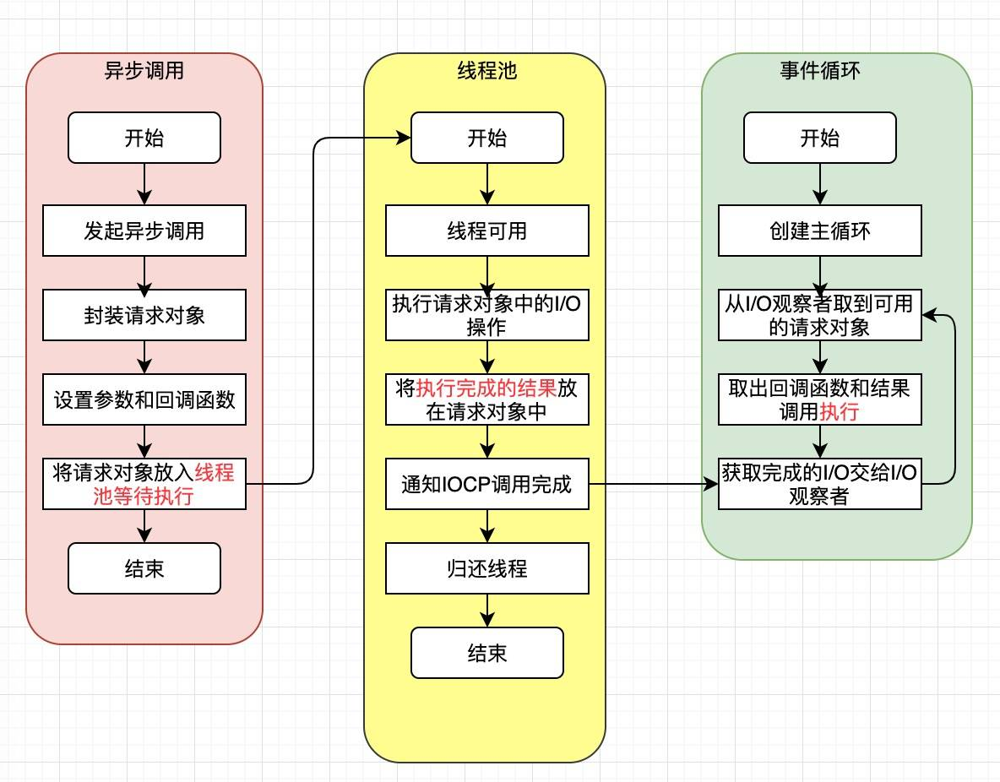

Node 相对于其他语言的优势在于对 I/O 的处理。我们知道 Node 基于 google 的 V8 引擎的非阻塞，事件驱动的平台。那么非阻塞和事件驱动都是什么意思？

答案就在 Node 的核心，**事件循环**。

先看一下 Node 的架构，然后再从下往上分析 Node 的事件循环，如下图：

## 异步 IO

## 非阻塞 IO

## Node 异步 IO 模型
下图是 libuv 的架构：

## 非 IO 的异步 API

## Event Loop

## 参考
- 深入浅出 Node.js - 朴灵
- [NodeJS Event Loop](https://blog.insiderattack.net/event-loop-and-the-big-picture-nodejs-event-loop-part-1-1cb67a182810)
- [JavaScript 运行机制详解：再谈 Event Loop](http://www.ruanyifeng.com/blog/2014/10/event-loop.html)
- https://juejin.im/post/5e1adbc05188253664549bab
