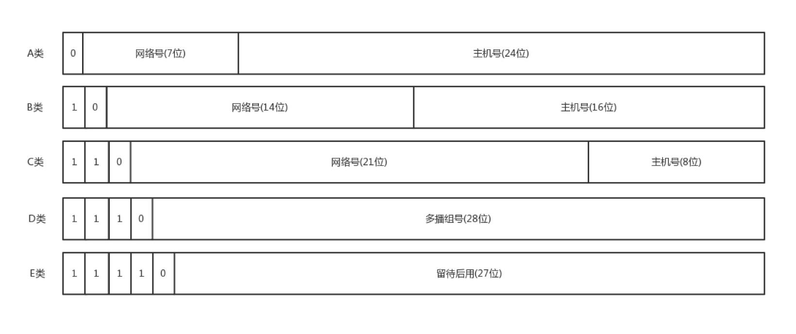
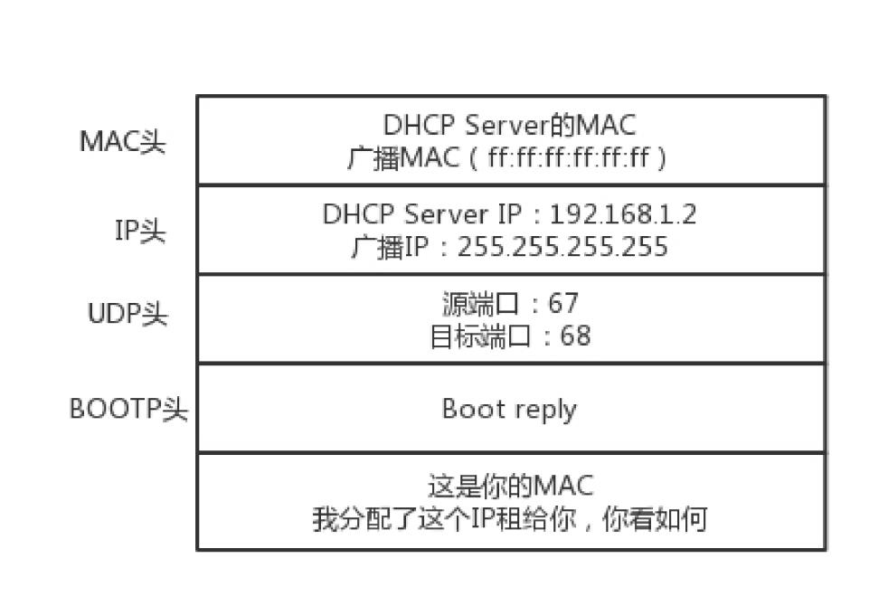
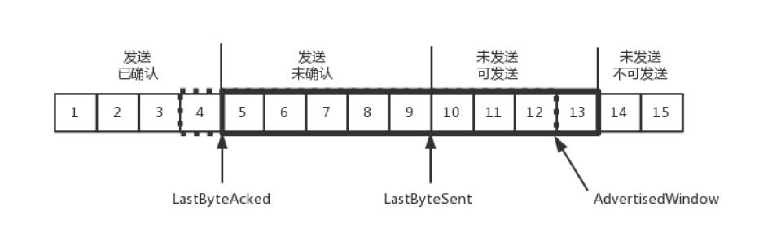
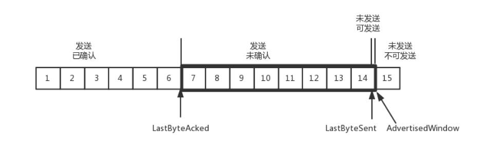
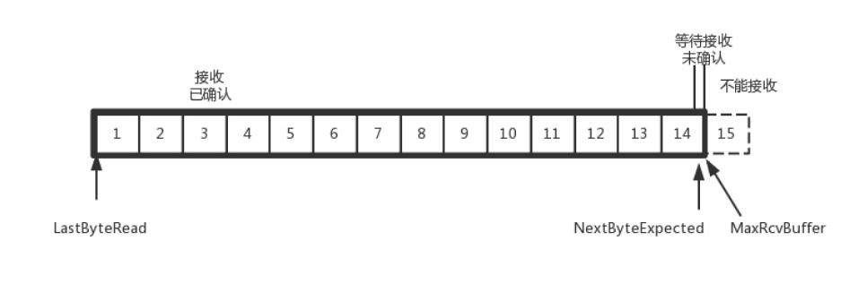
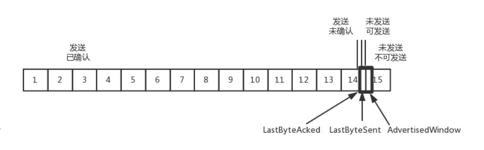

想成为技术牛人，先搞定网络协议。

<!-- more -->

## 为什么要学习网络协议？

计算机语言（C语言，Java 等）是人类和计算机沟通的协议，通过这种协议，计算机可以知道我们想让它做什么。但是这种协议计算机不能直接读懂，
对于计算机，它只认识 0 和 1，所以计算机语言还需要编译之后，计算机才会读懂。

协议三要素：
- 语法，就是这一段内容要符合一定的规则和格式。例如，括号要成对，结束要使用分号等。
- 语义，就是一段内容代表某种意义。例如数字减去数字是有意义的，数字减去文本一般来说就没有意义。
- 顺序，就是先干啥，后干啥。例如，先加上某个值，再减去某个值。

计算机语言，能够教给一台计算机完成你的工作，但是，要想一大片机器互相协作、共同完成一件事，只教给一台机器做什么是不够的，你需要学会
给一大片机器做什么。这就需要**网络协议**。

## 网络分层的真实含义是什么？
复杂的程序都要分层。比如，复杂的电商还会分数据库层、缓存层、Compose 层、Controller 层和接入层，每一层专注做本层的事情。

程序是如何工作的？


只要是在网络上跑的包，都是完整的。可以有下层没上层，绝对不可能有上层没下层。

例如：TCP 在三次握手的时候，IP 层和MAC 层在做什么呢？当然是TCP 发送每一个消息，都会带着IP 层和MAC 层了。因为，TCP 每发送一个消息，IP 层和MAC 层的所有机制都
要运行一遍。而你只看到TCP 三次握手了，其实，IP 层和MAC 层为此也忙活好久了。

所以，对TCP 协议来说，三次握手也好，重试也好，只要想发出去包，就要有IP 层和MAC 层，不然是发不出去的。

所谓的**二层设备、三层设备**，都是这些设备上跑的程序不同而已。一个HTTP 协议的包经过一个二层设备，二层设备收进去的是整个网络包。这里面HTTP、TCP、IP、MAC 都有。什么叫二层设备呀，
就是只把MAC 头摘下来，看看到底是丢弃、转发，还是自己留着。那什么叫三层设备呢？就是把MAC头摘下来之后，再把IP 头摘下来，看看到底是丢弃、转发，还是自己留着。

## ifconfig：最熟悉又陌生的命令行
怎么查看IP 地址？
Windows 上是`ipconfig`，在Linux 上是`ifconfig`，`ip addr`。

**IP 地址是一个网卡在网络世界的通讯地址，相当于我们现实世界的门牌号码。**大部分的网卡都会有一个IP 地址，当然，这不是必须的。

32 位的IP 地址就被分成了5 类：




C 类地址能包含的最大主机数量只有254 个，现在估计一个网吧都不够用。
B 类地址能包含的最大主机数量又太多了。6 万多台机器放在一个网络下面，一般的企业基本达不到这个规模，闲着的地址就是浪费。

### 无类型域间选路（CIDR）
CIDR，打破了原来设计的几类地址的做法，将`32`位的IP 地址一分为二，前面是网络号，后面是主机号。从哪里分呢？你如果注意观察的话可以看到，`10.100.122.2/24`，
这个IP 地址中有一个斜杠，斜杠后面有个数字`24`。这种地址表示形式，就是CIDR。后面`24`的意思是，`32`位中，前`24`位是网络号，后`8`位是主机号。

伴随着CIDR 存在的，一个是**广播地址**，`10.100.122.255`。如果发送这个地址，所有`10.100.122`网络里面的机器都可以收到。另一个是**子网掩码**，`255.255.255.0`。
将子网掩码和IP 地址进行`AND`计算，就可得到**网络号**。


### 公有IP 地址和私有IP 地址

在日常的工作中，几乎不用划分A 类、B 类或者C 类，所以时间长了，很多人就忘记了这个分类，而只记得CIDR。但是有一点还是要注意的，就是公有IP 地址和私有IP 地址。


表格最右列是私有IP 地址段。平时我们看到的数据中心里，办公室、家里或学校的IP 地址，一般都是私有IP 地址段。因为这些地址允许组织内部的IT 人员自己管理、自己分配，而
且可以重复。因此，你学校的某个私有IP 地址段和我学校的可以是一样的。

这就像每个小区有自己的楼编号和门牌号，你们小区可以叫6 栋，我们小区也叫6 栋，没有任何问题。但是一旦出了小区，就需要使用公有IP 地址。

`192.168.0.x`是最常用的私有IP 地址。一般你家里地上网设备不会超过256 个，所以`/24`基本就够了。有时候我们也能见到`/16 =`的CIDR，这两种是最常见的。
很明显`192.168.0`是网络号，整个网络里面的第一个地址`192.168.0.1`,往往就是你这个**私有网络的出口地址**。例如你家的路由器地址就是`192.168.0.1`。
`192.168.0.255`就是广播地址。一旦发送这个地址，整个`192.168.0`网络里面的所有机器都能收到。

### 一个容易“犯错”的CIDR
`16.158.165.91/22`这个CIDR。求一下这个网络的第一个地址、子网掩码和广播地址。

要是上来就写`16.158.165.1`，那就大错特错了。

`/22`不是`8`的整数倍，不好办，只能先变成二进制来看。`16.158`的部分不会动，它占了前`16`位。中间的`165`，变为二进制为`10100101` 。除了前面的`16`位，
还剩`6`位。所以，这`8`位中前`6`位是网络号，`16.158.<101001>`，而`<01>.91`是机器号。第一个地址是`16.158.<101001><00>.1`，即`16.158.164.1`。
子网掩码是`255.255.<111111><00>.0`，即`255.255.252.0`。广播地址为`16.158.<101001><11>.255`，即`16.158.167.255`。

**D 类是组播地址**。使用这一类地址，属于某个组的机器都能收到。这有点类似在公司里面大家都加入了一个邮件组。发送邮件，加入这个组的都能收到。

```bash
root@test:~# ip addr
1: lo: <LOOPBACK,UP,LOWER_UP> mtu 65536 qdisc noqueue state UNKNOWN group default
link/loopback 00:00:00:00:00:00 brd 00:00:00:00:00:00
inet 127.0.0.1/8 scope host lo
valid_lft forever preferred_lft forever
inet6 ::1/128 scope host
valid_lft forever preferred_lft forever
2: eth0: <BROADCAST,MULTICAST,UP,LOWER_UP> mtu 1500 qdisc pfifo_fast state UP group default qlen 1000
link/ether fa:16:3e:c7:79:75 brd ff:ff:ff:ff:ff:ff
inet 10.100.122.2/24 brd 10.100.122.255 scope global eth0
valid_lft forever preferred_lft forever
inet6 fe80::f816:3eff:fec7:7975/64 scope link
valid_lft forever preferred_lft forever
```

上面的输出，IP 地址的后面有个`scope`，对于`eth0`这张网卡来讲，是`global`，说明这张网卡是可以对外的，可以接收来自各个地方的包。对于`lo`来讲，是`host`，说明这张网
卡仅仅可以供本机相互通信。

`lo`全称是`loopback`，又称环回接口，往往会被分配到`127.0.0.1`这个地址。这个地址用于本机通信，经过内核处理后直接返回，不会在任何网络中出现。这就是为什么你可以在浏览器
通过访问`127.0.0.1`这个地址来访问本地服务，而且一般在你本机的`host`文件，会有`127.0.0.1 localhost`，这是个映射关系，访问`localhost`相当于`127.0.0.1`。


### MAC 地址
`link/ether fa:16:3e:c7:79:75 brd ff:ff:ff:ff:ff:ff`，这个被称为 **MAC 地址**，网卡的物理地址，用十六进制，6 个byte 表示。

MAC 地址既然全局唯一，不会有两个网卡有相同的 MAC 地址，那么为什么不直接用MAC地址来进行通信？

**一个网络包要从一个地方传到另一个地方，除了要有确定的地址，还需要有定位功能。**IP 地址，才是有远程定位功能的。

**MAC 地址更像是身份证，是一个唯一的标识。**它的唯一性设计是为了组网的时候，不同的网卡放在一个网络里面的时候，可以不用担心冲突。从硬件角度，保证不同的网卡有不同的标识。

例如，你去杭州市网商路599 号B 楼6 层找刘超，你在路上问路，可能被问的人不知道B 楼是哪个，但是可以给你指网商路怎么去。但是如果你问一个人，你知道这个身份证号的人在哪里吗？可想而知，
没有人知道。

MAC 地址是有一定定位功能的，只不过范围非常有限。你可以根据IP 地址，找到杭州市网商路599 号B 楼6 层，但是依然找不到我，你就可以靠吼了，
大声喊身份证XXXX 的是哪位？我听到了，我就会站起来说，是我啊。

MAC 地址的通信范围比较小，局限在一个子网里面。例如，例如，从`192.168.0.2/24`访问`192.168.0.3/24`是可以用MAC 地址的。一旦跨子网，即从`192.168.0.2/24`到
`192.168.1.2/24`，MAC地址就不行了，需要IP 地址起作用了。

### 网络设备的状态标识
`<BROADCAST,MULTICAST,UP,LOWER_UP>`是干什么的？这个叫作`net_device flags`，**网络设备的状态标识**。
- `UP`表示网卡处于启动的状态
- `BROADCAST`表示这个网卡有广播地址，可以发送广播包
- `MULTICAST`表示网卡可以发送多播包
- `LOWER_UP`表示`L1`是启动的，也即网线插着呢。
- `MTU1500`是指最大传输单元MTU 为1500，这是以太网的默认值。MTU 是二层MAC 层的概念。MAC 层有MAC 的头，以太网规定连MAC 头带正文合起来，不允许超过1500 个字节。
正文里面有IP 的头、TCP 的头、HTTP 的头。如果放不下，就需要分片来传输。

## DHCP：IP是怎么来的，又是怎么没的？
### 如何配置IP 地址
命令行自己配置一个地址。可以使用ifconfig，也可以使用ip addr。设置好了以后，用这两个命令，将网卡up 一下，就可以开始工作了。

但是不能随便配置，例如`192.168.1.6`就在你这台机器的旁边，甚至是在同一个交换机上，而你把机器的地址设为了`16.158.23.6`。在这台机器上，你企图去`ping 192.168.1.6`，
你看着它有自己的源IP 地址`16.158.23.6`，也有目标IP 地址`192.168.1.6`，但是包发不出去，这是因为MAC 层还没填。**IP 只有是一个网段的，它才会发送ARP 请求，获取MAC 地址**。
如果不是，**它便不会直接将包发送到网络上，而是企图将包发送到网关**。

如果你配置了网关的话，Linux 会获取网关的MAC 地址，然后将包发出去。对于`192.168.1.6`这台机器来讲，虽然路过它家门的这个包，目标IP 是它，但是无奈MAC 地址不是它的，
所以它的网卡是不会把包收进去的。如果没有配置网关，那包压根就发不出去。

**网关要和当前的网络至少一个网卡是同一个网段的**，否则不会配置成功。

### 动态主机配置协议（DHCP）
有了这个协议，网络管理员只需要配置一段共享的IP 地址。每一台新接入的机器都通过 DHCP 协议，来这个共享的IP 地址里申请，然后自动配置好就可以了。等人走了，或者用完了，还回
去，这样其他的机器也能用。

**如果是数据中心里面的服务器，IP 一旦配置好，基本不会变，这就相当于买房自己装修。 DHCP 的方式就相当于租房。你不用装修，都是帮你配置好的。你暂时用一下，用完退租就可以了。**

### 解析DHCP 的工作方式
一台机器新加入一个网络的时候，只知道自己的MAC 地址。怎么办？先吼一句，我来啦，有人吗？这时候的沟通基本靠“吼”。这一步，我们称为**DHCP Discover**。

第一步：
新来的机器使用IP 地址0.0.0.0 发送了一个广播包，目的IP 地址为255.255.255.255。


第二步：
**DHCP Server**立刻能知道来了一个“新人”，这个时候，我们可以体会MAC 地址唯一的重要性了。当一台机器带着自己的MAC地址加入一个网络的时候，MAC 是它唯一的身份，
如果连这个都重复了，就没办法配置了。**只有MAC 唯一，IP 管理员才能知道这是一个新人**。租给它一个IP 地址，这个过程我们称为**DHCP Offer**。同时，DHCP Server 为
此客户**保留为它提供的IP 地址**，从而不会为其他DHCP 客户分配此IP地址。**DHCP Offer 里面有新的分配的地址**：


DHCP Server 仍然使用广播地址作为目的地址，因为，此时请求分配IP 的新人还没有自己的IP。

第三步：
如果有多个DHCP Server，这台新机器会收到多个IP 地址，选择其中一个DHCP Offer，**一般是最先到达的那个**。并且会向网络发送一个DHCP Request 广播数据包，包中包含客户端
的MAC 地址、接受的租约中的IP 地址、提供此租约的DHCP 服务器地址等，并告诉所有DHCP Server 它将接受哪一台服务器提供的IP 地址，告诉其他DHCP 服务器请求撤销它们提供的IP 地址，
以便提供给下一个IP 租用请求者。


由于还没有得到DHCP Server 的最后确认，客户端仍然使用`0.0.0.0`为源IP 地址、`255.255.255.255`为目标地址进行广播。

第四步：
DHCP Server 接收到客户机的DHCP request 之后，会广播返回给客户机一个DHCP ACK 消息包，表明已经接受客户机的选择，并将这一IP 地址的合法租用信息和其他的配置信息都放入该
广播包，发给客户机，欢迎它加入网络大家庭。


### IP 地址的收回和续租
客户机会在租期过去50% 的时候，直接向为其提供IP 地址的DHCP Server 发送DHCP request 消息包。客户机接收到该服务器回应的DHCP ACK 消息包，会根据包中所提供的新的租期以及其他已经更新
的TCP/IP 参数，更新自己的配置。这样，IP 租用更新就完成了。

## 从物理层到MAC层：如何在宿舍里自己组网玩联机游戏？

### 第一层（物理层）
宿舍两个人的电脑怎么连接起来？可以使用路由器，但是路由器是在第三层上。我们先从第一层物理层开始说。

电脑连电脑。这种方式就是一根网线，有两个头。一头插在一台电脑的网卡上，另一头插在另一台电脑的网卡上。还需要配置这两台电脑的IP 地址、子网掩码和默认网关。
要想两台电脑能够通信，这三项必须配置成为一个网络，可以一个是`192.168.0.1/24`，另一个是`192.168.0.2/24`，否则是不通的。构成了一个最小的局域网，也即**LAN**。

两台电脑之间的网络包，包含MAC 层吗？当然包含，要完整。IP 层要封装了MAC 层才能将包放入物理层。

怎么把三台电脑连在一起呢？
有一个叫作Hub的东西，也就是集线器。这种设备有多个口，可以将宿舍里的多台电脑连接起来。但是，和交换机不同，集线器没有大脑，它完全在物理层工作。它会将自
己收到的每一个字节，都复制到其他端口上去。这是第一层物理层联通的方案。

### 第二层（数据链路层）

Hub 采取的是广播的模式，如果每一台电脑发出的包，宿舍的每个电脑都能收到。这就需要解决几个问题：
1. 这个包是发给谁的？谁应该接收？
2. 大家都在发，会不会产生混乱？有没有谁先发、谁后发的规则？
3. 如果发送的时候出现了错误，怎么办？

这几个问题都是第二层，数据链路层，也即 MAC 层要解决的问题。**MAC的全称是Medium Access Control，即媒体访问控制**。

第二个问题，有很多算法可以解决：

- 方式一：分多个车道。每个车一个车道，你走你的，我走我的。这在计算机网络里叫作**信道划分**；
- 方式二：今天单号出行，明天双号出行，轮着来。这在计算机网络里叫作**轮流协议**；
- 方式三：不管三七二十一，有事儿先出门，发现特堵，就回去。错过高峰再出。我们叫作**随机接入协议**。著名的以太网，用的就是这个方式。

解决了第二个问题，就是解决了媒体接入控制的问题。

第一个问题：这里用到链路层地址，也被称为**MAC 地址**。

第二层的网络包格式：


有了这个目标MAC 地址，数据包在链路上广播，MAC 的网卡才能发现，这个包是给它的。MAC 的网卡把包收进来，然后打开IP 包，发现IP 地址也是自己的，再打开TCP 包，发现端口是自己，也就是
80，而nginx 就是监听80。

于是将请求提交给nginx，nginx 返回一个网页。然后将网页需要发回请求的机器。然后层层封装，最后到MAC 层。因为来的时候有源MAC 地址，返回的时候，源MAC 就变成了目标MAC，再返给请求
的机器。

第三个问题：**CRC**，也就是**循环冗余检测**。通过XOR 异或的算法，来计算整个包是否在发送的过程中出现了错误。

### ARP 协议

当源机器知道目标机器的时候，可以将目标地址放入包里面，如果不知道呢？一个广播的网络里面接入了N 台机器，我怎么知道每个MAC 地址是谁呢？这就是**ARP 协议**，也
就是已知IP 地址，求MAC 地址的协议。

在一个局域网里面，当知道了IP 地址，不知道MAC 怎么办呢？靠“吼”。


为了避免每次都用ARP 请求，机器本地也会进行ARP 缓存。当然机器会不断地上线下线，IP 也可能会变，所以ARP 的MAC 地址缓存过一段时间就会过期。

### 局域网
Hub 组网的方式，一旦机器数目增多，问题就出现了。因为Hub 是广播的，不管某个接口是否需要，所有的Bit 都会被发送出去，然后让主机来判断是不是需要。这种方式路
上的车少就没问题，车一多，产生冲突的概率就提高了。而且把不需要的包转发过去，纯属浪费。

这就需要二层设备，**交换机**。

因为每个口都只连接一台电脑，这台电脑又不怎么换IP 和MAC 地址，只要记住这台电脑的MAC 地址，如果目标MAC 地址不是这台电脑的，这个口就不用转发了。
交换机怎么知道每个口的电脑的MAC 地址呢？这需要交换机会学习。

一台MAC1 电脑将一个包发送给另一台MAC2 电脑，当这个包到达交换机的时候，一开始交换机也不知道MAC2 的电脑在哪个口，所以没办法，它只能将包转发给出了来的那个口之外的其他所有的口。
这个时候，交换机会记住 MAC1 是来自一个明确的口。以后有包的目的地址是MAC1 的，直接发送到这个口就可以了。

交换机作为一个关卡一样，过了一段时间之后，就有了整个网络的一个结构了，这个时候，基本上不用广播了，全部可以准确转发。当然，每个机器的IP 地址会变，所在的口也会变，因而交换机上的学习
的结果，我们称为**转发表**，是有一个过期时间的。

## 交换机与VLAN：办公室太复杂，我要回学校

### 拓扑结构是怎么形成的

常见到的办公室大多是一排排桌子，每个桌子都有网口，一排就有十几个网口，一个楼层就会有几十个甚至上百个网口。如果算上所有楼层，这个场景自然比宿舍里的复杂多了。

这个时候，一个交换机肯定不够用，需要多台交换机，交换机之间连接起来，就形成一个稍微复杂的**拓扑结构**。

下图中，两台交换机连接着三个局域网，每个局域网上都有多台机器。如果机器1只知道机器4的IP地址，当它想要访问机器4，把包发出去的时候，它必须要知道机器4 的MAC 地址。


于是机器1 发起广播，机器2 收到这个广播，但是这不是找它的，所以没它什么事。交换机A 一开始是不知道任何拓扑信息的，在它收到这个广播后，采取的策略是，除了广播包来的方向外，它还要转发给
其他所有的网口。于是机器3 也收到广播信息了，但是这和它也没什么关系。当然，交换机B 也是能够收到广播信息的，但是这时候它也是不知道任何拓扑信息的，因而也是进行广播的策略，将包转发到局域网三
。这个时候，机器4 和机器5 都收到了广播信息。机器4 主动响应说，这是找我的，这是我的MAC 地址。于是一个ARP 请求就成功完成了。

在上面的过程中，交换机A 和交换机B 都是能够学习到这样的信息：机器1 是在左边这个网口的。当了解到这些拓扑信息之后，情况就好转起来。当机器2 要访问机器1 的时候，机器2 并不知道机器1 的
MAC 地址，所以机器2 会发起一个ARP 请求。这个广播消息会到达机器1 ，也同时会到达交换机A 。这个时候交换机A 已经知道机器1 是不可能在右边的网口的，所以这个广播信息就不会广播到局域网二
和局域网三。

当机器3 要访问机器1 的时候，也需要发起一个广播的ARP 请求。这个时候交换机A 和交换机B 都能够收到这个广播请求。交换机A 当然知道主机A 是在左边这个网口的，所以会把广播消息转发到局域网一。
同时，交换机B 收到这个广播消息之后，由于它知道机器1 是不在右边这个网口的，所以不会将消息广播到局域网三。


### 如何解决常见的环路问题
当整个拓扑结构复杂了，这么多网线，绕过来绕过去，不可避免地会出现一些意料不到的情况。其中常见的问题就是环路问题。

下面途中，就出现了环路。


想象一下机器1访问机器2的过程。一开始，机器1并不知道机器2的MAC地址，所以它需要发起一个ARP的广播。广播到达机器2，机器2会把MAC地址返回来，看起来没有这两个交换机什么事情。

但是问题来了，这两个交换机还是都能够收到广播包的。交换机A一开始是不知道机器2在哪个局域网的，所以它会把广播消息放到局域网二，在局域网二广播的时候，交换机B右边这个网口也是能够收到广播消息的。
交换机B会将这个广播息信息发送到局域网一。局域网一的这个广播消息，又会到达交换机A左边的这个接口。交换机A这个时候还是不知道机器2在哪个局域网，于是将广播包又转发到局域网二。左转左转左转，
好像是个圈。

并且这种情况，**交换机是学习不到拓扑结构的**，为什么？

机器1的广播包到达交换机A和交换机B的时候，本来两个交换机都学会了机器1是在局域网一的，但是当交换机A将包广播到局域网二之后，交换机B右边的网口收到了来自交换机A的广播包。根据学习机制，这彻底
损坏了交换机B的三观，刚才机器1还在左边的网口呢，怎么又出现在右边的网口呢？哦，那肯定是机器1换位置了，于是就误会了，交换机B就学会了，机器1是从右边这个网口来的，把刚才学习的那一条清理掉。
同理，交换机A右边的网口，也能收到交换机B转发过来的广播包，同样也误会了，于是也学会了，机器1从右边的网口来，不是从左边的网口来。

然而当广播包从左边的局域网一广播的时候，两个交换机再次刷新三观，原来机器1是在左边的，过一会儿，又发现不对，是在右边的，过一会，又发现不对，是在左边的。

### 破除环路，STP协议中那些难以理解的概念

计算机网络中，生成树的算法叫作STP，全称Spanning Tree Protocol。


- **Root Bridge**，也就是**根交换机**。这个比较容易理解，可以比喻为“掌门”交换机，是某棵树的老大，是掌门，最大的大哥。
- **Designated Bridges**，有的翻译为**指定交换机**。这个比较难理解，可以想像成一个“小弟”，对于树来说，就是一棵树的树枝。所谓“指定”的意思是，我拜谁做大哥，其他交换机通过这个交换机到
达根交换机，也就相当于拜他做了大哥。这里注意是树枝，不是叶子，因为叶子往往是主机。
- **Bridge Protocol Data Units （BPDU）**，**网桥协议数据单元**。可以比喻为“相互比较实力”的协议。行走江湖，比的就是武功，拼的就是实力。当两个交换机碰见的时候，也就是相连的时候，
就需要互相比一比内力了。BPDU只有掌门能发，已经隶属于某个掌门的交换机只能传达掌门的指示。
- **Priority Vector，优先级向量**。可以比喻为实力（值越小越牛）。实力是啥？就是一组ID数目，[Root Bridge ID, Root Path Cost, Bridge ID, and Port ID]。为什么这样设计呢？
这是因为要看怎么来比实力。先看Root Bridge ID。拿出老大的ID看看，发现掌门一样，那就是师兄弟；再比Root Path Cost，也即我距离我的老大的距离，也就是拿和掌门关系比，看同一个门派
内谁和老大关系铁；最后比Bridge ID，比我自己的ID，拿自己的本事比。

### VLAN
机器多了，交换机也多了，就算交换机比Hub 智能一些，但是还是难免有广播的问题，一大波机器，相关的部门、不相关的部门，广播一大堆，性能就下来了。
公司有不同的部门，有的部门需要保密的，比如人事部门，肯定要讨论升职加薪的事儿。由于在同一个广播域里面，很多包都会在一个局域网里面飘啊飘，碰到了一个会抓包的
程序员，就能抓到这些包，如果没有加密，就能看到这些敏感信息了。怎么办？两种办法：

- 物理隔离，每个部门有单独的交换机，配置单独的子网，这样部门之间的沟通就需要路由器了。但是有的部门人多，有的人少，如果每个部门有单独的交换机，口多了浪费，少了又不够用。
- 虚拟隔离，也就是VLAN。或者叫虚拟局域网。使用VLAN，一个交换机上会连属于多个局域网的机器。

交换机怎么区分哪个机器属于哪个局域网？


只需要在原来的二层的头上加一个TAG，里面有一个VLAN ID，一共12位。

如果我们买的交换机是支持VLAN的，当这个交换机把二层的头取下来的时候，就能够识别这个VLAN ID。这样只有相同VLAN的包，才会互相转发，不同VLAN的包，是看不到的。


可以设置交换机每个口所属的VLAN。如果某个口坐的是程序员，他们属于VLAN 10；如果某个口坐的是人事，他们属于VLAN 20；如果某个口坐的是财务，他们属于VLAN30。这样，财务发的包，
交换机只会转发到VLAN 30的口上。

对于交换机来讲，每个VLAN的口都是可以重新设置的。一个财务走了，把他所在的作为的口从VLAN 30移除掉，来了一个程序员，坐在财务的位置上，就把这个口设置为VLAN 10，十分灵活。

对于支持VLAN的交换机，有一种口叫作**Trunk口**。它可以转发属于任何VLAN的口。交换机之间可以通过这种口相互连接。

## ICMP与ping：投石问路的侦察兵
ping 是基于ICMP 协议工作的。ICMP全称Internet Control Message Protocol，就是**互联网控制报文协议**。


- ICMP 相当于网络世界的侦察兵。两种类型的ICMP 报文，一种是主动探查的查询报文，一种异常报告的差错报文。
- ping 使用查询报文，Traceroute 使用差错报文。

## 世界这么大，我想出网关：欧洲十国游与玄奘西行
### 怎么在宿舍上网？
路由器，路由器会有内网网口和外网网口。把外网网口的线插到校园网的网口上，将这个外网网口配置成和网管部的一样。内网网口连上你们宿舍的所有的电脑。这种情况下，如果你们宿舍的人要上网，
就需要一直开着路由器。

在任何一台机器上，当要访问另一个IP 地址的时候，都会使用CIDR 和子网掩码先判断是否在同一个网段。

- 如果是同一个网段，例如，你访问你旁边的兄弟的电脑，那就没网关什么事情，直接将源地址和目标地址放入IP 头中，然后通过ARP 获得MAC 地址，将源MAC 和目的MAC 放入MAC 头中，发出去就可以了。
- 如果不是同一网段，例如，你要访问你们校园网里面的BBS，该怎么办？这就需要发往默认网关Gateway。Gateway 的地址一定是和源IP 地址是一个网段的。往往不是第一个，就是第二个。
例如`192.168.1.0/24`这个网段，Gateway 往往会是`192.168.1.1/24`或者`192.168.1.2/24`。

如何发往默认网关呢？网关不是和源IP 地址是一个网段的么？这个过程就和发往同一个网段的其他机器是一样的：将源地址和目标IP 地址放入IP 头中，通过ARP 获得网关的MAC 地址，将源MAC 和网关的
MAC 放入MAC 头中，发送出去。网关所在的端口，例如`192.168.1.1/24`将网络包收进来，然后接下来怎么做，就完全看网关的了。

网关往往是一个路由器，是一个三层转发的设备。啥叫三层设备？前面也说过了，就是把MAC 头和IP头都取下来，然后根据里面的内容，看看接下来把包往哪里转发的设备。

**路由器是一台设备，它有五个网口或者网卡，相当于有五只手，分别连着五个局域网。每只手的IP 地址都和局域网的IP地址相同的网段，每只手都是它握住的那个局域网的网关。**

### 静态路由是什么？
静态路由，其实就是在路由器上，配置一条一条规则。这些规则包括：想访问BBS 站（它肯定有个网段），从2 号口出去，下一跳是IP2；想访问教学视频站（它也有个自己的网段），
从3 号口出去，下一跳是IP3，然后保存在路由器里。

### IP 头和MAC 头哪些变、哪些不变？
MAC 地址是一个局域网内才有效的地址。因而，MAC 地址只要过网关，就必定会改变，因为已经换了局域网。两者主要的区别在于IP 地址是否改变。不改变IP 地址的网关，
我们称为**转发网关**；改变IP 地址的网关，我们称为**NAT 网关**。

#### “欧洲十国游”型


服务器A 要访问服务器B。首先，`192.168.4.101`和我不在同一个网段的，需要先发给网关。那网关是谁呢？已经静态配置好了，
网关是`192.168.1.1`。发送ARP 获取网关的MAC 地址，然后发送包。包的内容是这样的:
```
源MAC：服务器A 的MAC
目标MAC：192.168.1.1 这个网口的MAC
源IP：192.168.1.101
目标IP：192.168.4.101
```
包到达`192.168.1.1`这个网口，发现MAC 一致，将包收进来，开始思考往哪里转发。

在路由器A 中配置了静态路由之后，要想访问`192.168.4.0/24`，要从`192.168.56.1`这个口出去，下一跳为`192.168.56.2`。发送ARP 获取`192.168.56.2`的MAC 地址，然后发送包。
包的内容是这样的：
```
源MAC：192.168.56.1 的MAC 地址
目标MAC：192.168.56.2 的MAC 地址
源IP：192.168.1.101
目标IP：192.168.4.101
```
包到达`192.168.56.2`这个网口，发现MAC 一致，将包收进来，开始思考往哪里转发。

路由器B 中配置了静态路由，要想访问`192.168.4.0/24`，要从`192.168.4.1`这个口出去，没有下一跳了。因为我右手这个网卡，就是这个网段的，我是最后一跳了。发送ARP 获取`192.168.4.101`
的MAC 地址，然后发送包。包的内容是这样的：
```
源MAC：192.168.4.1 的MAC 地址
目标MAC：192.168.4.101 的MAC 地址
源IP：192.168.1.101
目标IP：192.168.4.101
```
包到达服务器B，MAC 地址匹配，将包收进来。

这个过程可以看出，每到一个新的局域网，MAC 都是要变的，但是IP 地址都不变。在IP 头里面，不会保存任何网关的IP 地址。所谓的下一跳是，某个IP 要将这个IP 地址转换为MAC 放入MAC 头。

之所以将这种模式比喻称为欧洲十国游，是因为在整个过程中，IP 头里面的地址都是不变的。IP 地址在三个局域网都可见，在三个局域网之间的网段都不会冲突。在三个网段之间传输包，IP 头不改变。
这就像在欧洲各国之间旅游，一个签证就能搞定。

#### “玄奘西行”型


遇见的第一个问题是，局域网之间没有商量过，各定各的网段，因而IP 段冲突了。最左面大唐的地址是`192.168.1.101`，最右面印度的地址也是`192.168.1.101`，
如果单从IP 地址上看，简直是自己访问自己，其实是大唐的`192.168.1.101`要访问印度的`192.168.1.101`。怎么解决这个问题呢？既然局域网之间没有商量过，你们各管各的，那到国际上，
也即中间的局域网里面，就需要使用另外的地址。就像出国，不能用咱们自己的身份证，而要改用护照一样，玄奘西游也要拿着专门取经的通关文牒，而不能用自己国家的身份证。

首先，目标服务器B 在国际上要有一个国际的身份，我们给它一个`192.168.56.2`。在网关B 上记下来，国际身份`192.168.56.2`对应国内身份`192.168.1.101`。凡是要访问`192.168.56.2`，
都转成`192.168.1.101`。

源服务器A 要访问目标服务器B，要指定的目标地址为`192.168.56.2`。这是它的国际身份。`192.168.56.2`和我不是一个网段的，因而需要发给网关`192.168.1.1`，发送ARP 获取网关的MAC 地址，
然后发送包。包的内容是这样的：
```
源MAC：服务器A 的MAC
目标MAC：192.168.1.1 这个网口的MAC
源IP：192.168.1.101
目标IP：192.168.56.2
```

路由器A 中配置了静态路由：要想访问`192.168.56.2/24`，要从`192.168.56.1`这个口出去，没有下一跳了，因为我右手这个网卡，就是这个网段的，我是最后一跳了。发送ARP
获取`192.168.56.2`的MAC 地址。

当网络包发送到中间的局域网的时候，服务器A 也需要有个国际身份，因而在国际上，源IP 地址也不能用`192.168.1.101`，需要改成`192.168.56.1`。发送包的内容是这样的：
```
源MAC：192.168.56.1 的MAC 地址
目标MAC：192.168.56.2 的MAC 地址
源IP：192.168.56.1
目标IP：192.168.56.2
```

路由器B 是一个NAT 网关，它上面配置了，要访问国际身份`192.168.56.2`对应国内身份`192.168.1.101`，于是改为访问`192.168.1.101`。

路由器B 中配置了静态路由：要想访问`192.168.1.0/24`，要从`192.168.1.1`这个口出去，没有下一跳了，因为我右手这个网卡，就是这个网段的，我是最后一跳了。发送ARP 获取`192.168.1.101`
的MAC 地址，然后发送包。内容是这样的：
```
源MAC：192.168.1.1 的MAC 地址
目标MAC：192.168.1.101 的MAC 地址
源IP：192.168.56.1
目标IP：192.168.1.101
```

服务器B 接收的包可以看出，源IP 为服务器A 的国际身份，因而发送返回包的时候，也发给这个国际身份，由路由器A 做NAT，转换为国内身份。

这个过程可以看出，IP 地址也会变。这个过程用英文说就是**Network Address Translation**，简称**NAT**。

第二种方式我们经常见，现在大家每家都有家用路由器，家里的网段都是`192.168.1.x`，所以你肯定访问不了你邻居家的这个私网的IP 地址的。所以，当我们家里的包发出去的时候，
都被家用路由器NAT 成为了运营商的地址了。

## 路由协议：西出网关无故人，敢问路在何方

### 如何配置路由
路由器就是一台网络设备，它有多张网卡。当一个入口的网络包送到路由器时，它会根据一个本地的转发信息库，来决定如何正确地转发流量。这个转发信息库通常被称为**路由表**。

一张路由表中会有多条路由规则。每一条规则至少包含这三项信息。
- 目的网络：这个包想去哪儿？
- 出口设备：将包从哪个口扔出去？
- 下一跳网关：下一个路由器的地址。

**根据目的IP 地址来配置路由**，通过route 命令和ip route 命令。

### 配置策略路由
除了可以根据目的ip 地址配置路由外，还可以根据多个参数来配置路由，这就称为**策略路由**。

可以配置多个路由表，可以根据源IP 地址、入口设备、TOS 等选择路由表，然后在路由表中查找路由。这样可以使得来自不同来源的包走不同的路由。

### 动态路由算法
上面的都是静态路由。但是网络环境复杂并且多变，使用动态路由路由器，可以根据路由协议算法生成动态路由表，随网络运行状况的变化而变化。

可以想象唐僧西天取经，无论是一个国家内部，还是国家之间，我们都可以将复杂的路径，抽象为一种叫作图的数据结构。至于唐僧西行取经，肯定想走得路越少越好，
道路越短越好，因而这就转化成为**如何在途中找到最短路径的问题**。

1. 距离矢量路由算法
基于Bellman-Ford 算法，这种算法的基本思路是，每个路由器都保存一个路由表，包含多行，每行对应网络中的一个路由器，每一行包含两部分信息，一个是要到目标路由器，
从那条线出去，另一个是到目标路由器的距离。

2. 链路状态路由算法

基本思路是：当一个路由器启动的时候，首先是发现邻居，向邻居say hello，邻居都回复。然后计算和邻居的距离，发送一个echo，要求马上返回，除以二就是距离。然后将自
己和邻居之间的链路状态包广播出去，发送到整个网络的每个路由器。这样每个路由器都能够收到它和邻居之间的关系的信息。因而，每个路由器都能在自己本地构建一个完整的图，然
后针对这个图使用Dijkstra 算法，找到两点之间的最短路径。

## UDP协议：因性善而简单，难免碰到“城会玩”

**所谓的建立连接，是为了在客户端和服务端维护连接，而建立一定的数据结构来维护双方交互的状态，用这样的数据结构来保证所谓的面向连接的特性**。

- TCP 提供可靠交付。通过TCP 连接传输的数据，无差错、不丢失、不重复、并且按序到达。
- UDP 继承了IP包的特性，不保证不丢失，不保证按顺序到达。IP 包是没有任何可靠性保证的。
- TCP 是面向字节流的。发送的时候发的是一个流，没头没尾。IP 包可不是一个流，而是一个个的IP 包。之所以变成了流，这也是TCP 自己的状态维护做的事情。
- UDP 继承了IP 的特性，基于数据报的，一个一个地发，一个一个地收。
- TCP 是可以有拥塞控制的。它意识到包丢弃了或者网络的环境不好了，就会根据情况调整自己的行为，看看是不是发快了，要不要发慢点。
- UDP 就不会，应用让我发，我就发，管它洪水滔天。
- TCP 其实是一个有状态服务，通俗地讲就是有脑子的，里面精确地记着发送了没有，接收到没有，发送到哪个了，应该接收哪个了，错一点儿都不行。
- UDP 则是无状态服务。

**网络传输是以包为单位的，二层叫帧，网络层叫包，传输层叫段。我们笼统地称为包。包单独传输，自行选路，在不同的设备封装解封装，不保证到达。**UDP 完全继承了这些特性。

### UDP 包头


IP 头里面有个8 位协议，这里会存放，数据里面到底是TCP 还是UDP。解析玩UDP，一台机器上跑着这么多的应用程序，应该给谁？
无论应用程序使用TCP 还是UDP 传数据，都要监听一个端口。正是这个端口，用来区分应用程序。

### 三个特点
- 第一，沟通简单，相信网络通路默认就是很容易送达的，不容易被丢弃的。
- 第二，轻信他人。它不会建立连接，虽然有端口号，但是监听在这个地方，谁都可以传给他数据。也可以传给任何人数据。
- 第三，愣头青，做事不懂权变。不会根据网络的情况进行发包的拥塞控制，无论网络丢包丢成啥样了，它该怎么发还怎么发。

### 三个场景
- 需要资源少，在网络情况比较好的内网，或者对于丢包不敏感的应用。
- 不需要一对一沟通，建立连接，而是可以广播的应用。
- 需要处理速度快，时延低，可以容忍少数丢包，但是要求即便网络拥塞，也毫不退缩，一往无前的时候。

## TCP协议（上）：因性恶而复杂，先恶后善反轻松
### TCP 包头


- 包的序号，为了解决乱序的问题。
- 确认序号，发出去的包要确认，不然怎么知道有没有收到。没有收到就重发。为了解决不丢包的问题。
- 状态位，SYN是发起一个连接，ACK是回复，RST是重连，FIN是结束连接。
- 窗口大小，TCP要做流量控制，双方各自声明一个窗口，表示自己当前能够的处理能力，避免发的太快或者太慢。TCP还会做拥塞控制。

### 三次握手
为什么是三次，不是两次？为什么不是四次？因为通信双方都要保证通信可以有来有回。例如，A和B，A发起一个连接（第一次握手），B收到请求，并发送应答给A（第二次握手），
说明B可以建立连接，但是B的应答包，B不知道A是否收到，可能丢失了，所以A需要应答B的应答包（第三次握手），B收到这个消息，下能确认连接建立。

这也就是说，其实四次握手甚至更多也是可以的，但是只要双方的消息有去有回，就基本可以了。

**三次握手除了建立连接，还要沟通TCP包的序号**。A告诉B我发起的请求从哪个序号开始，B告诉A，B发起的包的序号从哪个开始。
为什么序号不都从1开始？为了防止冲突。

例如，A连上B，发送了1，2，3 三个包，但是3丢失了或者绕路了，重新发送，但是后来A又掉线了，重新连上B后，又从1开始发，但是只发了1，2，但是上次绕路的那个3 又回来了，发给了B，B 自然认为，
这就是下一个包，于是发生了错误。

起始序号是随时间变化的，32位，每4S加一。


### 四次挥手

A：B 啊，我不想玩了。
B：哦，你不想玩了啊，我知道了。

这个时候，还只是A 不想玩了，也即A 不会再发送数据，但是B 能不能在ACK 的时候，直接关闭呢？当然不可以了，很有可能A 是发完了最后的数据就准备不玩了，但是B 还没做完自己的事情，
还是可以发送数据的，所以称为**半关闭**的状态。

B：A 啊，好吧，我也不玩了，拜拜。
A：好的，拜拜

这样整个连接就关闭了。

但是这个过程有没有异常情况呢？

一种情况是，A 说完“不玩了”之后，直接跑路，是会有问题的，因为B 还没有发起结束，而如果A 跑路，B 就算发起结束，也得不到回答，B 就不知道该怎么办了。另一种情况是，A 说完“不玩了”，
B 直接跑路，也是有问题的，因为A 不知道B 是还有事情要处理，还是过一会儿会发送结束。


A 收到“B 说知道了”，就进入`FIN_WAIT_2`的状态，如果这个时候B 直接跑路，则A 将永远在这个状态。TCP 协议里面并没有对这个状态的处理，但是Linux 有，可以调整`tcp_fin_timeout`这个参数，
设置一个超时时间。

如果B 没有跑路，发送了“B 也不玩了”的请求到达A 时，A 发送“知道B 也不玩了”的ACK 后，从FIN_WAIT_2 状态结束，按说A 可以跑路了，但是最后的这个ACK 万一B 收不到呢？则B 会重新发一个“B 不玩了”，
这个时候A 已经跑路了的话，B 就再也收不到ACK 了，因而TCP 协议要求A 最后等待一段时间TIME_WAIT，这个时间要足够长，长到如果B 没收到ACK 的话，“B 说不玩了”会重发的，A 会重新发
一个ACK 并且足够时间到达B。

A 直接跑路还有一个问题是，A 的端口就直接空出来了，但是B 不知道，B 原来发过的很多包很可能还在路上，如果A 的端口被一个新的应用占用了，这个新的应用会收到上个连接中B 发过来的包，虽然序列号是
重新生成的，但是这里要上一个双保险，防止产生混乱，因而也需要等足够长的时间，等到原来B 发送的所有的包都死翘翘，再空出端口来。

等待的时间设为2MSL，**MSL是Maximum Segment Lifetime，报文最大生存时间**，它是任何报文在网络上存在的最长时间，超过这个时间报文将被丢弃。因为TCP 报文基于是IP 协议的，而IP 头中有
一个TTL 域，是IP 数据报可以经过的最大路由数，每经过一个处理他的路由器此值就减1，当此值为0 则数据报将被丢弃，同时发送ICMP 报文通知源主机。协议规定MSL 为2 分钟，实际应用中常用的
是30秒，1 分钟和2 分钟等。

还有一个异常情况就是，B 超过了2MSL 的时间，依然没有收到它发的FIN 的ACK，怎么办呢？按照TCP 的原理，B 当然还会重发FIN，这个时候A 再收到这个包之后，A 就表示，我已经在这里等了这么长时间了，已
经仁至义尽了，之后的我就都不认了，于是就直接发送RST，B 就知道A 早就跑了。


## TCP协议（下）：西行必定多妖孽，恒心智慧消磨难
### 如何实现一个靠谱的协议？
为了保证顺序性，每一个包都有一个ID。在建立连接的时候，会商定起始的ID 是什么，然后按照ID 一个个发送。为了保证不丢包，对于发送的包都要进行应答，但是这个应答也不是一个一个来的，而是会应答某个之前的ID，
表示都收到了，这种模式称为**累计确认或者累计应答（cumulative acknowledgment）**。

为了记录所有发送的包和接收的包，TCP 也需要发送端和接收端分别都有缓存来保存这些记录（为了效率，不能每发送一个包，要等到收到了应答，再发送下一个，所以现将事情几下来，办完一件回复一件）。
发送端的缓存里是按照包的ID 一个个排列，根据处理的情况分成四个部分。
- 第一部分：发送了并且已经确认的。这部分就是你交代下属的，并且也做完了的，应该划掉的。
- 第二部分：发送了并且尚未确认的。这部分是你交代下属的，但是还没做完的，需要等待做完的回复之后，才能划掉。
- 第三部分：没有发送，但是已经等待发送的。这部分是你还没有交代给下属，但是马上就要交代的。
- 第四部分：没有发送，并且暂时还不会发送的。这部分是你还没有交代给下属，而且暂时还不会交代给下属的。

为什么要区分第三部分和第四部分？
因为流量控制，要考虑接收端的处理能力。

在TCP 里，接收端会给发送端报一个窗口的大小，叫**Advertised window**。这个窗口的大小应该等于上面的第二部分加上第三部分，就是已经交代了没做完的加上马上要交代的。超过这个窗口的，接收端做不
过来，就不能发送了。


对于接收端来讲，它的缓存里记录的内容要简单一些。
- 第一部分：接受并且确认过的。也就是我领导交代给我，并且我做完的。
- 第二部分：还没接收，但是马上就能接收的。也即是我自己的能够接受的最大工作量。
- 还没接收，也没法接收的。也即超过工作量的部分，实在做不完。


- MaxRcvBuffer：最大缓存的量；
- LastByteRead 之后是已经接收了，但是**还没被应用层读取的**；
- NextByteExpected 是第一部分和第二部分的分界线。

NextByteExpected 和LastByteRead 的差其实是还没被应用层读取的部分占用掉的MaxRcvBuffer 的量，我们定义为A。AdvertisedWindow 其实是MaxRcvBuffer 减去A。也就是：
`AdvertisedWindow=MaxRcvBuffer-((NextByteExpected-1)-LastByteRead)`。

其中第二部分里面，由于受到的包可能不是顺序的，会出现空挡，**只有和第一部分连续的，可以马上进行回复，中间空着的部分需要等待，哪怕后面的已经来了**。

### 顺序问题与丢包问题
刚才的图，在发送端来看，1、2、3 已经发送并确认；4、5、6、7、8、9 都是发送了还没确认；10、11、12 是还没发出的；13、14、15 是接收方没有空间，不准备发的。

在接收端来看，1、2、3、4、5 是已经完成ACK，但是没读取的；6、7 是等待接收的；8、9 是已经接收，但是没有ACK 的。

当前的状态如下：
- 1、2、3 没有问题，双方达成了一致。
- 4、5 接收方说ACK 了，但是发送方还没收到，有可能丢了，有可能在路上。
- 6、7、8、9 肯定都发了，但是8、9 已经到了，但是6、7 没到，出现了乱序，缓存着但是没办法ACK。

顺序问题和丢包问题都有可能发生。

#### 确认与重发的机制
假设4 的确认到了，不幸的是，5 的ACK 丢了，6、7 的数据包丢了，这该怎么办？

**超时重试**，也即对每一个发送了，但是没有ACK 的包，都有设一个定时器，超过了一定的时间，就重新尝试。但是这个超时的时间如何评估呢？这个时间不宜过短，时间必须大于往返时间RTT，
否则会引起不必要的重传。也不宜过长，这样超时时间变长，访问就变慢了。

估计往返时间，需要TCP 通过采样RTT 的时间，然后进行加权平均，算出一个值，而且这个值还是要不断变化的，因为网络状况不断的变化。除了采样RTT，还要采样RTT 的波动范围，计算出一个估计的超时时间。
由于重传时间是不断变化的，我们称为**自适应重传算法（Adaptive RetransmissionAlgorithm）**。

如果7丢了，重传之后又丢了，**TCP 的策略是超时间隔加倍。每当遇到一次超时重传的时候，都会将下一次超时时间间隔设为先前值的两倍。两次超时，就说明网络环境差，不宜频繁反复发送**。

#### 快速重传
超时触发重传存在的问题是，超时周期可能相对较长。有一个可以快速重传的机制，当接收方收到一个序号大于下一个所期望的报文段时，就检测到了数据流中的一个间格，于是发送三个冗余的ACK，客户端收到后，
就在定时器过期之前，重传丢失的报文段。

#### Selective Acknowledgment （SACK）
这种方式需要在TCP 头里加一个SACK 的东西，可以将缓存的地图发送给发送方。例如可以发送ACK6、SACK8、SACK9，有了地图，发送方一下子就能看出来是7 丢了。

### 流量控制问题
流量控制机制，**在对于包的确认中，同时会携带一个窗口的大小**。

先假设窗口不变的情况，窗口始终为9。4 的确认来的时候，会右移一个，这个时候第13 个包也可以发送了。



这个时候，假设发送端发送过猛，会将第三部分的10、11、12、13 全部发送完毕，之后就停止发送了，未发送可发送部分为0。


当对于包5 的确认到达的时候，在客户端相当于窗口再滑动了一格，这个时候，才可以有更多的包可以发送了，例如第14 个包才可以发送。


如果接收方实在处理的太慢，导致缓存中没有空间了，可以通过确认信息修改窗口的大小，甚至可以设置为0，则发送方将暂时停止发送。

我们假设一个极端情况，接收端的应用一直不读取缓存中的数据，当数据包6 确认后，窗口大小就不能再是9 了，就要缩小一个变为8。


这个新的窗口8 通过6 的确认消息到达发送端的时候，你会发现窗口没有平行右移，而是仅仅左面的边右移了，窗口的大小从9 改成了8。



如果接收端还是一直不处理数据，则随着确认的包越来越多，窗口越来越小，直到为0。



当这个窗口通过包14 的确认到达发送端的时候，发送端的窗口也调整为0，停止发送。



如果这样的话，发送方会定时发送窗口探测数据包，看是否有机会调整窗口的大小。当接收方比较慢的时候，**要防止低能窗口综合征，别空出一个字节来就赶快告诉发送方，
然后马上又填满了，可以当窗口太小的时候，不更新窗口，直到达到一定大小，或者缓冲区一半为空，才更新窗口**。

### 拥塞控制问题
拥塞控制的问题，也是通过窗口的大小来控制的，前面的**滑动窗口rwnd 是怕发送方把接收方缓存塞满，而拥塞窗口cwnd，是怕把网络塞满**。

`LastByteSent - LastByteAcked <= min {cwnd, rwnd}`，是拥塞窗口和滑动窗口共同控制发送的速度。

发送方怎么判断网络是不是满了？TCP 发送包常被比喻为往一个水管里面灌水，而**TCP 的拥塞控制就是在不堵塞，不丢包的情况下，尽量发挥带宽**。

水管有粗细，网络有带宽，也即每秒钟能够发送多少数据；水管有长度，端到端有时延。在理想状态下，水管里面水的量= 水管粗细x 水管长度。对于到网络上，**通道的容量= 带宽× 往返延迟**。

如果我们设置发送窗口，使得发送但未确认的包为为通道的容量，就能够撑满整个管道。


如图所示，假设往返时间为8s，去4s，回4s，每秒发送一个包，每个包1024byte。已经过去了8s，则8 个包都发出去了，其中前4 个包已经到达接收端，但是ACK 还没有返回，不能算发送成功。
5-8后四个包还在路上，还没被接收。这个时候，整个管道正好撑满，在发送端，已发送未确认的为8 个包，正好等于带宽，也即每秒发送1 个包，乘以来回时间8s。

TCP 的拥塞控制主要来避免两种现象，包丢失和超时重传。一旦出现了这些现象就说明，发送速度太快了，要慢一点。但是一开始我怎么知道速度多快呢，我怎么知道应该把窗口调整到多大呢？
如果我们通过漏斗往瓶子里灌水，我们就知道，不能一桶水一下子倒进去，肯定会溅出来，要一开始慢慢的倒，然后发现总能够倒进去，就可以越倒越快。这叫作**慢启动**。

一条TCP 连接开始，cwnd 设置为一个报文段，一次只能发送一个；当收到这一个确认的时候，cwnd加一，于是一次能够发送两个；当这两个的确认到来的时候，每个确认cwnd 加一，两个确认cwnd 加二，
于是一次能够发送四个；当这四个的确认到来的时候，每个确认cwnd 加一，四个确认cwnd 加四，于是一次能够发送八个。可以看出这是**指数性的增长**。

**有一个值ssthresh 为65535 个字节，当超过这个值的时候，就要小心一点了，不能倒这么快了，可能快满了，再慢下来。**

每收到一个确认后，cwnd 增加1/cwnd，我们接着上面的过程来，一次发送八个，当八个确认到来的时候，每个确认增加1/8，八个确认一共cwnd 增加1，于是一次能够发送九个，变成了线性增长。
但是线性增长还是增长，还是越来越多，直到有一天，水满则溢，出现了拥塞，这时候一般就会一下子降低倒水的速度，等待溢出的水慢慢渗下去。拥塞的一种表现形式是丢包，需要超时重传，这个时候，
将sshresh 设为cwnd/2，将cwnd 设为1，重新开始慢启动。这真是一旦超时重传，马上回到解放前。但是这种方式太激进了，将一个高速的传输速度一下子停了下来，会造成网络卡顿。

当接收端发现丢了一个中间包的时候，发送三次前一个包的ACK，于是发送端就会快速的重传，不必等待超时再重传。TCP 认为这种情况不严重，因为大部分没丢，只丢了一小部分，cwnd 减半为cwnd/2，
然后sshthresh = cwnd，当三个包返回的时候，cwnd = sshthresh +3，也就是没有一夜回到解放前，而是还在比较高的值，呈线性增长。就像前面说的一样，正是这种知进退，使得时延很重要的情况下，
反而降低了速度。但是如果你仔细想一下，TCP 的拥塞控制主要来避免的两个现象都是有问题的。

- 第一个问题是丢包并不代表着通道满了，也可能是管子本来就漏水。例如公网上带宽不满也会丢包，这个时候就认为拥塞了，退缩了，其实是不对的。
- 第二个问题是TCP 的拥塞控制要等到将中间设备都填充满了，才发生丢包，从而降低速度，这时候已经晚了。其实TCP 只要填满管道就可以了，不应该接着填，直到连缓存也填满。

为了优化这两个问题，后来有了TCP BBR 拥塞算法。它企图找到一个平衡点，就是通过不断的加快发送速度，将管道填满，但是不要填满中间设备的缓存，因为这样时延会增加，在这个平衡点
可以很好的达到高带宽和低时延的平衡。


