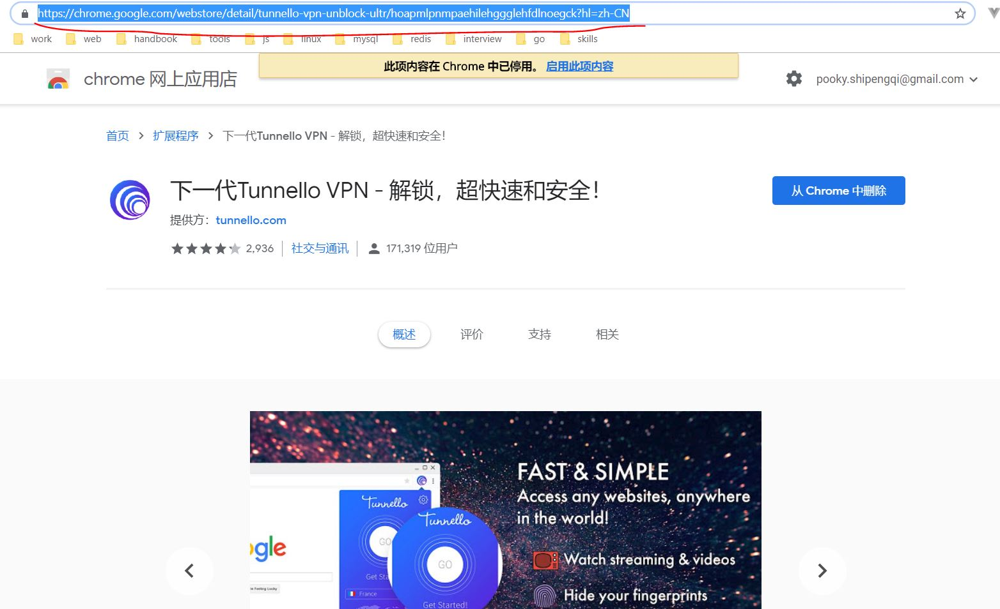
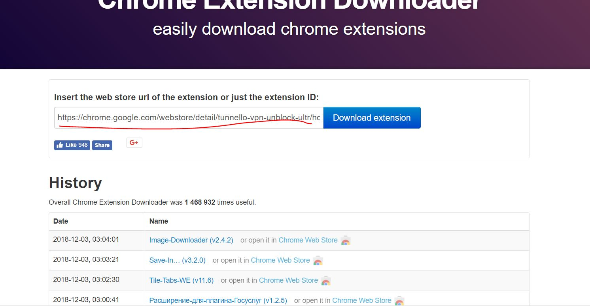

最近在家里不能访问 Google 了，原因是 VPN 到期了（没钱买了），修改 host 文件的方式也行不通了。就行到了 Chrome 插件。以前也用过但是
不太稳定，先凑合用吧。

## 下载插件

因为我可以在公司访问 Google，所以我在公司先把插件下载好，到家里安装。在应用商店是不能直接下载插件的。但是可应通过这个[网站](https://chrome-extension-downloader.com/)下载。
1. 先在 Chrome 应用商店找到插件，复制连接。

2. 打开 https://chrome-extension-downloader.com，粘贴连接即可。

### 不能访问 Google 的情况下
可以尝试在第三方的 Chrome插件下载网站。

- [crx4chrome](https://www.crx4chrome.com/)
- [Chrome插件网](http://chromecj.com/)
- [插件网](http://www.cnplugins.com/)
- [浏览器插件下载中心](https://www.chromefor.com/)

当然上面可能没有你想要的插件，我把已经下载好的插件放到了[这里](https://pan.baidu.com/s/1VMRNvrfzauwAvQhAOLy1Vw)，提取码是`zf36`，可以自行下载，包括了一下插件：

- Tunnello VPN
- 谷歌访问助手
- 谷歌上网助手
- 谷歌服务助手