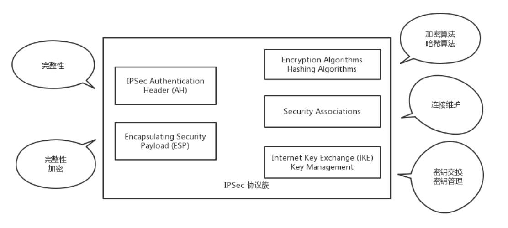
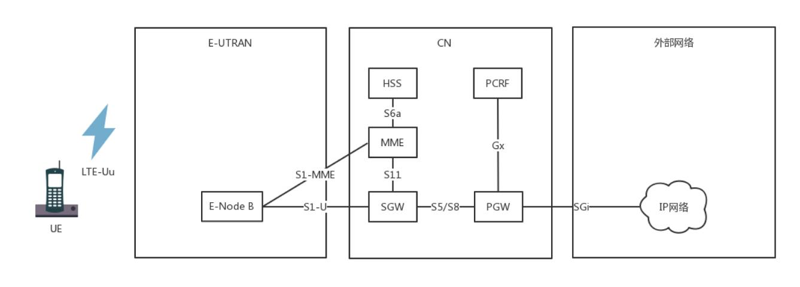
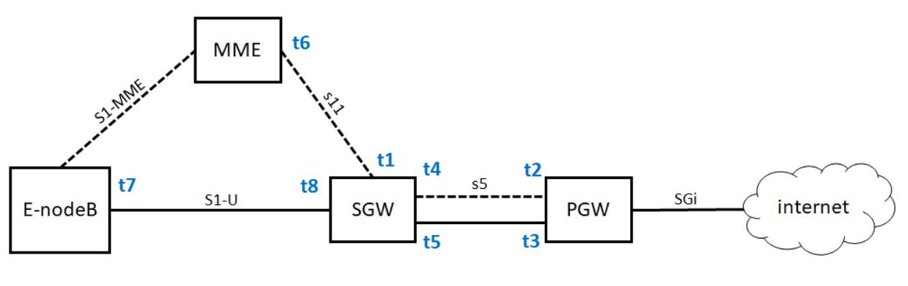

想成为技术牛人，先搞定网络协议。

<!-- more -->

## 数据中心：我是开发商，自己拿地盖别墅
数据中心用到了前面学过的所有知识，数据中心里面是一堆服务器。服务器被放在一个个叫作**机架（Rack）**的架子上面，出入口也是漏油器，在数据中心的边界，
所以叫做**边界路由器**，为了高可用，边界路由器有多个，而且会连接多个运营商网络，防止一个运营商网络出问题。

交换机往往是放在机架顶端的，所以经常称为**TOR（Top Of Rack）交换机**。这一层的交换机常常称为**接入层（Access Layer）**。

当一个机架放不下的时候，就需要多个机架，还需要有交换机将多个机架连接在一起。这些交换机对性能的要求更高，带宽也更大。这些交换机称为**汇聚层交换机（AggregationLayer）**。

**数据中心里面的每一个连接都是需要考虑高可用的**。这里首先要考虑的是，如果一台机器只有一个网卡，上面连着一个网线，接入到TOR交换机上。如果网卡坏了，或者不小心网线掉了，机器就上不去了。
所以，需要至少两个网卡、两个网线插到TOR交换机上，但是两个网卡要工作得像一张网卡一样，这就是常说的**网卡绑定（bond）**。

这就需要服务器和交换机都支持一种协议**LACP（Link Aggregation Control Protocol）**。它们互相通信，将多个网卡聚合称为一个网卡，多个网线聚合成一个网线，在网线之间可以进行负载均衡，
也可以为了高可用作准备。

TOR交换机也需要高可用，同理接入层和汇聚层的连接也需要高可用性，也不能单线连着。

最传统的方法是，部署两个接入交换机、两个汇聚交换机。服务器和两个接入交换机都连接，接入交换机和两个汇聚都连接，当然这样会形成环，所以需要启用STP协议，去除环，但是这样两个汇聚就只能一主一备了。
STP协议里我们学过，只有一条路会起作用。

交换机有一种技术叫作堆叠，所以另一种方法是，将多个交换机形成一个逻辑的交换机，服务器通过多根线分配连到多个接入层交换机上，而接入层交换机多根线分别连接到多个交换机上，并且通过堆叠的私有协议，
形成双活的连接方式。

汇聚层将大量的计算节点相互连接在一起，形成一个集群。在这个集群里面，服务器之间通过二层互通，这个区域常称为一个**POD（Point Of Delivery）**，有时候也称为一个**可用区（Available Zone）**。

当节点数目再多的时候，一个可用区放不下，需要将多个可用区连在一起，连接多个可用区的交换机称为**核心交换机**。

核心交换机吞吐量更大，高可用要求更高，肯定需要堆叠，但是往往仅仅堆叠，不足以满足吞吐量，因而还是需要部署多组核心交换机。核心和汇聚交换机之间为了高可用，也是全互连模式的。

## VPN：朝中有人好做官
数据中心，里面很复杂，但是有的公司有多个数据中心，需要将多个数据中心连接起来，或者需要办公室和数据中心连接起来。怎么办？
走公网不安全，租用专线成本高，使用VPN，安全有不贵。

**VPN，全名Virtual Private Network，虚拟专用网**，就是利用开放的公众网络，建立专用数据传输通道，将远程的分支机构、移动办公人员等连接起来。

### VPN是如何工作的
VPN通过隧道技术在公众网络上仿真一条点到点的专线，是通过利用一种协议来传输另外一种协议的技术，这里面涉及三种协议：**乘客协议、隧道协议**和**承载协议**。

以IPsec协议为例：

**IPsec VPN**。这是基于IP协议的**安全隧道协议**，为了保证在公网上面信息的安全，因而采取了一定的机制保证安全性。
- 机制一：**私密性**，防止信息泄漏给未经授权的个人，通过加密把数据从明文变成无法读懂的密文，从而确保数据的私密性。前面讲HTTPS的时候，说过加密可以分为对称加密和非对称加密。对称加密速度快一些。
而VPN一旦建立，需要传输大量数据，因而我们采取对称加密。但是同样，对称加密还是存在加密秘钥如何传输的问题，这里需要用到因特网密钥交换（IKE，Internet Key Exchange）协议。
- 机制二：**完整性**，数据没有被非法篡改，通过对数据进行hash运算，产生类似于指纹的数据摘要，以保证数据的完整性。
- 机制三：**真实性**，数据确实是由特定的对端发出，通过身份认证可以保证数据的真实性。

如何保证对方就是真正的那个人呢？
- 第一种方法就是**预共享密钥**，也就是双方事先商量好一个暗号，比如“天王盖地虎，宝塔镇河妖”，对上了，就说明是对的。
- 另外一种方法就是用**数字签名来验证**。

基于以上三个特性，组成了**IPsec VPN的协议簇**。

- AH（Authentication Header），只能进行数据摘要，不能实现数据加密。
- ESP（Encapsulating Security Payload），能够进行数据加密和数据摘要。
- IKE组件，用于VPN的双方要进行对称密钥的交换。
- SA（Security Association）组件，用于VPN的双方对连接进行维护

### IPsec VPN的建立过程
分两个阶段。

**第一个阶段，建立IKE自己的SA**。这个SA用来维护一个通过身份认证和安全保护的通道，为第二个阶段提供服务。通过DH（Diffie-Hellman）算法计算出一个对称密钥K。

DH算法是一个比较巧妙的算法。客户端和服务端约定两个公开的质数p和q，然后客户端随机产生一个数a作为自己的私钥，服务端随机产生一个b作为自己的私钥，客户端可以根据p、q和a计算出公钥A，服务端根据p、q和b计算出公钥B，
然后双方交换公钥A和B。

到此客户端和服务端可以根据已有的信息，各自独立算出相同的结果K，就是**对称密钥**。但是这个过程，对称密钥从来没有在通道上传输过，只传输了生成密钥的材料，通过这些材料，截获的人是无法算出的。

**第二个阶段，建立IPsec SA**。在这个SA里面，双方会生成一个随机的对称密钥M，由K加密传给对方，然后使用M进行双方接下来通信的数据。对称密钥M是有过期时间的，会过一段时间，重新生成一次，从而防止被破解。

IPsec SA里面有以下内容：
- SPI（Security Parameter Index），用于标识不同的连接
- 双方商量好的加密算法、哈希算法和封装模式
- 生存周期，超过这个周期，就需要重新生成一个IPsec SA，重新生成对称密钥

当IPsec建立好，接下来就可以开始打包封装传输了。

左面是原始的IP包，在IP头里面，会指定上一层的协议为TCP。ESP要对IP包进行封装，因而IP头里面的上一层协议为ESP。在ESP的正文里面，ESP的头部有双方商讨好的SPI，以及这次传输的序列号。

接下来全部是加密的内容。可以通过对称密钥进行解密，解密后在正文的最后，指明了里面的协议是什么。如果是IP，则需要先解析IP头，然后解析TCP头，这是从隧道出来后解封装的过程。

有了IPsec VPN之后，客户端发送的明文的IP包，都会被加上ESP头和IP头，在公网上传输，由于加密，可以保证不被窃取，到了对端后，去掉ESP的头，进行解密。

这种点对点的基于IP的VPN，能满足互通的要求，但是速度往往比较慢，这是由底层IP协议的特性决定的。IP不是面向连接的，是尽力而为的协议，每个IP包自由选择路径，到每一个路由器，都自己去找下一跳，丢了就丢了，
是靠上一层TCP的重发来保证可靠性。

因为IP网络从设计的时候，就认为是不可靠的，所以即使同一个连接，也可能选择不同的道路，这样的好处是，一条道路崩溃的时候，总有其他的路可以走。当然，带来的代价就是，不断的路由查找，效率比较差。

和IP对应的另一种技术称为ATM。这种协议和IP协议的不同在于，它是面向连接的。你可以说TCP也是面向连接的啊。这两个不同，ATM和IP是一个层次的，和TCP不是一个层次的。

另外，TCP所谓的面向连接，是不停地重试来保证成功，其实下层的IP还是不面向连接的，丢了就丢了。ATM是传输之前先建立一个连接，形成一个虚拟的通路，一旦连接建立了，所有的包都按照相同的路径走，不会分头行事。

好处是不需要每次都查路由表的，虚拟路径已经建立，每个包都按相同的路径走，这样效率会高很多。但是一旦虚拟路径上的某个路由器坏了，则这个连接就断了，什么也发不过去了，因为其他的包还会按照原来的路径走，
都掉坑里了，它们不会选择其他的路径走。

**多协议标签交换（MPLS，Multi-Protocol Label Switching）**，将两者的优点结合起来。

## 移动网络：去巴塞罗那，手机也上不了脸书
### 移动网络的发展历程
你一定知道手机上网有2G、3G、4G的说法，究竟这都是什么意思呢？有一个通俗的说法就是：用2G看txt，用3G看jpg，用4G看avi。
#### 2G网络
在2G时代，上网使用的不是IP网络，而是电话网络，走模拟信号，专业名称为公共交换电话网（PSTN，Public Switched TelephoneNetwork）。

那手机不连网线，也不连电话线，它是怎么上网？

手机是通过收发无线信号来通信的，专业名称是Mobile Station，简称MS，需要嵌入SIM。手机是客户端，而无线信号的服务端，就是基站子系统（BSS，Base Station SubsystemBSS）。

**无论无线通信如何无线，最终还是要连接到有线的网络里**。

基站子系统分两部分，一部分对外提供无线通信，叫作基站收发信台（BTS，Base Transceiver Station），另一部分对内连接有线网络，叫作基站控制器（BSC，Base StationController）。
基站收发信台通过无线收到数据后，转发给基站控制器。

这部分属于无线的部分，统称为无线接入网（RAN，Radio Access Network）。

基站控制器通过有线网络，连接到提供手机业务的运营商的数据中心，这部分称为核心网（CN，Core Network）。核心网还没有真的进入互联网，这部分还是主要提供手机业务，是手机业务的有线部分。

首先接待基站来的数据的是移动业务交换中心（MSC，Mobile Service Switching Center），它是进入核心网的入口，但是它不会让你直接连接到互联网上。

因为在让你的手机真正进入互联网之前，提供手机业务的运营商，需要认证是不是合法的手机接入。别你自己造了一张手机卡，就连接上来。鉴权中心（AUC，Authentication Center）和设备识别寄存器
（EIR，Equipment Identity Register）主要是负责安全性的。

另外，需要看你是本地的号，还是外地的号，这个牵扯到计费的问题，异地收费还是很贵的。访问位置寄存器（VLR，Visit Location Register）是看你目前在的地方，归属位置寄存器
（HLR，Home Location Register）是看你的号码归属地。

当你的手机卡既合法又有钱的时候，才允许你上网，这个时候需要一个网关，连接核心网和真正的互联网。网关移动交换中心（GMSC ，Gateway Mobile Switching Center）就是干这个的，然后是真正的互连网。
在2G时代，还是电话网络PSTN。

数据中心里面的这些模块统称为网络子系统（NSS，Network and Switching Subsystem）。

- **手机通过无线信号连接基站**；
- **基站一面朝前接无线，一面朝后接核心网**；
- **核心网一面朝前接到基站请求，一是判断你是否合法，二是判断你是不是本地号，还有没有钱，一面通过网关连接电话网络**。

#### 2.5G网络
在原来电路交换的基础上，加入了分组交换业务，支持Packet的转发，从而支持IP网络。多了一个分组控制单元（PCU，Packet Control Unit），用以提供分组交换通道。

在核心网里面，有个朝前的接待员（SGSN，Service GPRS Supported Node）和朝后连接IP网络的网关型GPRS支持节点（GGSN，Gateway GPRS Supported Node）。

#### 3G网络

线通信技术有了改进，大大增加了无线的带宽。

以W-CDMA为例，理论最高2M的下行速度，因而基站改变了，一面朝外的是Node B，一面朝内连接核心网的是无线网络控制器（RNC，Radio Network Controller）。核心网以及连接的IP网络没有什么变化。

#### 4G网络
基站为eNodeB，包含了原来Node B和RNC的功能，下行速度向百兆级别迈进。另外，核心网实现了控制面和数据面的分离，这个怎么理解呢？

在前面的核心网里面，有接待员MSC或者SGSN，你会发现检查是否合法是它负责，转发数据也是它负责，也即控制面和数据面是合二为一的，这样灵活性比较差，因为控制面主要是指令，多是小包，往往需要高的及时性；
数据面主要是流量，多是大包，往往需要吞吐量。

HSS用于存储用户签约信息的数据库，其实就是你这个号码归属地是哪里的，以及一些认证信息。

MME是核心控制网元，是控制面的核心，当手机通过eNodeB连上的时候，MME会根据HSS的信息，判断你是否合法。如果允许连上来，MME不负责具体的数据的流量，而是MME会选择数据面的SGW和PGW，然后告诉eNodeB，
我允许你连上来了，你连接它们吧。

于是手机直接通过eNodeB连接SGW，连上核心网，SGW相当于数据面的接待员，并通过PGW连到IP网络。PGW就是出口网关。在出口网关，有一个组件PCRF，称为策略和计费控制单元，用来控制上网策略和流量的计费。

### 手机上网流程
手机开机之后上网的流程，这个过程称为**Attach**。可以看出来，移动网络还是很复杂的。因为这个过程要建立很多的隧道，分配很多的隧道ID:

1. 手机开机以后，在附近寻找基站eNodeB，找到后给eNodeB发送Attach Request，说“我来啦，我要上网”。
2. eNodeB将请求发给MME，说“有个手机要上网”。
3. MME去请求手机，一是认证，二是鉴权，还会请求HSS看看有没有钱，看看是在哪里上网。
4. 当MME通过了手机的认证之后，开始分配隧道，先告诉SGW，说要创建一个会话（Create Session）。在这里面，会给SGW分配一个隧道ID t1，并且请求SGW给自己也分配一个隧道ID。
5. SGW转头向PGW请求建立一个会话，为PGW的控制面分配一个隧道ID t2，也给PGW的数据面分配一个隧道ID t3，并且请求PGW给自己的控制面和数据面分配隧道ID。
6. PGW回复SGW说“创建会话成功”，使用自己的控制面隧道ID t2，回复里面携带着给SGW控制面分配的隧道ID t4和控制面的隧道ID t5，至此SGW和PGW直接的隧道建设完成。
双方请求对方，都要带着对方给自己分配的隧道ID，从而标志是这个手机的请求。
7. 接下来SGW回复MME说“创建会话成功”，使用自己的隧道ID t1访问MME，回复里面有给MME分配隧道ID t6，也有SGW给eNodeB分配的隧道ID t7。
8. 当MME发现后面的隧道都建设成功之后，就告诉eNodeB，“后面的隧道已经建设完毕，SGW给你分配的隧道ID是t7，你可以开始连上来了，但是你也要给SGW分配一个隧道ID”。
9. eNodeB告诉MME自己给SGW分配一个隧道，ID为t8。
10. MME将eNodeB给SGW分配的隧道ID t8告知SGW，从而前面的隧道也建设完毕。

### 异地上网问题
为什么要分SGW和PGW呢，一个GW不可以吗？SGW是你本地的运营商的设备，而PGW是你所属的运营商的设备。

如果你在巴塞罗那，一下飞机，手机开机，周围搜寻到的肯定是巴塞罗那的eNodeB。通过MME去查寻国内运营商的HSS，看你是否合法，是否还有钱。如果允许上网，你的手机和巴塞罗那的SGW会建立一个隧道，
然后巴塞罗那的SGW和国内运营商的PGW建立一个隧道，然后通过国内运营商的PGW上网。

这样判断你是否能上网的在国内运营商的HSS，控制你上网策略的是国内运营商的PCRF，给手机分配的IP地址也是国内运营商的PGW负责的，给手机分配的IP地址也是国内运营商里统计的。运营商由于是在PGW里面统计的，
这样你的上网流量全部通过国内运营商即可，只不过巴塞罗那运营商也要和国内运营商进行流量结算。由于你的上网策略是由国内运营商在PCRF中控制的，因而你还是上不了脸书。

## 云中网络：自己拿地成本高，购买公寓更灵活
数据中心里面堆着一大片一大片的机器，但是维护起来很麻烦。

### 从物理机到虚拟机
为了解决这些问题，人们发明了一种叫虚拟机的东西，并基于它产生了云计算技术。

我们常把物理机比喻为自己拿地盖房子，而虚拟机则相当于购买公寓，更加灵活方面，随时可买可卖。

它用的是软件模拟硬件的方式。刚才说了，数据中心里面用的qemu-kvm。从名字上来讲，emu就是Emulator（模拟器）的意思，主要会模拟CPU、内存、网络、硬盘，使得虚拟机感觉自己在使用独立的设备，
但是真正使用的时候，当然还是使用物理的设备。

简单比喻，虚拟化软件就像一个“骗子”，向上“骗”虚拟机里面的应用，让它们感觉独享资源，其实自己啥都没有，全部向下从物理机里面弄。

### 虚拟网卡的原理

首先，虚拟机要有一张网卡。对于qemu-kvm来说，这是通过Linux上的一种TUN/TAP技术来实现的。

虚拟机是物理机上跑着的一个软件。这个软件可以像其他应用打开文件一样，打开一个称为TUN/TAP的Char Dev（字符设备文件）。打开了这个字符设备文件之后，在物理机上就能看到一张虚拟TAP网卡。
虚拟化软件作为“骗子”，会将打开的这个文件，在虚拟机里面虚拟出一张网卡，让虚拟机里面的应用觉得它们真有一张网卡。于是，所有的网络包都往这里发。

当然，**网络包会到虚拟化软件这里。它会将网络包转换成为文件流，写入字符设备，就像写一个文件一样。内核中TUN/TAP字符设备驱动会收到这个写入的文件流，交给TUN/TAP的虚拟网卡驱动。
这个驱动将文件流再次转成网络包，交给TCP/IP协议栈，最终从虚拟TAP网卡发出来，成为标准的网络包**。

就这样，几经转手，数据终于从虚拟机里面，发到了虚拟机外面。

### 虚拟网卡连接到云中
虚拟TAP网卡怎么接入庞大的数据中心网络中。

云计算中的网络需要注意的点：
- **共享**：尽管每个虚拟机都会有一个或者多个虚拟网卡，但是物理机上可能只有有限的网卡。那这么多虚拟网卡如何共享同一个出口？
- **隔离**：分两个方面，一个是安全隔离，两个虚拟机可能属于两个用户，那怎么保证一个用户的数据不被另一个用户窃听？一个是流量隔离，两个虚拟机，如果有一个疯狂下片，会不会导致另外一个上不了网？
- **互通**：分两个方面，一个是如果同一台机器上的两个虚拟机，属于同一个用户的话，这两个如何相互通信？另一个是如果不同物理机上的两个虚拟机，属于同一个用户的话，这两个如何相互通信？
- **灵活**：虚拟机和物理不同，会经常创建删除，从一个机器漂移到另一台机器，有的互通，有的不通，灵活性比物理网络要好的多，需要能够灵活配置。

#### 共享与互通问题
首先，一台物理机上有多个虚拟网卡，这些虚拟网卡如何连在一起，进行相互访问，并且可以访问外网？

你可以想象物理机就是你的宿舍，虚拟机就是你的个人电脑，这些电脑怎么连接起来，需要一个交换机。

在物理机上，应该有一个虚拟的交换机，在Linux上有个命令`brctl`，可以常见虚拟网桥`brctl addbr br0`。创建出来之后，将虚拟网卡连接到虚拟网桥上`brctl addif br0 tap0`，将两个虚拟机配置相同的
子网网段，两台虚拟机就可以互相通信了。

虚拟机如何连外网呢？

这里面，host-only的网络对应的，其实就是上面两个虚拟机连到一个br0虚拟网桥上，而且不考虑访问外部的场景，只要虚拟机之间能够相互访问就可以了。

如果要访问外部，往往有两种方式。

1. 一种方式称为**桥接**。如果在桌面虚拟化软件上选择桥接网络，则在你的笔记本电脑上，就会形成下面的结构。

每个虚拟机都会有虚拟网卡，在你的笔记本电脑上，会发现多了几个网卡，其实是虚拟交换机。这个虚拟交换机将虚拟机连接在一起。在桥接模式下，物理网卡也连接到这个虚拟交换机上，
物理网卡在桌面虚拟化软件上，在“界面名称”那里选定。

如果使用桥接网络，当你登录虚拟机里看IP地址的时候会发现，你的虚拟机的地址和你的笔记本电脑的，以及你旁边的同事的电脑的网段是一个网段。这是为什么呢？这其实相当于将物理机和虚拟机放在同一个网桥上，
相当于这个网桥上有三台机器，是一个网段的，全部打平了。我将图画成下面的样子你就好理解了。

在数据中心里面，采取的也是类似的技术，只不过都是Linux，在每台机器上都创建网桥br0，虚拟机的网卡都连到br0上，物理网卡也连到br0上，所有的br0都通过物理网卡出来连接到物理交换机上。

在这种方式下，不但解决了同一台机器的互通问题，也解决了跨物理机的互通问题，因为都在一个二层网络里面，彼此用相同的网段访问就可以了。但是当规模很大的时候，会存在问题。

在一个二层网络里面，最大的问题是广播。一个数据中心的物理机已经很多了，广播已经非常严重，需要通过VLAN进行划分。如果使用了虚拟机，假设一台物理机里面创建10台虚拟机，
全部在一个二层网络里面，那广播就会很严重，所以除非是你的桌面虚拟机或者数据中心规模非常小，才可以使用这种相对简单的方式。

2. 另外一种方式称为**NAT**。如果在桌面虚拟化软件中使用NAT模式，在你的笔记本电脑上会出现如下的网络结构。

在这种方式下，你登录到虚拟机里面查看IP地址，会发现虚拟机的网络是虚拟机的，物理机的网络是物理机的，两个不相同。虚拟机要想访问物理机的时候，需要将地址NAT成为物理机的地址。

除此之外，它还会在你的笔记本电脑里内置一个DHCP服务器，为笔记本电脑上的虚拟机动态分配IP地址。因为虚拟机的网络自成体系，需要进行IP管理。为什么桥接方式不需要呢？
因为桥接将网络打平了，虚拟机的IP地址应该由物理网络的DHCP服务器分配。

在数据中心里面，也是使用类似的方式。这种方式更像是真的将你宿舍里面的情况，搬到一台物理机上来。

虚拟机是你的电脑，路由器和DHCP Server相当于家用路由器或者寝室长的电脑，物理网卡相当于你们宿舍的外网网口，用于访问互联网。所有电脑都通过内网网口连接到一个网桥br0上，
虚拟机要想访问互联网，需要通过br0连到路由器上，然后通过路由器将请求NAT成为物理网络的地址，转发到物理网络。

#### 隔离问题
如果一台机器上的两个虚拟机不属于同一个用户，怎么办？`brctl`创建的网桥也是支持VLAN功能的，可以设置两个虚拟机的tag，这样在这个虚拟网桥上，两个虚拟机是不互通的。

但是如何跨物理机互通，并且实现VLAN的隔离？由于`brctl`创建的网桥上面的tag是没办法在网桥之外的范围内起作用的，于是我们需要寻找其他的方式。

有一个命令**vconfig**，可以基于物理网卡eth0创建带VLAN的虚拟网卡，所有从这个虚拟网卡出去的包，都带这个VLAN，如果这样，跨物理机的互通和隔离就可以通过这个网卡来实现。

**云计算的关键技术是虚拟化，这里我们重点关注的是，虚拟网卡通过打开TUN/TAP字符设备的方式，将虚拟机内外连接起来**。

**云中的网络重点关注四个方面，共享、隔离、互通、灵活。其中共享和互通有两种常用的方式，分别是桥接和NAT，隔离可以通过VLAN的方式**。

## 软件定义网络：共享基础设施的小区物业管理办法

可以这样比喻，云计算就像大家一起住公寓，要共享小区里面的基础设施，其中网络就相当于小区里面的电梯、楼道、路、大门等，大家都走，往往会常出现问题，尤其在上班高峰期，出门的人太多，对小区的物业管理
就带来了挑战。

如果物业管理人员有一套智能的控制系统，在物业监控室里就能看到小区里每个单元、每个电梯的人流情况，然后在监控室里面，只要通过远程控制的方式，拨弄一个手柄，电梯的速度就调整了，栅栏门就打开了，
某个入口就改出口了。

这就是**软件定义网络（SDN）**。它主要有以下三个特点。